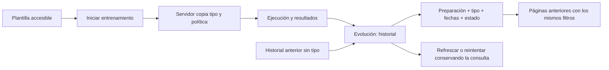
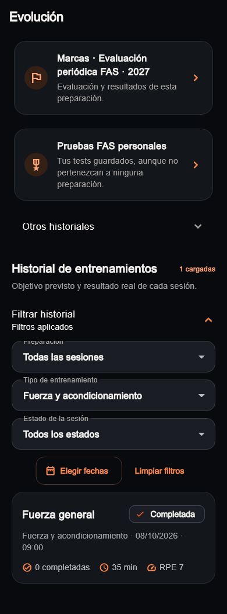
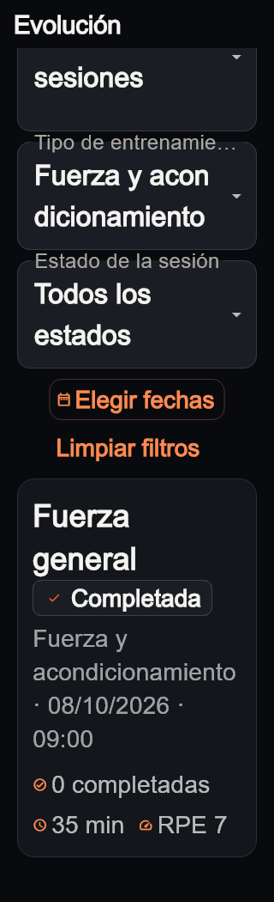

# Evolución: tipo histórico y filtro de sesiones · 08/10/2026

UI-016 continúa UI-015 dentro del refresh autorizado por Javier. Se explica
antes de implementar la ampliación del contrato: clasificar en servidor al
iniciar y conservar el resultado. No se reconstruyen sesiones anteriores desde
una plantilla que puede haber cambiado.

## Recorrido implementado

«Tipo de entrenamiento» ofrece Todos los tipos, Carrera, Fuerza y
acondicionamiento, Mixta y Sin clasificar. Las tarjetas muestran el tipo junto
a la fecha. Preparación, tipo y estado admiten varias líneas en pantalla
estrecha con texto ampliado. Se conservan la composición actual, tema y rutas.

## Clasificación y límites

La política `block_format_v1` usa los bloques presentes al iniciar, no el nombre
de la sesión, las marcas registradas ni su plantilla actual al consultar.

| Bloques de la plantilla | Tipo guardado | Presentación |
| --- | --- | --- |
| Algún `running`, sin otros bloques de trabajo | `running` | Carrera |
| `running` y otros bloques de trabajo | `mixed` | Mixta |
| Sin `running` | `strength` | Fuerza y acondicionamiento |
| Ejecución anterior a la migración | `NULL` | Sin clasificar |

`warm_up` y `cool_down` no convierten una carrera en mixta. La familia general
sin carrera sigue la denominación de acondicionamiento ya usada en Biblioteca;
no identifica por sí sola músculos, deportes o estímulos fisiológicos. Una
plantilla con solo calentamiento/vuelta a la calma pertenece a esa familia.
El resumen de Biblioteca conserva sus dos familias actuales; este cambio
clasifica el historial, sin rediseñar aquel catálogo.

`workout_executions.session_type` y `session_type_policy` se rellenan mediante
trigger al insertar desde los RPC existentes. El cliente no elige estos datos.
Un `CHECK` limita sus combinaciones; el trigger rechaza modificar cualquiera de
los dos posteriormente. Reanudar, completar, cerrar, corregir resultados o
editar la plantilla no reclasifica la ejecución. Las sesiones antiguas, incluidas
las que estaban en curso al aplicar la migración, mantienen ambos campos nulos.

`WorkoutHistoryQuery` transmite el tipo hasta PostgREST. El filtro se aplica
antes del cursor y del límite; Sin clasificar consulta `session_type is null`.
Se mantienen propietario, exclusión de sesiones en curso, vínculo opcional de
preparación, días civiles y orden estable `(started_at, id)`. Refresco,
paginación y errores conservan los criterios. No cambia RLS ni los derechos
comerciales; tampoco modifica prescripción, resultados o adaptación deportiva.

## Comprobación del bloque

- `flutter analyze`: sin incidencias.
- Batería completa de raíz: **591 pruebas correctas**; una prueba exclusiva web
  mantiene su omisión existente en el runner VM.
- Regresiones específicas: **25 correctas**, incluidas combinación de filtros,
  páginas, respuesta antigua descartada, refresco fallido, lectura de tipos y
  ausencia de clasificación inferida en registros anteriores. Los selectores
  se comprueban por altura real a 320 px con texto doble.
- Tres recorridos de captura correctos y **15 imágenes revisadas**, fuera de
  la batería de raíz. Widgets actuales con datos ficticios; sin sesión real,
  AppShell, portadas de preparación o dispositivo físico. Arial sustituye Ahem
  del runner; tamaños, fuentes y contenido pueden diferir del dispositivo.
- Migración `20261008001000_workout_execution_session_type.sql`: ensayo previo
  transaccional conserva los registros anteriores sin tipo; aplicada únicamente
  en **entrenaop-dev** (`sxbxfjqgoddzhtcyhalw`). Después de aplicarla, **133
  migraciones coinciden**, sin diferencias local/remoto.
- Cuatro pruebas SQL transaccionales terminadas con `ROLLBACK`: tipo histórico,
  edición de ejercicios personales, contrato de resultados y borradores admin.
  Cubren reanudación, edición posterior, inmutabilidad, permisos y aislamiento
  entre cuentas. Sus datos ficticios no quedan guardados.
- No cambian dependencias ni paquetes compartidos. El admin conserva su código;
  la prueba SQL de sus borradores comprueba la frontera de datos afectada.

## Imágenes del código actual

La página se desplaza para mostrar la selección y el resultado. La vista de
texto ampliado enfoca esa misma zona; una parte del selector de preparación
queda fuera del viewport, sin recortarse su contenido en el campo.

- [Historial sin clasificar](visual-audit/history-session-type-2026-10-08/movil-sin-clasificar.webp).
- [Error de refresco persistente](visual-audit/history-session-type-2026-10-08/movil-error-conservado.webp).
- [Escritorio](visual-audit/history-session-type-2026-10-08/escritorio-fuerza.webp).
- [Manifiesto de las 15 capturas, fuentes y huellas](visual-audit/history-session-type-2026-10-08/manifest.json).

## Único siguiente bloque recomendado

El pulido localizado siguiente se comprueba después en
[UI-017](REFRESH_FORMS_2026_10_08.md), que registra su alcance y la recomendación
actual. La sección siguiente conserva el cierre original de UI-016.

Pulido localizado de textos, estados y accesos en app/admin, contrastando cada
recorrido con su código y conservando el diseño aprobado. El detalle de programa
admin ya se organizó en UI-014; no se rehace como trabajo pendiente.

La comparación configurable requiere completar su contrato histórico y sigue
pendiente. El recorrido autenticado global y la prueba física tampoco quedan
acreditados por estos fixtures. Javier ya confirma recepción del correo y
recuperación web (MAIL-001); iPhone/iOS espera a su entorno Mac. Almacenamiento
seguro móvil, eliminación de cuenta y acceso a privacidad siguen registrados
como trabajo previo a publicación, sin introducirlos en este contrato de tipos.
Vídeos, negocio Free/Pro y motores mantienen sus tareas aparte.

La pestaña local accesible al agente (`localhost:55556`) vuelve al acceso al
abrir `/assessment/history`: no hay sesión autenticada disponible en ese
navegador. No se solicita ni utiliza la contraseña de Javier para estas pruebas.
