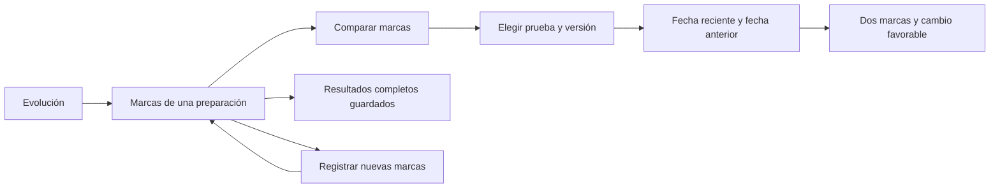
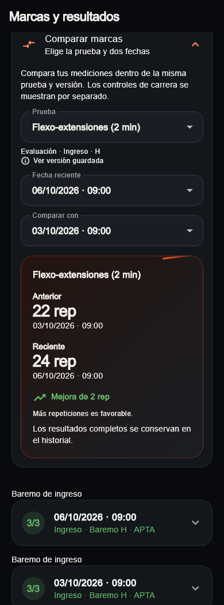

# Evolución: comparación de marcas guardadas · 08/10/2026

UI-015 continúa UI-011 dentro del refresh UI-008/UI-010. Javier pide continuar
Evolución. El criterio se explica antes de implementar: comparar mediciones
originales de la misma prueba y versión, conservar los resultados completos y
separar controles de carrera de evaluaciones oficiales. Se conserva el aspecto
de Inicio/Mi plan, las tarjetas, las fotografías y los recorridos actuales.

## Recorrido implementado

El comparador se despliega en «Marcas y resultados»; el historial y el registro
existentes siguen disponibles. Empieza con una serie comparable y sus dos
mediciones más recientes. Permite elegir otras fechas y consultar retroceso,
mejora o marca mantenida. Más repeticiones y más tiempo de plancha son favorables;
en carrera/agilidad es favorable reducir el tiempo. No calcula una puntuación
de progreso, predice rendimiento ni cambia puntos o aptitud.

Los selectores conservan prueba y fechas al recargar o fallar. Un resultado
nuevo no cambia una comparación elegida. Una selección que desaparezca se
resuelve contra los datos presentes, sin conservar identificadores ajenos.
Cada tarjeta histórica tiene almacenamiento de expansión propio por ID,
separado del scroll. El comparador también conserva su expansión por preparación.

## Compatibilidad y límites comprobados

| Fuente | Qué se puede comparar | Qué se mantiene separado o pendiente |
|---|---|---|
| Tropa | Misma prueba, versión del catálogo, columna H/M, hito, unidad y dirección favorable. La marca y el estándar deben ser coherentes con la cabecera. | Otros catálogos, hitos, columnas, unidades o direcciones. No se inventa una versión deportiva de protocolo que los registros antiguos no guardan. |
| FAS | Prueba de la versión íntegra `es_def_15_2026_periodic_2027_v2_full_scores`, columna H/M igual y unidad guardada coincidente con su catálogo versionado. | Otra versión, prueba/edad ajena al catálogo o unidad incompatible. Las edades aparecen junto a las marcas; el cambio se calcula sobre la medición original, nunca sobre puntos de distintos tramos. |
| Control de carrera | Controles válidos y persistidos de `run_2000m_v1`; segundos originales convertidos exactamente a milisegundos. RPE visible junto a cada marca. | Evaluaciones oficiales, otra distancia/protocolo o control sin identidad persistida. |
| Programa configurable | Se conservan los detalles, puntos e intentos del snapshot. | El snapshot actual no incluye unidad/protocolo/dirección completos. Se explica por qué no se ofrece comparación; no se reconstruyen con el catálogo editorial vigente. |

La fecha anterior debe ser estrictamente anterior a la reciente. Identidad
ajena, fecha igual, invertida o comparación consigo mismo no producen progreso.
El formato conserva hasta milésimas guardadas; una diferencia pequeña no se
trunca a cero. El comparador anterior de Tropa también comprueba compatibilidad;
si sus dos últimas evaluaciones no son compatibles, indica el motivo general
y conserva el historial.

No cambia tablas, RPC, RLS, SDK, rutas, paquetes compartidos, permisos, motores,
suscripciones o producción. `MeasurementSeries` contiene datos de consulta y
un cálculo puro; el adaptador construye series desde los modelos ya leídos y
el widget conserva únicamente estado de selección. No añade acceso a Supabase.

## Comprobación y capturas

Análisis de raíz limpio; 579 pruebas completas correctas, con una prueba
exclusiva web omitida en el runner nativo. Las 64 de evaluación incluyen
regresiones de compatibilidad, precisión, cambios de selección, recarga fallida,
inserción de evaluación sin perder expansión y texto 2× a 320/390/1100 px.
La comprobación de texto grande mide la altura del párrafo y del campo: no se
limita a comprobar ausencia de excepciones de overflow.

Seis recorridos adicionales de captura correctos; 19 imágenes revisadas de
widgets actuales con tema compartido y datos ficticios. Las preparaciones del
fixture no llevan portada: estas imágenes no acreditan fotografías remotas,
cuenta autenticada ni dispositivo físico. Admin y paquetes compartidos no
cambian; no corresponde ejecutar su matriz ni SQL para este alcance.

- [Control de carrera](visual-audit/measurement-comparison-2026-10-08/movil-tropa-4.webp).
- [FAS: marcas y edades](visual-audit/measurement-comparison-2026-10-08/movil-fas-2.webp).
- [Versiones separadas](visual-audit/measurement-comparison-2026-10-08/versiones-distintas-2.webp).
- [Programa configurable: resultado conservado](visual-audit/measurement-comparison-2026-10-08/programa-snapshot-2.webp).
- [Texto ampliado](visual-audit/measurement-comparison-2026-10-08/texto-ampliado-tropa-2.webp).
- [Escritorio](visual-audit/measurement-comparison-2026-10-08/escritorio-tropa-2.webp).
- [Manifiesto de todas las imágenes y fuentes](visual-audit/measurement-comparison-2026-10-08/manifest.json).

## Único siguiente bloque recomendado

Definir el dato histórico de tipo deportivo de la sesión antes de añadir su
filtro a Evolución. Hoy la ejecución no lo conserva y no debe inferirse de una
plantilla mutable. Se explicará el cambio de contrato antes de implementar;
habrá que distinguir las sesiones antiguas sin clasificación y preservar los
filtros, la paginación y las instantáneas actuales.

La comparación configurable requiere un contrato histórico más completo;
queda pendiente y no se considera terminada toda Evolución. El correo real y
el recorrido autenticado siguen abiertos para cuando Javier pueda probarlos.
Vídeos, negocio y motores mantienen sus tareas aparte.
