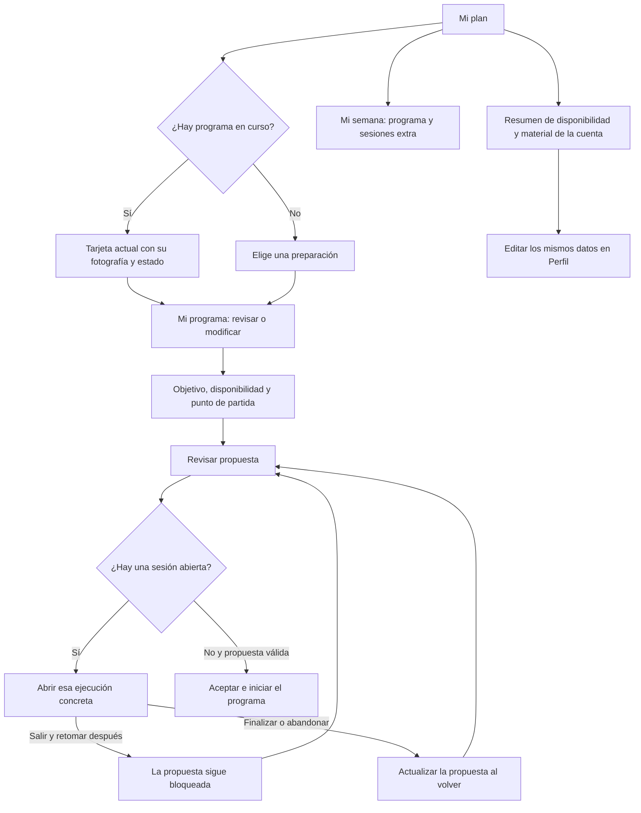
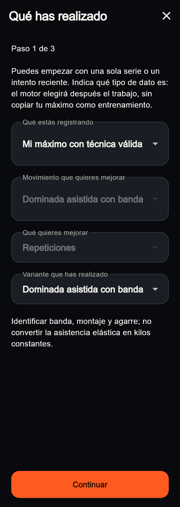
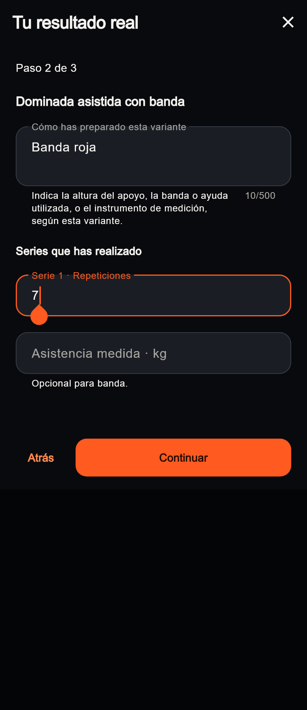
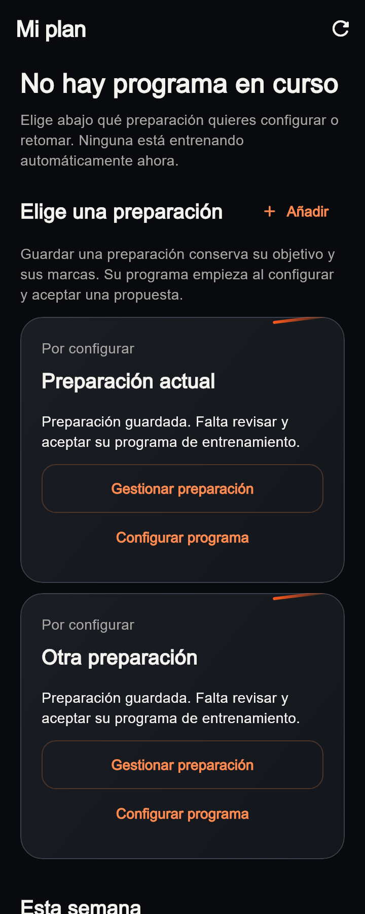
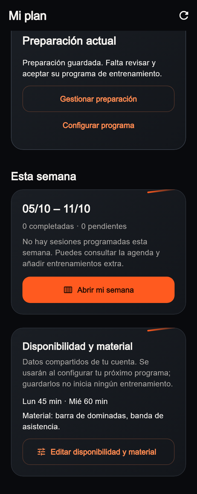

# Mi plan y formularios: coherencia del recorrido · 08/10/2026

UI-021 recoge las incoherencias que Javier muestra en diez fotografías y en el
vídeo de Mi plan. La revisión se realiza sobre el árbol local actual, sin
recuperar composiciones antiguas. Conserva las tarjetas, portadas, encuadres,
datos deportivos y motores. Continúa UI-008 y ajusta el recorrido UI-010 por
petición expresa de Javier; no abre el negocio Free/Pro.

## Qué ocurría

- Los campos de referencias no reservaban separación suficiente para las
  etiquetas flotantes. Los selectores limitaban a una línea nombres largos y
  algunas ayudas se recortaban junto al contador de caracteres.
- El aviso de sesión abierta llevaba a la agenda de la semana actual. La sesión
  que bloquea el cambio puede pertenecer a otra fecha o preparación, por lo que
  esa agenda no necesariamente ofrecía una salida al bloqueo.
- Mi plan sin programa reutilizaba el siguiente paso de Inicio. La primera
  preparación con marcas pendientes parecía un programa predeterminado.
- Preparación guardada y programa iniciado no quedaban suficientemente
  diferenciados. Disponibilidad y material no explicaban su relación con el
  cuestionario del programa.

En el vídeo, Reiniciar ensayos devuelve el programa a borrador. Es una operación
de desarrollo con confirmación, no el recorrido normal para cambiar o pausar
un programa. Esta revisión no la ejecuta ni borra resultados.

## Recorrido vigente



La propuesta conserva la semana elegida y el asistente al abrir la ejecución
mediante `go_router.push`. La flecha de la sesión regresa a esa propuesta; no
reinicia el cuestionario ni publica un programa automáticamente. El servidor
vuelve a validar si se puede activar. Si la sesión ya se cerró en otro
dispositivo, se actualiza la propuesta sin abrir una agenda vacía. Un fallo de
consulta mantiene la pantalla y permite reintentar.

## Preparaciones y programa

| Estado real | Qué muestra Mi plan | Acción principal |
| --- | --- | --- |
| Sin programa en curso | Elige una preparación, antes de la semana | Configurar o retomar la preparación elegida |
| Preparación guardada / borrador | Por configurar, fecha y explicación | Revisar y aceptar su programa |
| Programa en curso | Tarjeta fotográfica actual y estado del servidor | Ver el programa o revisar lo pendiente |
| Programa pausado | Progreso conservado y aviso de revisión | Retomar mediante propuesta |
| Programa finalizado | Estado finalizado y preparación conservada | Consultar preparación y resultados |

Javier confirma **Preparaciones** como nombre del bloque, y **Elige una
preparación** cuando no hay un programa en curso. Inicio también usa
Preparaciones. Estos accesos muestran las preparaciones añadidas a la cuenta;
Añadir mantiene el acceso al catálogo. No se convierte toda la oferta en un
programa activo ni se inicia ninguna por orden de aparición.

En Inicio, cuando hay varias preparaciones guardadas y ningún programa en curso,
el siguiente paso invita a elegir. Con una sola preparación se conserva su
acción pertinente, sin presentarla como programa iniciado. La sesión del día
sigue teniendo prioridad cuando corresponde.

## Disponibilidad y material

La tarjeta y el paso Disponibilidad del asistente consultan los mismos datos
de la cuenta. No hay una segunda configuración independiente ni un resto de
una instalación anterior. La tarjeta resume días/minutos y material reales,
explica cuándo se utilizan y abre el formulario existente en Perfil.

El coordinador utiliza ese contexto para repartir tiempo y seleccionar trabajo
compatible. Editarlo no inicia un programa ni altera resultados registrados.
Las revisiones de contexto y de semanas conservan los contratos existentes;
esta tarea no modifica las reglas de adaptación.

## Campos y capturas actuales

Los selectores locales permiten texto completo en varias líneas. La columna
del registro deja 20 px entre bloques. Las etiquetas numéricas se acortan y
la condición opcional/rango aparece en una ayuda legible. No cambian unidades,
validación, mediciones preseleccionadas ni datos de calibración.









Son capturas de los widgets actuales con fixtures, no maquetas ni una cuenta
autenticada. Los fixtures de Mi plan no aportan URLs de portada: su ausencia en
estas capturas no representa la eliminación de las fotografías de la app.
Arial sustituye la fuente del runner. La captura del teclado reserva su espacio;
no reproduce los controles del teclado nativo. El [manifiesto](visual-audit/plan-coherence-2026-10-08/manifest.json)
registra dimensiones y hashes de capturas, código y pruebas.

## Verificación y límites

- `flutter analyze`: limpio. Batería completa de la app: 671 pruebas correctas
  y la omisión existente exclusiva de web en el runner VM.
- Regresiones a 320, 390 y 640 px, texto 1×/2×, teclado y conservación del
  resultado al avanzar/retroceder. Meta de carrera separada de su selector.
- Preparaciones vacías, múltiples, pausadas y finalizadas; contexto guardado,
  navegación, fallo/reintento y retorno sin reiniciar el resumen.
- Consulta de sesión limitada explícitamente a la cuenta actual, sin limitar
  semana/preparación, y regresiones de sesión abierta, cerrada, fallo de red y
  salida sin cerrarla. Rutas anidadas equivalentes a la app, sin publicación
  automática ni capacidades inventadas.
- Contraste de SQL existente: lectura propia de `scheduled_workouts`, ejecución
  obligatoria para `in_progress`, bloqueo de activación por cualquier sesión
  propia abierta y contexto común. `supabase migration list` contra desarrollo:
  133/133 coincidentes. Sin migraciones, grants o RLS nuevos.
- No cambian paquetes compartidos, admin, dependencias ni producción; corresponde
  verificar la app del deportista. No se acredita aquí un recorrido autenticado
  nuevo en Android/iPhone ni una prueba real entrenando.

Este tramo localizado queda cerrado con los límites indicados. El único
siguiente bloque recomendado es la revisión pausada de incoherencias que
Javier quiere realizar, tomando cada recorrido y estado real antes de modificarlo.
Gimnasio, iPhone físico y primera entrada Android sin permiso mantienen sus
validaciones posteriores. Negocio, motores, vídeo y comparación configurable
mantienen sus alcances separados.

Para regenerar las capturas desde raíz:

```powershell
flutter test test/features/preparation_goal/presentation/preparation_layout_regression_test.dart test/features/training_plan/presentation/training_hub_page_test.dart --dart-define=CAPTURE_PERFORMANCE_REVIEW=true
python tools/export_plan_coherence_captures.py
```
