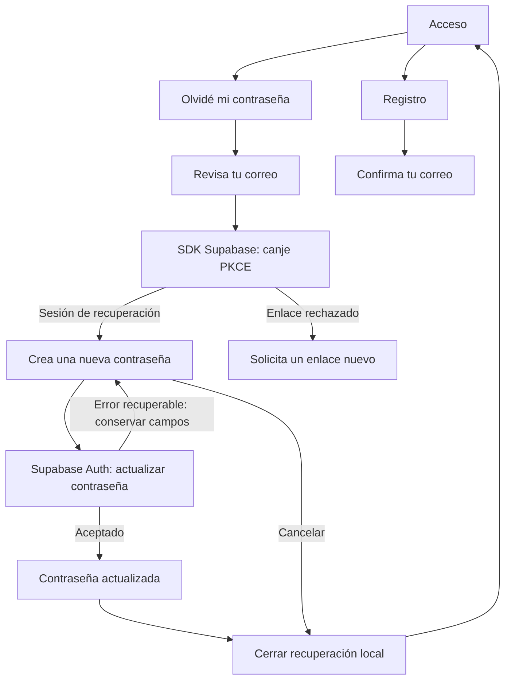
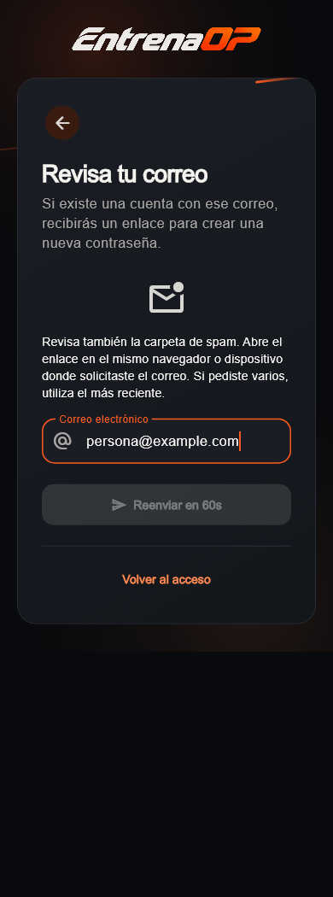
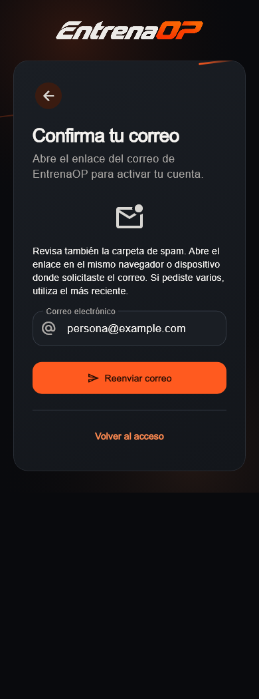
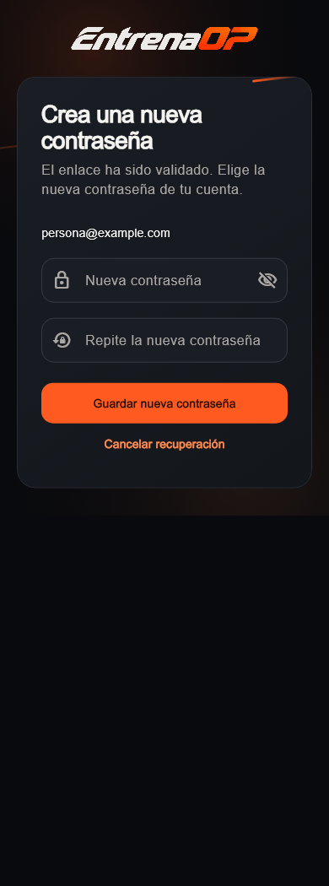
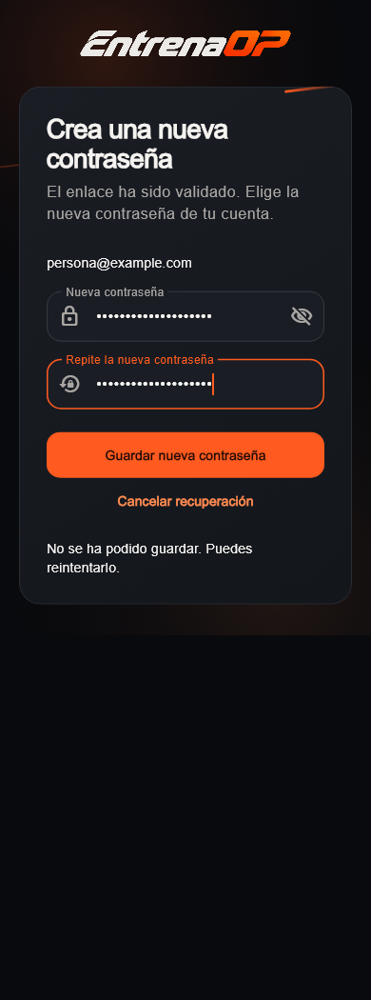
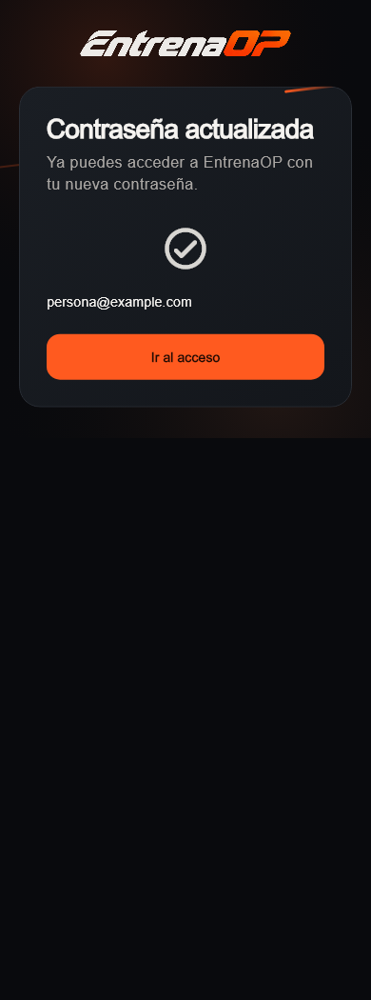
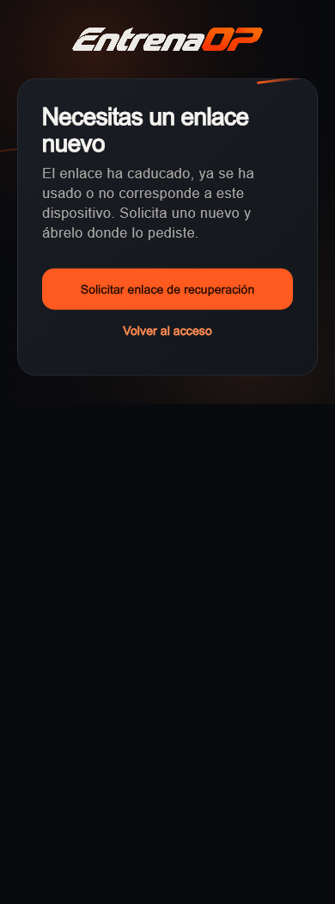

# Cuenta: recuperación y confirmaciones · 08/10/2026

UI-013 continúa el refresh autorizado. Conserva la identidad visual de acceso y
resuelve la recuperación de contraseña y la confirmación del correo. No cambia
Inicio/Mi plan, tarjetas fotográficas, motores, derechos Free/Pro ni producción.
Javier pide revisar la seguridad de este recorrido; este cierre no representa
una auditoría de seguridad de todo el login o de la aplicación.

## Recorrido implementado

| Situación | Comportamiento |
|---|---|
| Olvidé mi contraseña | El acceso abre el formulario con el correo ya escrito. |
| Solicitud aceptada | «Revisa tu correo» permanece visible; no confirma si existe la cuenta. |
| Fallo de envío | Conserva el correo y muestra un error con reintento. |
| Alta pendiente de confirmar | «Confirma tu correo», instrucciones y reenvío; también desde un acceso rechazado por correo sin confirmar. |
| Reenvío | Desactiva solicitudes simultáneas y espera un minuto tras una solicitud aceptada; el servidor mantiene sus propios límites. |
| Enlace de recuperación validado por el SDK | Abre «Crea una nueva contraseña»; intentar navegar a otra sección mantiene este recorrido. |
| URL de recuperación sin sesión correspondiente | No muestra el formulario de cambio; permite solicitar otro enlace. |
| Contraseña inválida o distinta de su repetición | Valida el formulario antes de enviar. Mínimo de interfaz: ocho caracteres; Auth conserva su validación independiente. |
| Guardado rechazado | Conserva los campos para reintentar, salvo que Auth indique que la sesión/enlace ya no es válido. |
| Guardado aceptado por Auth | Limpia los campos y muestra «Contraseña actualizada». |
| Terminar o cancelar | Cierra la sesión local de recuperación y vuelve al acceso; no solicita cerrar las sesiones de otros dispositivos. |
| Recarga durante recuperación | Conserva el recorrido únicamente si el propietario del marcador coincide con la sesión actual del SDK. |
| Cambio de cuenta o respuesta tardía | Descarta respuestas anteriores y no traslada la confirmación a otra cuenta. |

## Frontera de seguridad y configuración

- La app no interpreta un parámetro de URL como autorización. Supabase Flutter
  procesa el enlace y `AuthChangeEvent.passwordRecovery` diferencia el recorrido
  del acceso normal. El inicio usa ese flujo único; se retira la segunda consulta
  de perfil que podía competir con el evento de recuperación.
- Las solicitudes usan el flujo PKCE existente del SDK. La actualización usa
  `auth.updateUser`; la sesión y el servidor autorizan la operación. La guarda
  de navegación solo organiza la interfaz y no restringe ni amplía los permisos
  que tenga una sesión en Supabase.
- El nuevo marcador local contiene UUID del propietario y un indicador de
  confirmación visible. No almacena la nueva contraseña ni los tokens del
  enlace. El almacenamiento de sesión propio del SDK no se modifica en este
  bloque; no se acredita aquí una revisión de ese almacenamiento.
- Las respuestas de perfil, acceso o envío anteriores no restablecen una cuenta
  cerrada ni reemplazan una recuperación posterior. La renovación de la misma
  sesión no borra el guardado en curso ni su confirmación.
- Web retorna al origen de la app, eliminando consulta y fragmento. Móvil usa
  `es.entrenaop://auth-callback/`, registrado en Android e iOS. El SDK recibe el
  enlace y `go_router` observa el estado validado. `AUTH_REDIRECT_URL` permite
  configurar el retorno por entorno; HTTP solo se acepta en localhost de
  desarrollo y se rechazan credenciales, consulta o fragmento en el destino.
- En **entrenaop-dev**, `sxbxfjqgoddzhtcyhalw`, se añadió únicamente la lista de
  retornos localhost/127.0.0.1 y el callback móvil. La configuración parcial en
  `tools/account_access_dev/supabase/config.toml` evita aplicar los valores del
  archivo general generado por `supabase init`, que no reflejan Auth remoto.
  Se comparó antes/después: confirmación de correo, intervalo de envío, MFA y
  demás propiedades no declaradas conservaron sus valores. El diff posterior
  muestra cero diferencias en propiedades declaradas. No se cambia SQL/RLS.
- La documentación oficial de [recuperación de contraseña](https://supabase.com/docs/reference/dart/auth-resetpasswordforemail),
  [Auth con contraseña](https://supabase.com/docs/guides/auth/passwords) y
  [retornos autorizados](https://supabase.com/docs/guides/auth/redirect-urls)
  complementa la revisión del SDK instalado. El canje PKCE debe completarse en
  el navegador o dispositivo donde se solicitó el correo; la pantalla lo explica.

## Correo de recuperación: configuración comprobada; entrega pendiente

Actualización MAIL-001: Javier confirma `acceso@entrenaop.es` como remitente
propio, separado de su dirección personal. Asunto y HTML del correo de
recuperación están aplicados y comprobados en español en desarrollo;
conservan el enlace de Supabase y el logotipo de la web. No se cambian las
plantillas de alta ni la lógica Flutter. Hostinger ya está accesible y su plan
incluye plazas libres sin contratar nada; Javier ha creado el buzón y el panel
confirma `acceso@entrenaop.es` activo. Javier guarda SMTP en Supabase y la consulta
confirma la configuración acordada. El bloqueo inicial del envío predeterminado
queda resuelto; asunto/HTML e indicadores de personalización coinciden con lo
esperado. Segunda aplicación idempotente y cinco pruebas del verificador local
correctas. Supabase conserva el límite inicial de 30 correos por hora y 60
segundos por usuario; Hostinger impone 100 por día. Entrega real y recorrido
desde el enlace todavía pendientes. No se han contratado planes.
Configuración, comprobación y tareas abiertas en
[Cuenta de desarrollo](../tools/account_access_dev/README.md).

## Capturas del código actual

Son widgets actuales, con fuentes e iconos reales, repositorio de prueba y
correo/contraseñas ficticios. No son una maqueta ni un envío autenticado real.
Hay siete estados a 390 px, 320 px con texto 2× y 1100 px: 21 imágenes. A escala
2× el contenido es desplazable; la captura recoge la posición inicial.
El [manifiesto](visual-audit/refresh-account-2026-10-08/manifest.json) registra
dimensiones, fuentes y huellas del código y de las imágenes.

## Verificación y límites

- Análisis sin incidencias en app y admin. Batería completa de raíz: 563 pruebas
  correctas y una exclusiva web omitida; admin: 85 correctas y una optativa
  omitida. Las pruebas usan repositorios o respuestas HTTP simulados.
- El SDK real se prueba con transporte HTTP simulado: desafío PKCE, destino,
  consumo del verificador, actualización contra Auth, rechazo de sesión inválida
  aunque coincida el marcador, separación de propietario y cierre local.
  No acredita el vencimiento o reutilización de enlaces contra el servidor real.
- Pruebas del router y formularios: URL sola no habilita el cambio, recuperación
  prioritaria, respuestas tardías, error retenido, confirmación persistente,
  reenvío limitado y regreso al acceso. Tres recorridos de captura correctos,
  incluyendo texto ampliado sin errores de disposición.
- `http` 1.6.0 ya era transitiva de Supabase y se declara solo como dependencia
  de desarrollo para `MockClient`. Resolución offline sin cambiar versiones.
- Compilaciones web debug y APK debug correctas. iOS tiene configuración de
  callback revisada, pero no se compila desde este equipo Windows.
- **Pendiente:** correo real de alta/recuperación, apertura del enlace en web y
  Android físico, rechazo real de un enlace caducado o reutilizado y nuevo acceso
  con la contraseña cambiada. No se han enviado correos ni cambiado la cuenta
  de Javier para simular ese cierre. Tampoco se ha revisado producción, SMTP,
  dominios de publicación, almacenamiento de sesión o toda la seguridad del login.
- Antes de publicar hay que definir y comprobar los retornos y el correo del
  entorno real. La lista con puertos localhost es exclusivamente de desarrollo;
  no constituye configuración ni validación de producción.

El tramo técnico y visual queda comprobado en desarrollo, con el recorrido real
de correo/dispositivo abierto. El único siguiente bloque UX recomendado es
Evolución: filtro deportivo y comparativas de mediciones compatibles, sin tocar
los motores ni mezclar protocolos o versiones de baremo.
