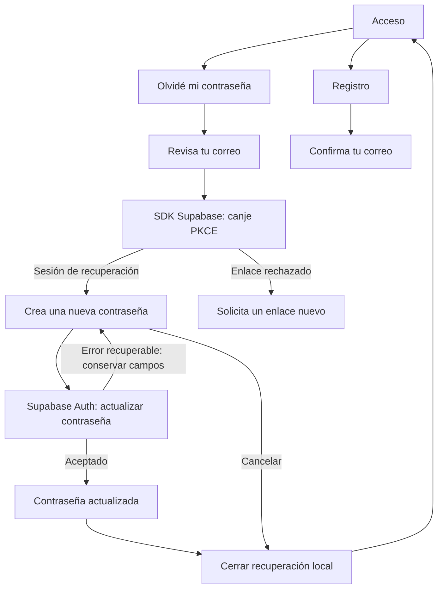

# Cuenta: recuperación y confirmaciones · 08/10/2026

UI-013 continúa el refresh autorizado. Conserva la identidad visual de acceso y
resuelve la recuperación de contraseña y la confirmación del correo. No cambia
Inicio/Mi plan, tarjetas fotográficas, motores, derechos Free/Pro ni producción.
Javier pide revisar la seguridad de este recorrido; este cierre no representa
una auditoría de seguridad de todo el login o de la aplicación.

## Recorrido implementado

### Corrección de confirmación de alta · MAIL-002 · 10/10/2026

Javier aporta el correo de alta aún en inglés y un error al abrir su enlace en
otro navegador seguido de reenvío sin recibir otro mensaje. La consulta de solo
lectura en Dev comprueba que la cuenta indicada quedó confirmada a las 10:10
(Europe/Madrid), sin inicio de sesión posterior. El correo puede confirmarse
antes de que falle el canje PKCE del acceso automático en otro perfil.

El asunto «Confirma tu correo de EntrenaOP» y el HTML español están aplicados en
Dev y coinciden exactamente con la plantilla versionada. El botón conserva
`{{ .ConfirmationURL }}` y las instrucciones explican el mismo navegador/origen
y la alternativa de iniciar sesión con contraseña si la dirección ya se confirmó.
La comparación remota no encuentra cambios ajenos y la recuperación sigue
coincidiendo con su plantilla anterior. No se modifican SMTP, cuotas, retornos,
confirmación obligatoria, MFA ni producción. La recepción del nuevo HTML aún
requiere un registro pendiente de confirmar; no se envían correos desde el agente.

El reenvío mantiene una respuesta condicional: el SDK no acredita entrega.
Supabase devuelve éxito sin generar un correo para cuentas ya confirmadas,
según su [implementación de reenvío](https://github.com/supabase/auth/blob/master/internal/api/resend.go).
La app explica que se pruebe a iniciar sesión con la contraseña antes de pedir
otro enlace. El aviso de enlace rechazado permite iniciar sesión, solicitar
recuperación o acceder al reenvío de confirmación. Solo abre ese formulario;
no envía nada al pulsar esta última opción. No revela si una cuenta existe ni
consulta su estado públicamente, y no habilita un cambio de contraseña sin la
sesión de recuperación correspondiente.

Verificación de MAIL-002: análisis de raíz limpio; 742 pruebas completas
correctas y la omisión web existente. La regresión de un enlace rechazado
vuelve al acceso sin iniciar recuperación, reenviar ni actualizar contraseña;
también se conserva la salida explícita para pedir recuperación. Siete pruebas
del verificador de configuración correctas, incluida la protección de las
plantillas no seleccionadas y SMTP. Las comprobaciones usan fixtures o lectura
remota: no acreditan acceso real con la contraseña de la cuenta indicada.

Las capturas y cifras de UI-013 que siguen describen la entrega del 08/10;
el aviso de enlace rechazado y los textos de confirmación se amplían aquí.

| Situación | Comportamiento |
|---|---|
| Olvidé mi contraseña | El acceso abre el formulario con el correo ya escrito. |
| Solicitud aceptada | «Revisa tu correo» permanece visible; no confirma si existe la cuenta. |
| Fallo de envío | Conserva el correo y muestra un error con reintento. |
| Alta pendiente de confirmar | «Confirma tu correo», instrucciones y reenvío; también desde un acceso rechazado por correo sin confirmar. |
| Reenvío | Respuesta condicional y acceso con contraseña si el correo ya se confirmó. Desactiva solicitudes simultáneas y espera un minuto tras una solicitud aceptada; el servidor mantiene sus propios límites. |
| Enlace de recuperación validado por el SDK | Abre «Crea una nueva contraseña»; intentar navegar a otra sección mantiene este recorrido. |
| URL de recuperación sin sesión correspondiente | No muestra el formulario de cambio; permite solicitar otro enlace. |
| Contraseña inválida o distinta de su repetición | Valida el formulario antes de enviar. Mínimo de interfaz: ocho caracteres; Auth conserva su validación independiente. |
| Guardado rechazado | Conserva los campos para reintentar, salvo que Auth indique que la sesión/enlace ya no es válido. |
| Guardado aceptado por Auth | Limpia los campos y muestra «Contraseña actualizada». |
| Terminar o cancelar | Cierra la sesión local de recuperación y vuelve al acceso; no solicita cerrar las sesiones de otros dispositivos. |
| Recarga durante recuperación | Conserva el recorrido únicamente si el propietario del marcador coincide con la sesión actual del SDK. |
| Cambio de cuenta o respuesta tardía | Descarta respuestas anteriores y no traslada la confirmación a otra cuenta. |

## Frontera de seguridad y configuración

- La app no interpreta un parámetro de URL como autorización. Supabase Flutter
  procesa el enlace y `AuthChangeEvent.passwordRecovery` diferencia el recorrido
  del acceso normal. El inicio usa ese flujo único; se retira la segunda consulta
  de perfil que podía competir con el evento de recuperación.
- Las solicitudes usan el flujo PKCE existente del SDK. La actualización usa
  `auth.updateUser`; la sesión y el servidor autorizan la operación. La guarda
  de navegación solo organiza la interfaz y no restringe ni amplía los permisos
  que tenga una sesión en Supabase.
- El nuevo marcador local contiene UUID del propietario y un indicador de
  confirmación visible. No almacena la nueva contraseña ni los tokens del
  enlace. El almacenamiento de sesión propio del SDK no se modifica en este
  bloque; no se acredita aquí una revisión de ese almacenamiento.
- Las respuestas de perfil, acceso o envío anteriores no restablecen una cuenta
  cerrada ni reemplazan una recuperación posterior. La renovación de la misma
  sesión no borra el guardado en curso ni su confirmación.
- Web retorna al origen de la app, eliminando consulta y fragmento. Móvil usa
  `es.entrenaop://auth-callback/`, registrado en Android e iOS. El SDK recibe el
  enlace y `go_router` observa el estado validado. `AUTH_REDIRECT_URL` permite
  configurar el retorno por entorno; HTTP solo se acepta en localhost de
  desarrollo y se rechazan credenciales, consulta o fragmento en el destino.
- En **entrenaop-dev**, `sxbxfjqgoddzhtcyhalw`, se añadió únicamente la lista de
  retornos localhost/127.0.0.1 y el callback móvil. La configuración parcial en
  `tools/account_access_dev/supabase/config.toml` evita aplicar los valores del
  archivo general generado por `supabase init`, que no reflejan Auth remoto.
  Se comparó antes/después: confirmación de correo, intervalo de envío, MFA y
  demás propiedades no declaradas conservaron sus valores. El diff posterior
  muestra cero diferencias en propiedades declaradas. No se cambia SQL/RLS.
- La documentación oficial de [recuperación de contraseña](https://supabase.com/docs/reference/dart/auth-resetpasswordforemail),
  [Auth con contraseña](https://supabase.com/docs/guides/auth/passwords) y
  [retornos autorizados](https://supabase.com/docs/guides/auth/redirect-urls)
  complementa la revisión del SDK instalado. El canje PKCE debe completarse en
  el mismo perfil de navegador y origen donde se solicitó el correo; la pantalla
  indica abrirlo donde se pidió. Chrome temporal de F5 y Chrome habitual no
  comparten la comprobación local, aunque se utilicen en el mismo PC.

## Correo de recuperación: prueba web confirmada por Javier

Actualización MAIL-001: Javier confirma `acceso@entrenaop.es` como remitente
propio, separado de su dirección personal. Asunto y HTML del correo de
recuperación están aplicados y comprobados en español en desarrollo;
conservan el enlace de Supabase y el logotipo de la web. No se cambian las
plantillas de alta ni la lógica Flutter. Hostinger ya está accesible y su plan
incluye plazas libres sin contratar nada; Javier ha creado el buzón y el panel
confirma `acceso@entrenaop.es` activo. Javier guarda SMTP en Supabase y la consulta
confirma la configuración acordada. El bloqueo inicial del envío predeterminado
queda resuelto; asunto/HTML e indicadores de personalización coinciden con lo
esperado. Segunda aplicación idempotente y cinco pruebas del verificador local
correctas. Supabase conserva el límite inicial de 30 correos por hora y 60
segundos por usuario; Hostinger impone 100 por día. Javier aporta un correo real
recibido en la bandeja de Gmail con asunto español, remitente y logotipo correctos.
La entrega y esa representación quedan comprobadas. Javier confirma después
«funciona perfectamente» al repetir el recorrido desde el mismo perfil:
recuperación web confirmada por él, sin una comprobación independiente del
agente sobre su contraseña o el acceso posterior. No se han contratado planes.

En el primer intento Javier solicita desde Chrome de F5 y abre el botón en su
navegador habitual. Se comprueba que F5 utiliza un perfil temporal de Flutter en
`localhost:55554`, separado del perfil habitual. Ese cambio de perfil explica el
rechazo esperado por PKCE; el aviso genérico no demuestra que el enlace haya
caducado. La repetición recomendada solicita un correo nuevo desde Chrome
habitual en ese mismo origen y completa allí el recorrido, manteniendo la app
local ejecutándose; Javier confirma que funciona. No se modifican el flujo de
Auth ni el código para omitir esta comprobación.
Configuración, comprobación y tareas abiertas en
[Cuenta de desarrollo](../tools/account_access_dev/README.md).

## Capturas del código actual

Son widgets actuales, con fuentes e iconos reales, repositorio de prueba y
correo/contraseñas ficticios. No son una maqueta ni un envío autenticado real.
Hay siete estados a 390 px, 320 px con texto 2× y 1100 px: 21 imágenes. A escala
2× el contenido es desplazable; la captura recoge la posición inicial.
El [manifiesto](visual-audit/refresh-account-2026-10-08/manifest.json) registra
dimensiones, fuentes y huellas del código y de las imágenes.

## Verificación y límites

- Análisis sin incidencias en app y admin. Batería completa de raíz: 563 pruebas
  correctas y una exclusiva web omitida; admin: 85 correctas y una optativa
  omitida. Las pruebas usan repositorios o respuestas HTTP simulados.
- El SDK real se prueba con transporte HTTP simulado: desafío PKCE, destino,
  consumo del verificador, actualización contra Auth, rechazo de sesión inválida
  aunque coincida el marcador, separación de propietario y cierre local.
  No acredita el vencimiento o reutilización de enlaces contra el servidor real.
- Pruebas del router y formularios: URL sola no habilita el cambio, recuperación
  prioritaria, respuestas tardías, error retenido, confirmación persistente,
  reenvío limitado y regreso al acceso. Tres recorridos de captura correctos,
  incluyendo texto ampliado sin errores de disposición.
- `http` 1.6.0 ya era transitiva de Supabase y se declara solo como dependencia
  de desarrollo para `MockClient`. Resolución offline sin cambiar versiones.
- Compilaciones web debug y APK debug correctas. iOS tiene configuración de
  callback revisada, pero no se compila desde este equipo Windows.
- **Pendiente:** correo real de alta, recuperación en Android físico e iPhone,
  rechazo real de un enlace caducado o reutilizado y
  verificación independiente del acceso con la contraseña cambiada. La recepción
  del correo y la recuperación web se acreditan mediante la prueba de Javier;
  el agente no ha accedido a su contraseña ni la ha cambiado. Tampoco se ha revisado
  producción, dominios de publicación o toda la seguridad del login. La revisión posterior
  identifica el almacenamiento por defecto del SDK, sin auditarlo íntegramente.
- Antes de publicar hay que definir y comprobar los retornos y el correo del
  entorno real. La lista con puertos localhost es exclusivamente de desarrollo;
  no constituye configuración ni validación de producción.

El tramo técnico y visual queda comprobado en desarrollo, con el correo recibido
y la recuperación web confirmados por Javier; la prueba nativa sigue abierta.
El único siguiente bloque UX recomendado es
Evolución: filtro deportivo y comparativas de mediciones compatibles, sin tocar
los motores ni mezclar protocolos o versiones de baremo.

## Revisión localizada de seguridad y publicación en iOS

Javier pide valorar la seguridad después de confirmar que la recuperación
funciona. Se revisan el código de Auth, router, configuración de callback, SDK
instalado, persistencia y accesos de Perfil; no se modifica su arquitectura.

- Supabase realiza el canje PKCE y autoriza `updateUser`. El marcador local no
  concede permisos: sin sesión válida el servidor rechaza la actualización.
  La solicitud solo envía el correo y desafío PKCE; la nueva contraseña se
  entrega a Auth por HTTPS y el formulario la limpia al guardar. Los destinos
  HTTP se limitan a localhost de desarrollo; producción exige HTTPS en web.
- Se repiten 24 regresiones de datasource, recuperación y Cubit, todas correctas.
  Incluyen ausencia de sesión, otro propietario, rechazo de Auth, consumo del
  verificador, respuestas tardías y cierre local. El transporte es simulado:
  estos tests no acreditan caducidad real, auditoría RLS ni seguridad integral.
- `main.dart` no proporciona un almacén de sesión personalizado. En
  `supabase_flutter` 2.17.2, el almacén nativo y el verificador PKCE predeterminados
  usan SharedPreferences; web usa almacenamiento del navegador. La app aún no
  integra Keychain para esos secretos. Se recomienda estudiar persistencia
  protegida en móvil, con migración y pruebas de sesión/callback antes de
  cambiarla. Es una recomendación técnica pendiente, no un cambio aplicado ni
  una exigencia textual de Apple sobre este paquete concreto.
- El Perfil y las rutas de la app no ofrecen eliminar cuenta ni un acceso a la
  política de privacidad. Apple exige iniciar la eliminación desde la app cuando
  permite crear cuentas, y un enlace accesible a la política tanto en la app como
  en App Store Connect. La eliminación necesita un contrato de servidor y datos;
  no se resuelve borrando preferencias locales.
- El acceso actual usa correo/contraseña de EntrenaOP. La regla 4.8 contempla una
  excepción para sistemas de cuenta propios; el uso de Supabase como backend no
  equivale a ofrecer Google/Facebook como inicio de sesión social. No se añade un
  proveedor de acceso por esta consulta.

Antes de publicar deben comprobarse el recorrido en iPhone, destinos reales,
política de contraseñas en Auth, aislamiento de datos y sesiones después de
recuperar. `finishPasswordRecovery` solicita cierre local; no acredita cierre
de todos los dispositivos. Esta revisión no garantiza aprobación de App Review
ni autoriza configurar o desplegar producción.

Fuentes consultadas el 08/10/2026:
[PKCE de Supabase](https://supabase.com/docs/guides/auth/sessions/pkce-flow),
[seguridad de contraseñas](https://supabase.com/docs/guides/auth/password-security),
[App Review, 1.6, 4.8 y 5.1.1](https://developer.apple.com/app-store/review/guidelines/),
[eliminación de cuenta](https://developer.apple.com/help/app-review/guideline-reference/5-1-1-account-deletion),
[Keychain](https://developer.apple.com/documentation/security/keychain-services).
