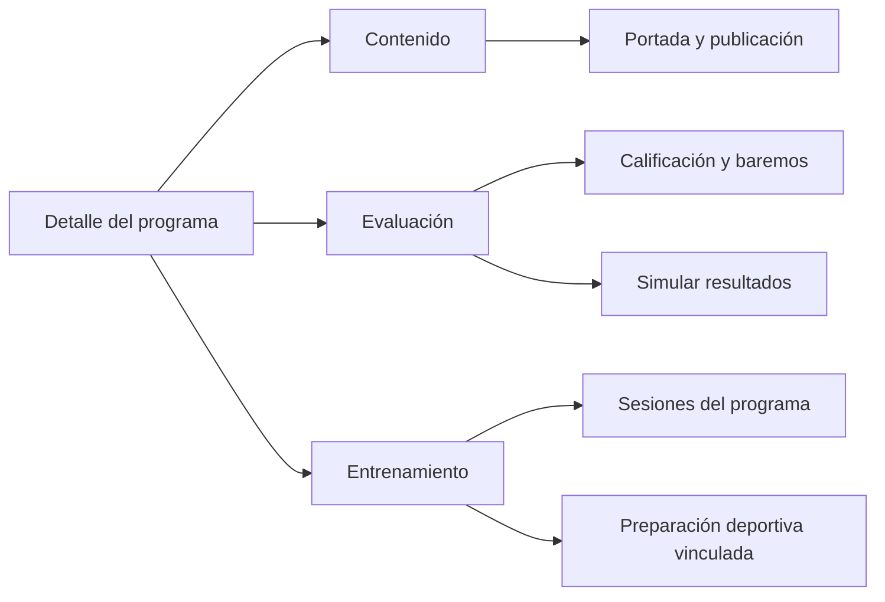
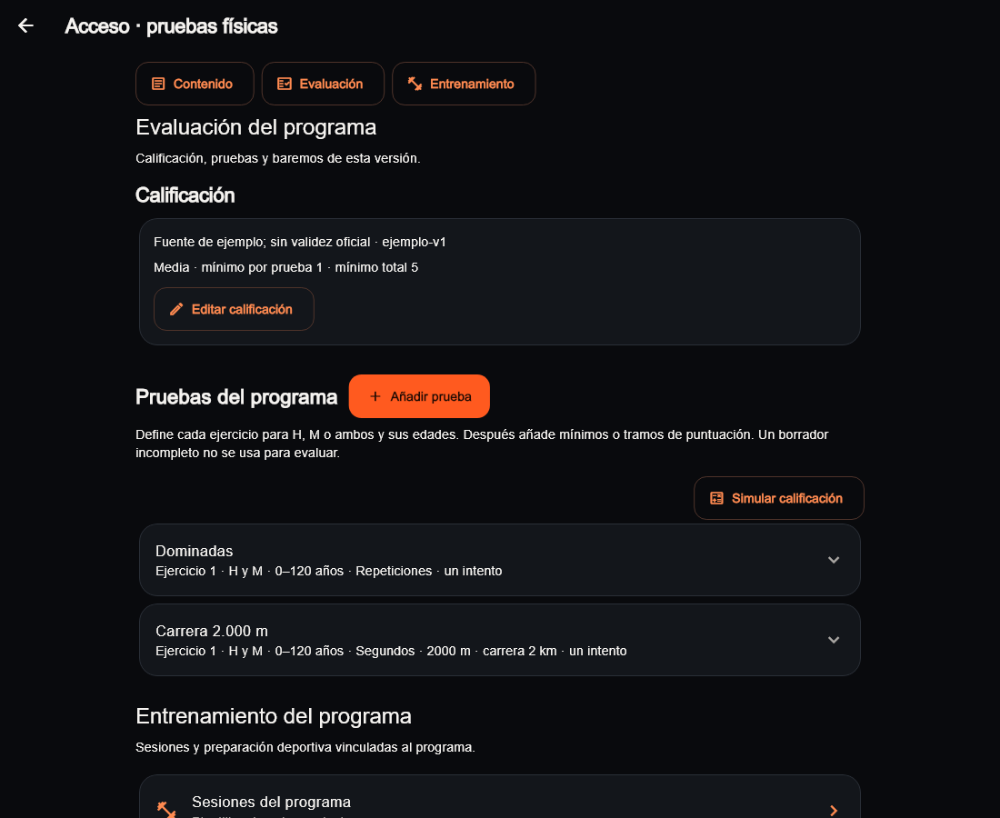
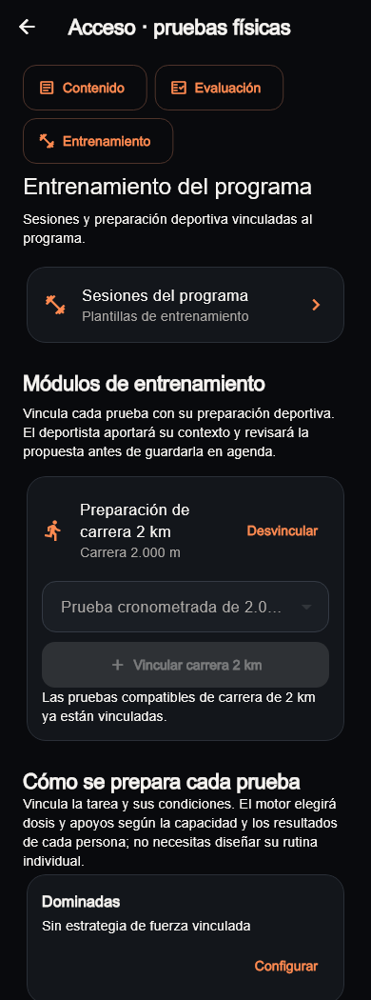
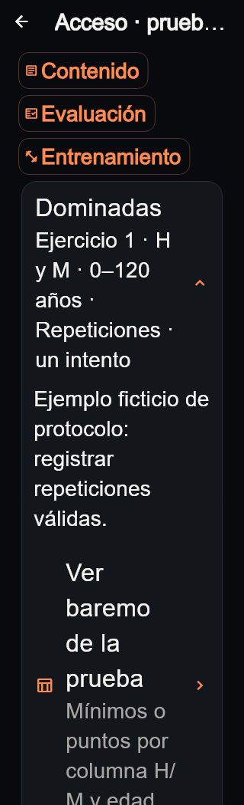

# Detalle de programa admin · 08/10/2026

UI-014 adelanta este tramo acotado del pulido UI-008 mientras Javier no puede
probar la recuperación desde el móvil. Mantiene la identidad visual del admin;
no cambia Inicio/Mi plan, tarjetas fotográficas, motores, negocio o producción.
La recuperación real del correo sigue pendiente y no se da por cerrada.

## Recorrido actual

| Sección | Contenido y accesos |
|---|---|
| Contenido | Estado editorial, publicar/revisar borrador o crear nueva versión, imagen de preparación y sus encuadres. |
| Evaluación | Calificación, pruebas, mínimos/tramos y simulación de resultados. |
| Entrenamiento | Sesiones del programa, módulo de carrera y estrategia vinculada a cada prueba. |

El índice permanece visible al desplazarse. Solo mueve el scroll de la página;
no oculta ni recrea secciones. Se mantienen pruebas desplegadas y selecciones.
Sesiones, baremos y simulación abren sus rutas existentes con go_router. Portada
y formularios siguen siendo diálogos protegidos; publicar conserva sus revisiones.

En publicados, el baremo dice «Ver»; los controles de edición conservan su
bloqueo existente. Los errores de módulos y cobertura de fuerza ofrecen reintento
en su propia sección. Si las pruebas de carrera compatibles ya están vinculadas,
el mensaje lo explica y no pide crearlas de nuevo. No cambia qué pruebas son
compatibles ni qué puede publicar una cuenta.

Acciones de pruebas admiten varias filas; las acciones de fuerza pasan bajo su
descripción en ancho estrecho. Los selectores admiten texto grande sin desbordar.
Cada prueba guarda su estado desplegado con una clave propia, evitando compartir
el dato booleano con la posición numérica del scroll.

## Capturas del código actual

Son widgets reales y tema compartido, con programas, protocolos y repositorios
ficticios. No son una maqueta ni acreditan una sesión autenticada o datos oficiales.
El fixture incluye el acceso real a portada; no sube imágenes ni modifica Storage.
Arial sustituye Roboto en el runner y se cargan los iconos de Material.
El [manifiesto](visual-audit/refresh-admin-2026-10-08/manifest.json) contiene las
24 imágenes, tamaños, hashes de fuentes y del código renderizado.

## Comprobación y límites

- `flutter analyze` del admin limpio.
- 89 pruebas del admin y seis recorridos de captura correctos; una captura
  optativa existente omitida. La ejecución final conjunta suma 95 correctos.
- Regresiones de índice sin nuevas consultas, expansión conservada, error/reintento,
  consulta publicada, edición protegida y pantalla de 320 px con texto doble.
- Se conserva la batería de guardados editoriales, roles/rutas, publicación,
  baremos y módulos compatibles. Las acciones que se movieron se localizan por
  sección/recurso en los tests; las comprobaciones anteriores no se retiran.
- Capturas de borrador/publicado a 390/1100 px y a 320 px con texto doble,
  revisadas visualmente. El manifiesto se contrasta con los archivos exportados.

No modifica deportista, paquetes compartidos, contratos de repositorio,
migraciones, RLS o Supabase. No se ejecuta una nueva batería de raíz ni SQL,
porque esos ámbitos no cambian. No acredita un recorrido autenticado real ni
una nueva auditoría global del admin. El resto de formularios del pulido
transversal permanece abierto.

Único siguiente bloque UX recomendado: Evolución, con criterios explícitos de
compatibilidad para comparativas y filtro deportivo; no inferir datos históricos
de una plantilla actual. Cuenta conserva su prueba real pendiente hasta que
Javier pueda usar el dispositivo. Vídeos, negocio y motores se trabajan aparte.

Actualización posterior: UI-015/UI-016 implementan comparaciones compatibles y
tipo histórico; MAIL-001 recoge recuperación web confirmada por Javier.
[UI-017](REFRESH_FORMS_2026_10_08.md) comprueba después el selector de nuevo
programa y el formulario de ejercicios compartido, sin rehacer el detalle de
este documento. La recomendación anterior corresponde al cierre de UI-014;
el siguiente bloque actual se consulta en `ROADMAP.md`.
