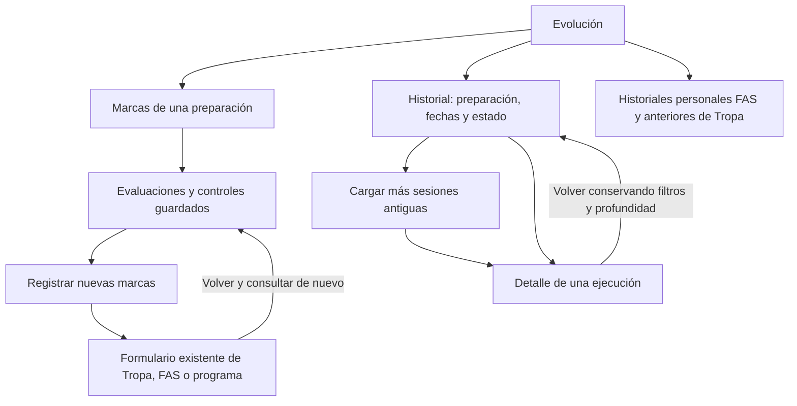
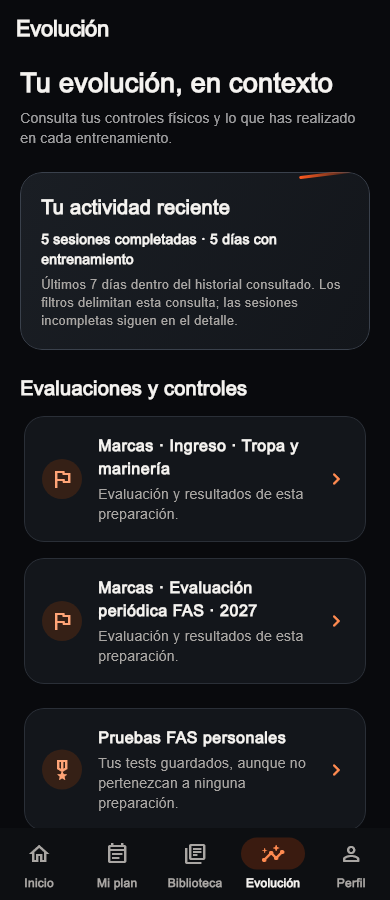
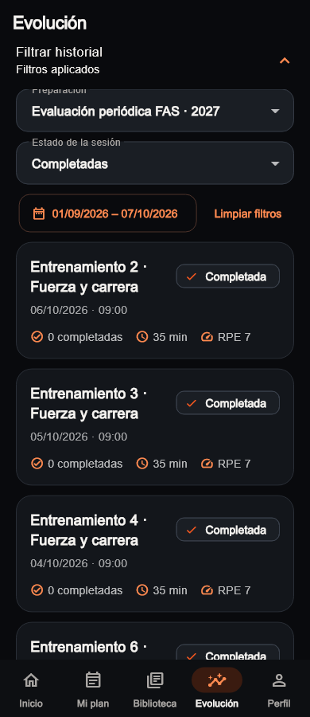
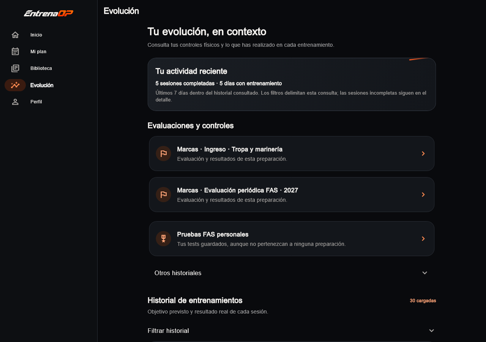
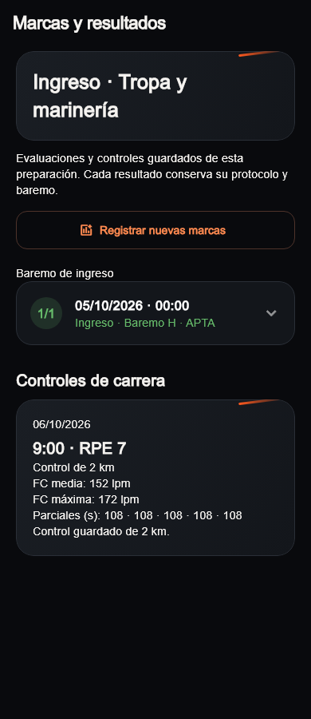
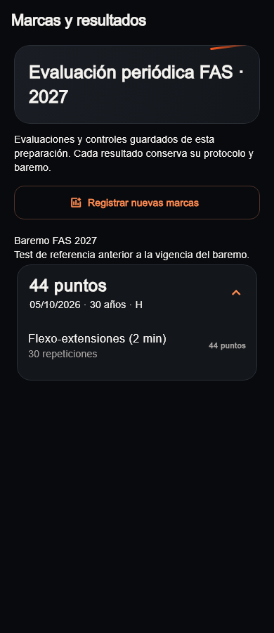
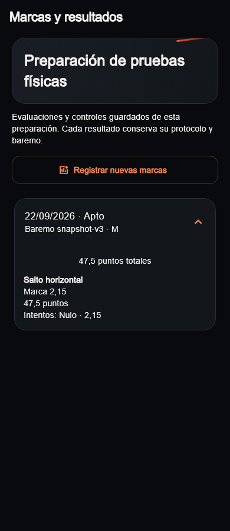
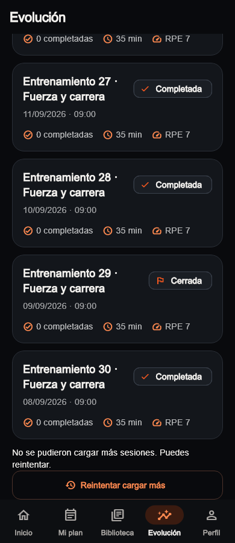
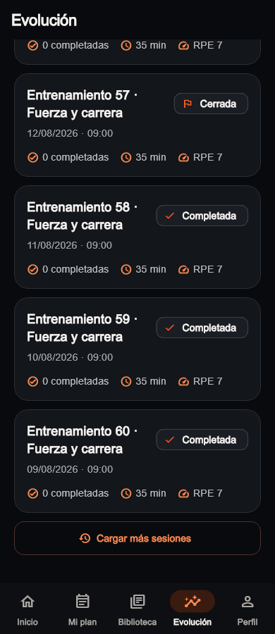
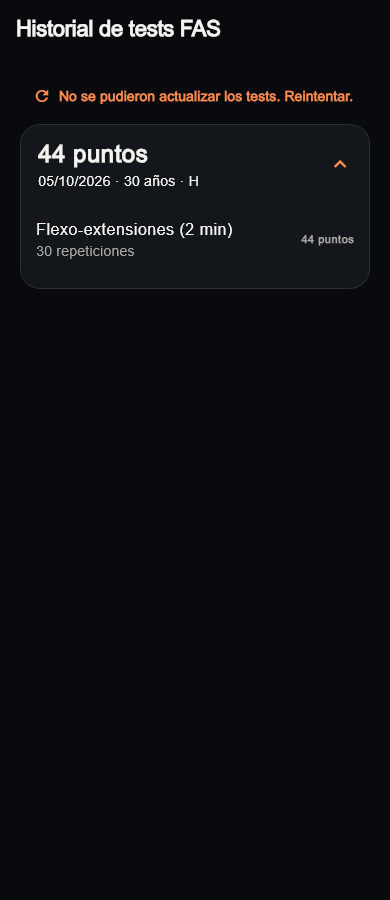

# Evolución: resultados y sesiones antiguas · 07/10/2026

Bloque UI-011, continuando UI-010. Se conserva la base actual y el aspecto de
Inicio/Mi plan, sus portadas, el catálogo y la gestión de preparaciones.
Este bloque no incorpora Free/Pro, cuotas, contratación ni reglas deportivas.

## Lo implementado

| Acceso o función | Comportamiento actual |
|---|---|
| Marcas de una preparación | Abre sus resultados en Evolución; antes abría gestión. |
| Tropa | Consulta evaluación con baremo guardado y controles de carrera. |
| FAS | Reutiliza cálculo versionado existente. Si el baremo no coincide, muestra marcas sin inventar puntos. |
| Evaluación configurable | Muestra resultado, puntuación e intentos guardados, incluidos nulos. |
| Registrar nuevas marcas | Abre el formulario existente; al volver actualiza la consulta. |
| Historial de entrenamientos | Filtra por preparación, fechas de inicio y estado de la sesión. |
| Sesiones antiguas | «Cargar más sesiones», por páginas de 30; no hay corte global a 30. |
| Retorno y refresco | Conservan filtros y profundidad consultada. |
| Error de consulta | Conserva los datos disponibles y ofrece reintento. |
| Cambio de cuenta | Renueva raíz y vistas de resultados, descartando consultas anteriores. |

## Recorrido

## Pantallas del código actual

Las imágenes provienen de widgets Flutter actuales con datos ficticios. No son
maquetas generadas ni una sesión autenticada. El runner usa Arial como Roboto
para evitar la fuente Ahem de tests; carga los iconos de Material. Las portadas
del Inicio real no se modifican y no están sustituidas por estas muestras.
El [manifiesto](visual-audit/refresh-evolution-2026-10-07/manifest.json) registra
fuentes, sus huellas, dimensiones y los 22 frames exportados.

### Evolución y filtros

### Marcas de la preparación

### Reintento y sesiones antiguas

## Comprobación y límites

- `flutter analyze` sin incidencias y 537 pruebas completas de raíz correctas.
- Compilación web debug correcta, sin despliegue.
- Nueve recorridos de captura correctos; revisión visual móvil/escritorio.
- Regresiones de filtros combinados, vacío/limpieza, fallo/reintento, navegación
  con router real, renovación/cambio de cuenta y respuestas tardías.
- Paginación con empates de fecha, 65 y 1205 sesiones; refresco conserva la
  profundidad sin pedir una única respuesta de tamaño creciente.
- Contrato HTTP PostgREST probado contra un servidor local: propietario,
  relación de preparación, estado, fechas, orden y cursor. Se contrastó el
  vínculo con las migraciones existentes; no se cambia esquema ni RLS.
- Texto 2× a 320/1100 px en Evolución y resultados configurables.

Falta el recorrido autenticado en navegador/Android y la comprobación de esta
consulta con datos reales de desarrollo. No se ha consultado ni desplegado
producción. Admin y paquetes compartidos no se modifican.

Las comparativas deportivas nuevas permanecen pendientes: no se trasladan
puntos entre baremos ni se mezclan protocolos. Se conservan las comparaciones
anteriores del historial físico de Tropa. No hay filtro por tipo deportivo
porque la ejecución no guarda ese dato como snapshot; no se infiere de una
plantilla actual. El selector de preparación lista las no archivadas; «Todas
las sesiones» conserva también ejecuciones de otras preparaciones o sin vínculo.
Si se perdió un vínculo histórico de agenda, no se inventa para incluirlo en
un filtro. Los resultados configurables presentan la marca sin inferir una
unidad de un catálogo actual cuando su snapshot no la contiene.

El único siguiente bloque UX recomendado es Biblioteca: consulta de vídeo y
gestión de ejercicios propios. Cuenta y pulido transversal/admin siguen después.
Inicio/Mi plan, descubrimiento comercial y negocio Free/Pro mantienen el límite
acordado UI-010; los motores conservan su tarea aparte.
