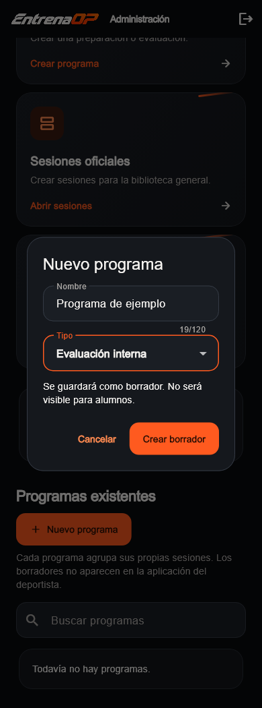
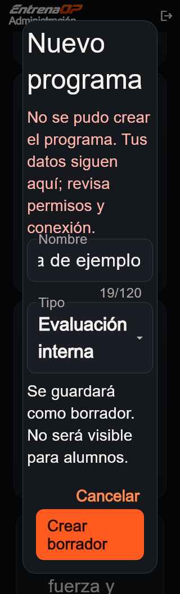
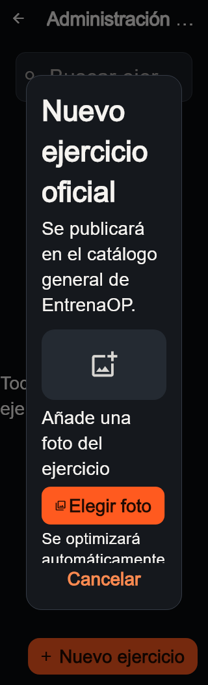

# Formularios: selecciones legibles y foto accesible · 08/10/2026

UI-017 continúa el pulido autorizado de UI-008 después del punto de guardado
de UI-016. La inspección se limita a crear programas y al formulario compartido
de ejercicios. No es una auditoría nueva de todas las pantallas.

## Problema comprobado y corrección

En 320 px con texto doble, el selector de tipo del nuevo programa desbordaba
horizontalmente. Dificultad y Medición habitual en el formulario de ejercicios
presentaban el mismo problema dentro del espacio de un diálogo estrecho.
La prueba del formulario también reprodujo desbordamientos en el mensaje y
los controles de la foto, que estaban dentro de una vista previa de altura fija.

Los tres selectores ahora permiten varias líneas, con altura suficiente y
selección completa. Las opciones, valores guardados, validadores y permisos no
cambian. Crear un programa sigue creando un borrador invisible para deportistas;
el fallo conserva nombre y tipo hasta reintentar o cancelar.

En el formulario de ejercicios, con poco ancho o texto ampliado, la indicación
y los controles de foto pasan debajo de la vista previa. En el resto se mantienen
superpuestos. La imagen conserva proporción 16:9, proveedor y encuadre actuales.
Elegir, cambiar, quitar y optimizar la foto siguen usando el mismo recorrido.
No modifica las tarjetas o portadas de Inicio/Mi plan ni sus fotografías.

## Archivos y fronteras

- `admin_app/lib/features/programs/presentation/admin_programs_page.dart`:
  presentación del selector de nuevo programa.
- `packages/workout_editor_ui/lib/exercise_form.dart`: selectores de ejercicio
  y distribución de los controles de foto. Lo consumen deportista y admin;
  ambos se verifican, sin duplicar formularios.
- Repositorios, RPC, navegación y protección del borrador permanecen iguales.
  No cambia esquema, RLS, configuración de Auth, motores, negocio o producción.
  No añade dependencias.

## Comprobación

- Las cuatro regresiones nuevas fallaban antes de la corrección y pasan después.
  Se comprueba ausencia de desbordamiento y altura real de las selecciones.
- Nuevo programa: ambos tipos a 320 px y texto doble; fallo/reintento conserva
  nombre, tipo y condición de borrador.
- Formulario compartido: cambio de dificultad y medición conserva los valores,
  nombre y grupos musculares al guardar. Se mantienen las pruebas de borrador
  y normalización, además de las de optimización de imágenes del paquete.
- `flutter analyze` limpio en app, admin y `workout_editor_ui`.
- Baterías completas: **591 pruebas de raíz, 91 de admin y 8 del paquete
  correctas**. Se conservan una omisión exclusiva web de raíz y una captura
  optativa del admin; no se retiran ni reducen verificaciones.
- Seis recorridos de captura correctos y **12 imágenes revisadas**, ejecutados
  aparte de las baterías completas. Widgets actuales, tema compartido, router
  del admin y repositorios ficticios, sin autenticación ni Supabase remoto.
  No se suben imágenes; la foto vacía del fixture no indica pérdida de una foto.
  Arial sustituye Ahem del runner; las capturas enfocan distintas posiciones
  del scroll, no todo el formulario a la vez.
- Este tramo no cambia SQL; conserva la comprobación de UI-016 en desarrollo,
  sin consultar ni desplegar producción otra vez.

## Imágenes del código actual

- [Selectores de ejercicio con texto doble](visual-audit/form-accessibility-2026-10-08/texto-ampliado-ejercicio-selectores.webp).
- [Ejercicio en escritorio](visual-audit/form-accessibility-2026-10-08/escritorio-ejercicio-selectores.webp).
- [Manifiesto de las 12 imágenes y fuentes](visual-audit/form-accessibility-2026-10-08/manifest.json).

## Límite y único siguiente bloque recomendado

Comprobación autenticada de los recorridos actuales de app/admin, registrando
los defectos concretos encontrados. La pestaña local disponible al agente sigue
sin sesión y devuelve el historial al acceso; no se pide la contraseña de Javier
ni se fabrica una sesión para acreditar ese recorrido.

Este cierre corresponde a los formularios indicados, no a todo el pulido
transversal. Comparación configurable y revisión física permanecen abiertas.
Recepción y recuperación web ya confirmadas en MAIL-001; iPhone/iOS espera al
entorno Mac de Javier. Los pendientes móviles de seguridad, eliminación de
cuenta y privacidad siguen en UI-013. Vídeos, negocio y motores continúan aparte.
