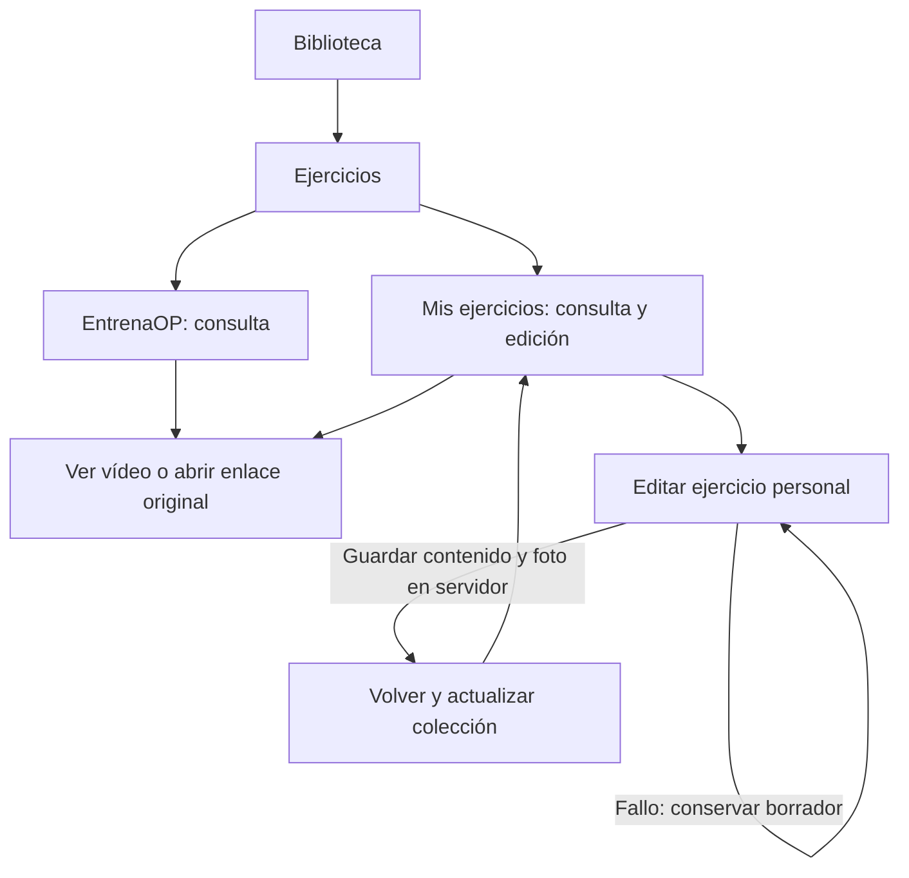
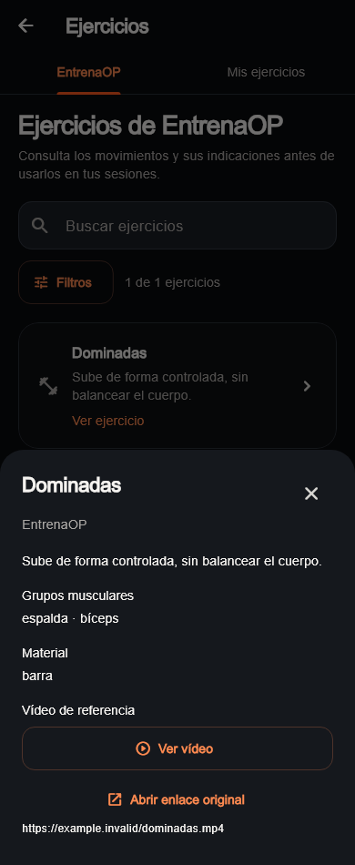
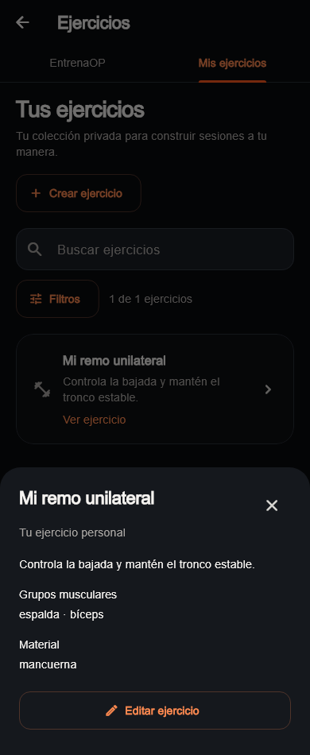
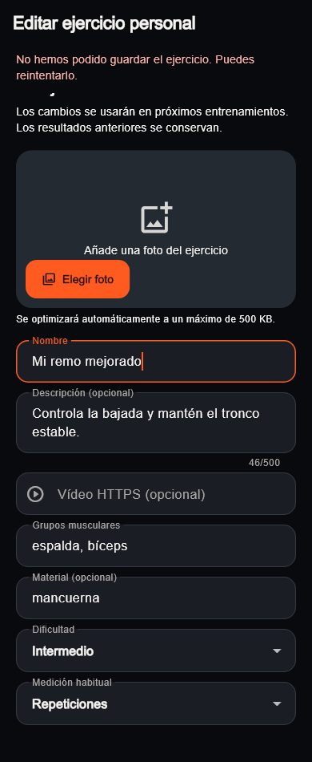
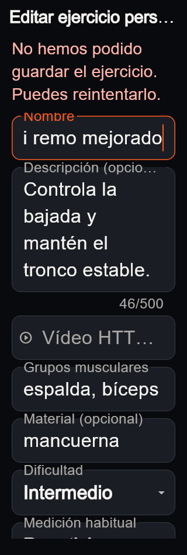
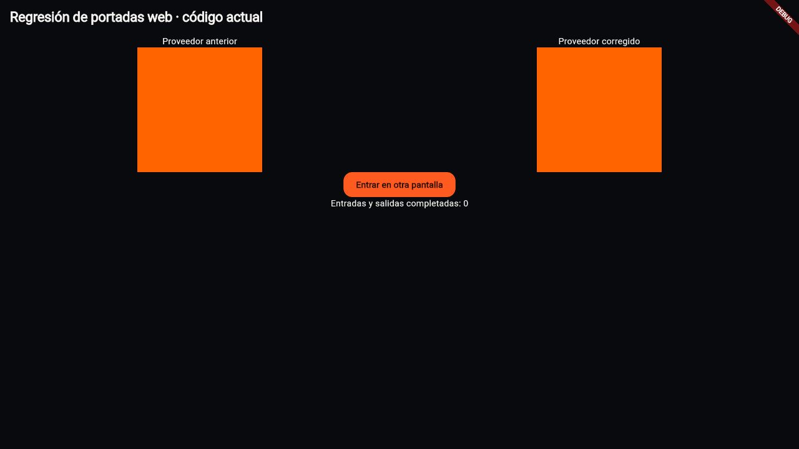
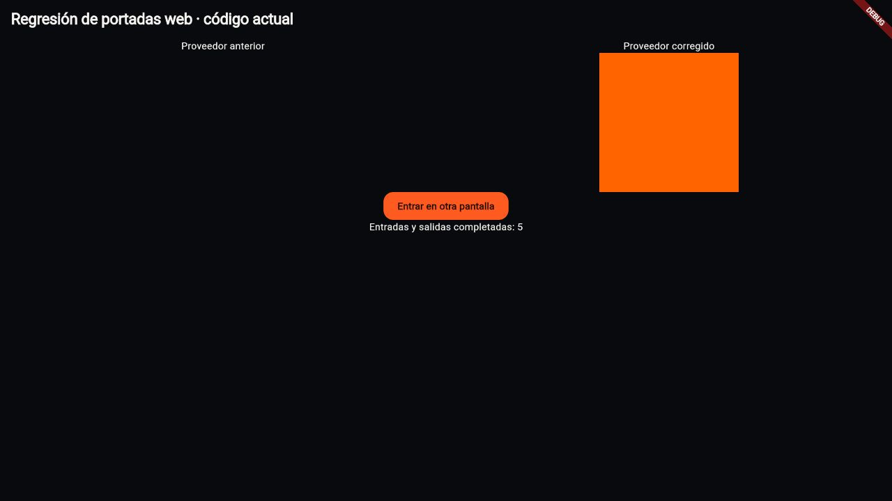

# Biblioteca y fotografías al navegar · 08/10/2026

UI-012 continúa el refresh autorizado, conservando las pantallas y las tarjetas
fotográficas actuales. Corrige la pérdida de imagen en web y completa consulta
de vídeo y edición privada de ejercicios. Inicio y Mi plan mantienen su diseño;
negocio Free/Pro, catálogo comercial y motores permanecen en sus trabajos aparte.

## Comportamiento implementado

| Recorrido | Resultado |
|---|---|
| Salir y volver a una preparación en web | La portada usa el proveedor de Flutter y conserva la imagen estática. |
| Portadas en móvil | Conservan el proveedor con caché en disco. |
| Ejercicio con vídeo | Carga al pulsar; reproducción, pausa y progreso. |
| Referencia externa | «Abrir enlace original» permite consultar páginas como YouTube; fallo con enlace copiable. |
| Ejercicio personal privado | Su detalle ofrece «Editar ejercicio». |
| Guardado fallido | Error visible, texto/foto/borrador conservados y botón de guardado accesible. |
| Salir con cambios | Confirmación del borrador existente, mediante la guarda de trabajo. |
| Guardado correcto | Retorno a la colección y nueva consulta conservando búsqueda y filtros. |
| Foto del ejercicio propio | Conservación por defecto; sustitución o retirada explícita. |
| Cambio de cuenta | Colección y editor se renuevan; no conservan contenido del anterior propietario. |
| Entrenamientos anteriores | Nombre, descripción, vídeo y prescripción de sus instantáneas permanecen intactos. |

## Imágenes del código actual

Estas capturas provienen de widgets Flutter actuales con datos ficticios,
fuentes legibles e iconos reales. No son maquetas ni una cuenta autenticada.
El [manifiesto](visual-audit/refresh-library-2026-10-08/manifest.json) registra
fuentes, huellas, dimensiones y doce capturas del catálogo, detalle y editor.

## Causa y comprobación de las fotografías

El modelo y las consultas conservaban las rutas y los encuadres. La causa
reproducida está en la interacción del proveedor de caché con el motor web:
al reactivar la ruta, su completer vuelve a pedir un fotograma del mismo
elemento HTML. Al liberar el anterior, Flutter vacía `imageElement.src`, dejando
sin foto el nuevo fotograma. `NetworkImage` conserva el fotograma estático y
usa la caché HTTP del navegador. No se alteran datos de Storage ni el tratamiento
visual del componente compartido.

`tools/cover_navigation_probe.dart` reproduce ambos proveedores con el mismo PNG
de color. Se compiló con Flutter y se recorrieron cinco entradas/salidas mediante
`go_router` en navegador Chromium real. La imagen anterior desaparece y la actual
permanece visible. El PNG de color permite aislar el ciclo de imagen sin cuentas,
fotografías privadas o servicios remotos.

## Validación y límites

- Análisis de app y admin sin incidencias. 544 pruebas de raíz y 85 de admin
  correctas; una exclusiva web y una optativa de admin omitidas respectivamente.
- Cinco recorridos de captura correctos, móvil/escritorio y editor con texto 2×.
- Pruebas de reintento, borrador, retorno con búsqueda, bloqueo de edición
  oficial, cambio de cuenta, carga bajo demanda y liberación del vídeo.
- `url_launcher` 6.3.2 ya existía como dependencia de Supabase. Se declara
  directamente para los enlaces externos; resolución offline sin cambiar versiones.
- `20261008000000_edit_personal_exercises` aplicada solo a desarrollo. Las 132
  migraciones locales/remotas coinciden. Pruebas SQL de edición, creación e
  imágenes correctas, transaccionales y con `ROLLBACK`.
- La nueva RPC impone autoría y privacidad, normaliza campos, valida una imagen
  privada previamente subida y actualiza contenido/foto de forma atómica. La
  prueba crea una ejecución, edita su ejercicio y confirma la instantánea original.
- Compilación web debug de la app correcta y reproducción comparada del fallo
  de portadas en navegador real. No se despliega.
- El runner automatizado `flutter test --platform chrome` no consiguió iniciar
  la suite: el host web mostró un operador nulo en `host.dart.js`. No se cuenta
  como prueba pasada. La regresión web se comprobó mediante la reproducción
  compilada y cinco retornos visibles; el test exclusivo web se omite en VM.
- No acredita el recorrido completo con la cuenta autenticada de Javier ni un
  dispositivo físico. Tampoco acredita reproducción real de un vídeo remoto:
  los controles/lifecycle se prueban con un controlador simulado. El enlace
  original ofrece salida para servicios incompatibles con el reproductor.
- No incluye borrado/archivado de ejercicios ni revisión concurrente: prevalece
  el último guardado. Las imágenes antiguas o de operaciones inciertas se
  conservan para evitar eliminar un objeto vigente; limpieza de huérfanos aparte.

El siguiente bloque UX recomendado es Cuenta: recuperación de contraseña y
confirmaciones persistentes. Comparativas de Evolución y revisión autenticada
siguen pendientes; no autorizan reabrir el diseño comercial o los motores aquí.
