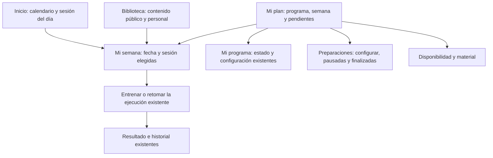
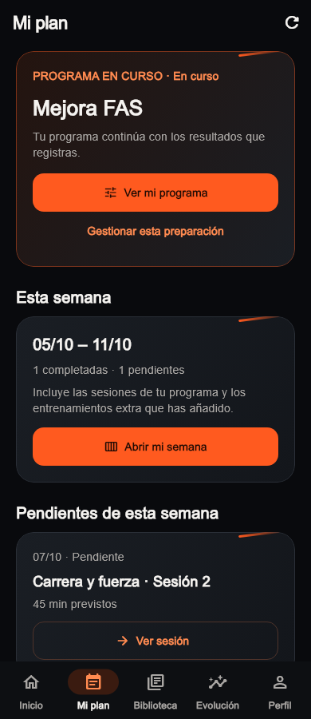
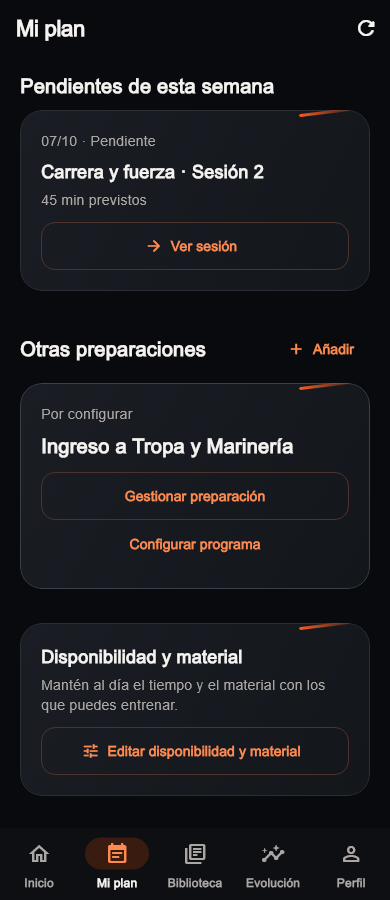
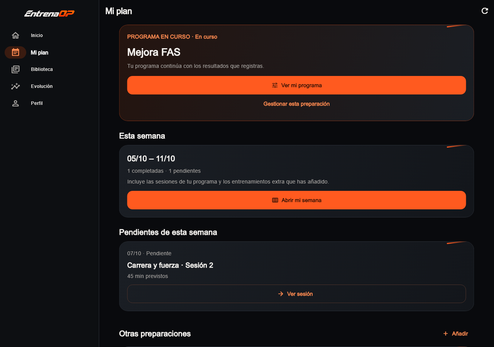
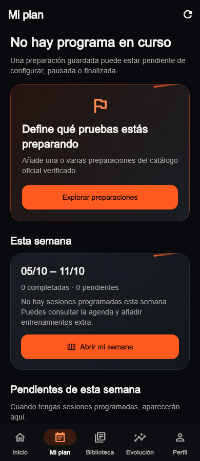
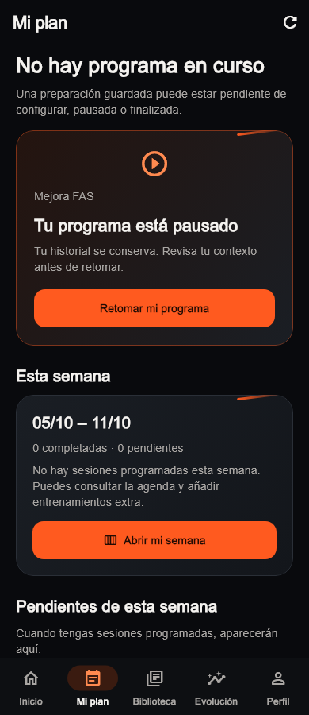
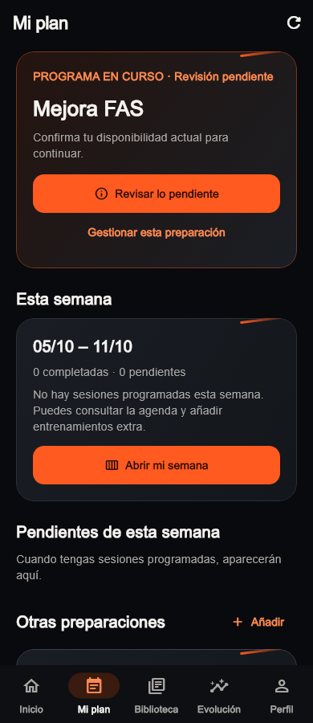
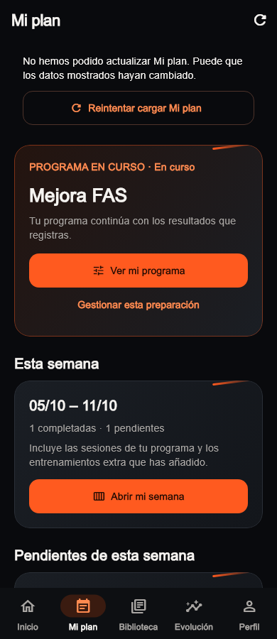
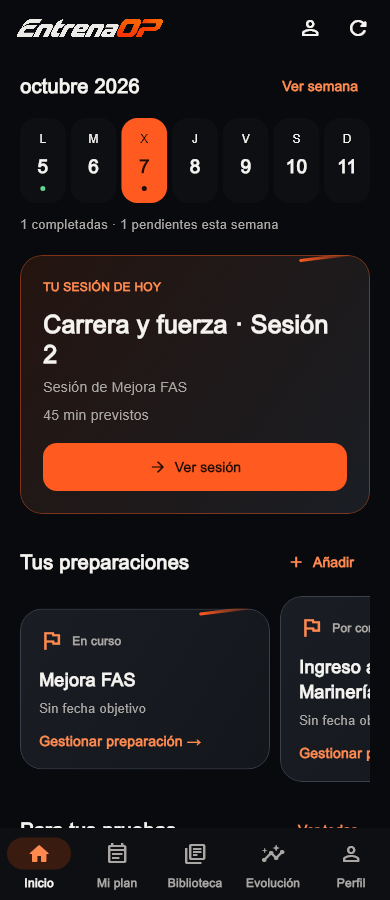
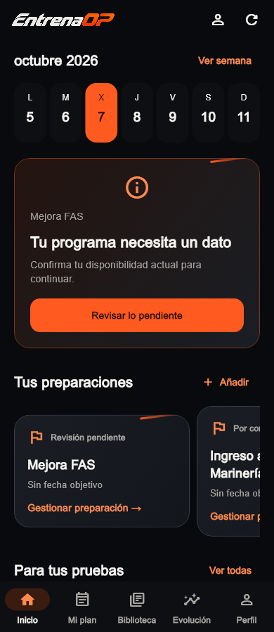

# Inicio y Mi plan: recorrido cerrado el 07/10/2026

Actualización localizada del 08/10/2026: [UI-021](PLAN_COHERENCE_2026_10_08.md)
ajusta el estado sin programa, los nombres de Preparaciones, el contexto común
y el retorno desde una sesión bloqueante. El contenido y las capturas siguientes
conservan su fecha histórica; los siguientes bloques originales deben consultarse
en el estado vigente de [ROADMAP.md](ROADMAP.md).

Estas imágenes renderizan `HomePage`, `TrainingHubPage` y `AppShell` del código
actual. Usan datos simulados, sin cuentas ni consultas a servidor. Arial sustituye
las fuentes del runner; la familia de la etiqueta seleccionada del rail también
se normaliza para evitar los rectángulos de Ahem. No son pantallas inventadas ni
una comprobación autenticada. El [manifiesto](visual-audit/refresh-plan-2026-10-07/manifest.json)
conserva estados, dimensiones, textos y hashes de imágenes y código fuente.

## Recorrido principal



Consultar una sesión abre su fecha y su ID en Mi semana. Retomar utiliza el ID de
la ejecución, sin crear otra ni ejecutar una plantilla independiente. Una semana
sin sesiones no se presenta como descanso prescrito. Las sesiones extra siguen
disponibles desde agenda, incluso sin programa activo.

## Programa y semana







El programa en curso se consulta desde el estado real del servidor; no se infiere
por tener una preparación guardada. El resumen de semana incluye programa y
entrenamientos extra, con recuentos por estado. Se muestran tres pendientes y un
acceso a la agenda completa cuando hay más. Sesiones terminadas/omitidas no se
anuncian como pendientes. Las demás preparaciones conservan sus historiales y
estados de configuración, pausa y finalización.

## Primer acceso, pausa, revisión y fallo









La carga inicial tiene su estado de error y reintento. Al fallar una actualización
se conserva el resumen previo, con un aviso persistente de que puede haber
cambiado. Retomar o revisar abre el programa concreto sin pasar por gestión.
Las tareas protegidas y sus contratos de guardado se conservan.

## Inicio conserva su función diaria





Se mantienen calendario arriba, selección de fecha, preparaciones, herramientas,
Biblioteca y favoritos. La sesión identifica su preparación; el siguiente paso y
los estados comparten presentación con Mi plan, sin cambiar criterios deportivos.
Volver de esa tarea actualiza una sola vez mediante la frontera de navegación.

## Verificación y siguientes bloques

- `flutter analyze` limpio; 505 pruebas completas de raíz correctas.
- Router real: acceso directo, retorno, conservar instancia/scroll, renovar la
  sesión de la misma cuenta y sustituirla al cambiar usuario. Una respuesta de
  la cuenta anterior no actualiza el resumen nuevo.
- Fallo/reintento, conteos mixtos, agenda manual, tres variantes de evaluación y
  consulta/retorno de sesiones sin perder su vínculo.
- Texto 2× a 320 × 480 y 1100 × 480; ocho recorridos de captura correctos.
- No cambia admin, paquetes compartidos, SQL, algoritmos ni producción.

Pendiente la comprobación autenticada en dispositivo real. El próximo bloque UX
es Evolución/Marcas con resultados por preparación, filtros e historial antiguo.
Siguen abiertos Biblioteca, cuenta y pulido transversal/admin.

Para regenerar evidencia, ejecutar desde raíz:

```powershell
flutter test tools/visual_refresh_plan_capture.dart
python tools/export_refresh_plan_captures.py
```

La exportación comprueba las dimensiones y escribe WebP sin pérdida y manifiesto.
No modifica las imágenes históricas de `docs/visual-audit/2026-10-07`.
