# EntrenaOP: mapa visual y funcional del código actual

Instantánea: **07/10/2026**, sobre `cf7025f`, versión auditada del PC de Javier.
Esta tarea analiza y documenta; no cambia pantallas, datos, algoritmos o producción.
Las propuestas no se convierten en decisiones aprobadas por aparecer aquí.

Los avances posteriores de UI-008 se contrastan en
[REFRESH_STATUS_2026_10_07.md](REFRESH_STATUS_2026_10_07.md). Estas imágenes
conservan su revisión de origen; no representan los estados de error/guardado
añadidos después ni sustituyen la evidencia del código y las pruebas actuales.
La reorganización posterior de Inicio/Mi plan dispone de sus propias
[20 capturas y recorrido verificado](REFRESH_PLAN_2026_10_07.md); el atlas inicial
mantiene la versión de origen y no debe utilizarse para describir esa raíz actual.

## Evidencia y límites de las imágenes

- **49 vistas públicas** de Flutter: 35 de la app y 14 del admin, incluyendo
  diálogos, laboratorios y las dos vistas antiguas sin entrada actual. Se añaden
  siete formularios/diálogos privados y dos componentes de programa/carrera:
  **58 vistas inventariadas** en total.
- Todas tienen imagen procedente de su **widget actual**, renderizado por
  Flutter; ninguna se ha dibujado como maqueta. Se reutilizan fixtures existentes
  y se añaden seis fixtures visuales para pantallas que no tenían uno.
- Los fotogramas de trabajo se cuentan en el manifiesto. Se seleccionan hasta tres estados distintos
  por vista para la evidencia versionada. No equivalen a pantallas diferentes ni a
  recorridos completos. El catálogo diferencia actual, pendiente y propuesta.
- Tema compartido `EntrenaTheme.dark`, iconos reales y Arial cargada como Roboto
  para sustituir Ahem de los tests. Fuente/métricas, datos, fecha del fixture y
  dimensiones pueden diferir del dispositivo. Algunos fixtures incluyen router
  y barra real; otros aíslan contenido. No se añade barra artificialmente.
- Móvil/escritorio se identifican por dimensiones. Los estados de texto ampliado
  son pruebas de accesibilidad. Nombres, marcas y resultados son **ficticios**;
  un catálogo vacío en un fixture no acredita una base de datos vacía.
- Contraste de hoy: análisis de ambas apps sin incidencias; **474 pruebas
  originales de raíz y 74 del admin correctas**, con una del admin omitida por
  su condición de captura optativa. Capturas: 193 pruebas copiadas de app,
  68 del admin y seis complementarias correctas, ejecutadas aparte. Seis casos
  de componentes se vuelven a ejecutar para capturar fases y desglose de carrera.
- No se repite auditoría SQL ni se consulta producción. Supabase de desarrollo
  se comprobó el 06/10 (`AUDIT_2026_10_06.md`); las pruebas/capturas de hoy no
  acreditan el recorrido autenticado en dispositivo.

Fuentes: routers de app/admin, páginas y repositorios relacionados,
`DECISIONS.md` (STR-027/029/032/033 y UI-007/008), `PROGRAMA_ADAPTATIVO.md`,
`ESTRATEGIAS_RENDIMIENTO_V3.md`, `VISUAL_DESIGN.md` y `ROADMAP.md`.
El [manifiesto](visual-audit/2026-10-07/manifest.json) conserva fuente, fixture,
estado, dimensiones, texto visible y commit de cada imagen.

## Estado del producto

**El ciclo principal ya existe en desarrollo:** preparación → contexto y
referencias → revisar/activar propuesta → entrenar/registrar → continuidad
automática. El recorrido consume el servidor; no falta conectar un coordinador
local. Hay varias preparaciones, pero solo una genera entrenamientos por usuario;
cambiar requiere aceptación, pausa la anterior y conserva progreso.

Carrera v5 y coordinación v2.1 tienen recorrido real. Rendimiento v3 añade
fases/previsión, principal/apoyos calibrados, alternativas sin accesorios,
comprobación submáxima y calentamiento guiado omisible. El laboratorio ADMIN
experimental no convierte este recorrido del deportista en simulación. Tampoco
acredita eficacia deportiva humana o todo el banco de estrategias: controles
específicos, prioridades por déficit y ampliar cuerda/reactividad siguen abiertos.

La marca y el tema son coherentes entre las dos apps. La mayor deuda visible es
la **organización y continuidad de la información**: Mi plan aún sirve como menú,
mientras Mi programa tiene los datos activos que deberían orientar ese menú.
Marcas, historiales y herramientas se distribuyen entre destinos que se solapan.

El admin actual **ya usa go_router**, URLs por ID, comprobación de acceso y
recursos, reintento y renovación de pila al cambiar identidad. Referencias,
creación de programa y edición de ejercicios conservan el formulario para
revisión; evaluaciones/editor admin protegen cambios pendientes. Son avances
de UI-008 que se conservan; no se vuelven a presentar como ausentes.

## Mapa de navegación de la app

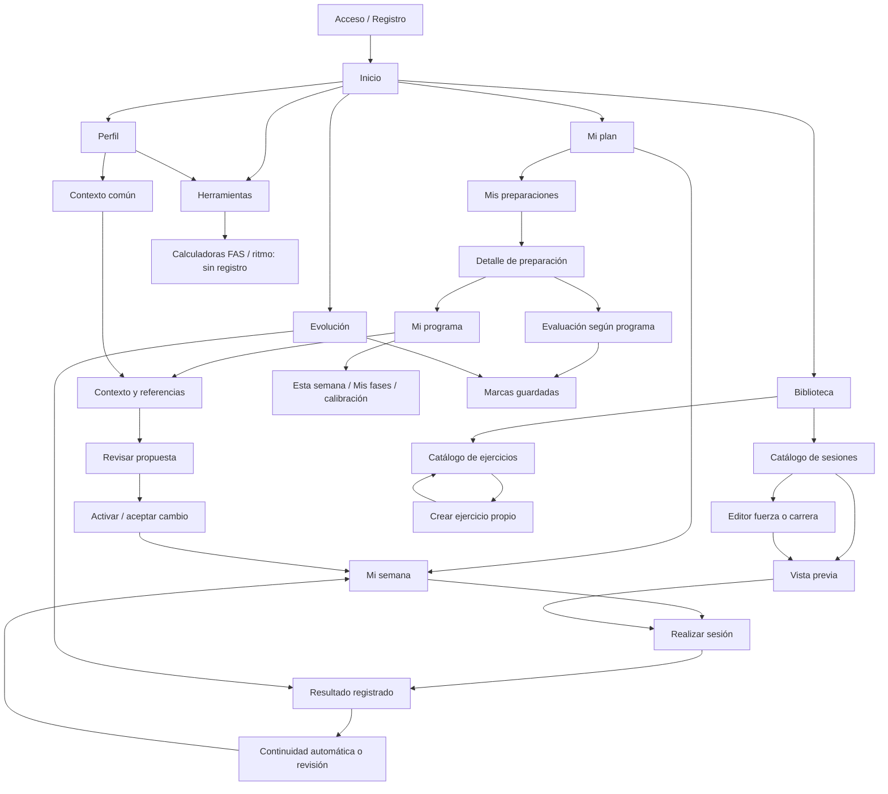
```mermaid
flowchart TD
  ACC[Acceso / Registro] --> INI[Inicio]
  INI --> PLAN[Mi plan]
  INI --> BIB[Biblioteca]
  INI --> EVO[Evolución]
  INI --> PERF[Perfil]
  PLAN --> SEM[Mi semana]
  PLAN --> PREP[Mis preparaciones]
  PREP --> DET[Detalle de preparación]
  DET --> PROG[Mi programa]
  PROG --> CONF[Contexto y referencias]
  CONF --> REV[Revisar propuesta]
  REV --> ACT[Activar / aceptar cambio]
  ACT --> SEM
  PROG --> FASE[Esta semana / Mis fases / calibración]
  SEM --> EJEC[Realizar sesión]
  EJEC --> RES[Resultado registrado]
  RES --> CONT[Continuidad automática o revisión]
  CONT --> SEM
  DET --> EVAL[Evaluación según programa]
  EVAL --> HIST[Marcas guardadas]
  EVO --> HIST
  EVO --> RES
  BIB --> SES[Catálogo de sesiones]
  SES --> EDIT[Editor fuerza o carrera]
  SES --> PREV[Vista previa]
  EDIT --> PREV
  PREV --> EJEC
  BIB --> EX[Catálogo de ejercicios]
  EX --> ALTA[Crear ejercicio propio]
  ALTA --> EX
  PERF --> CTX[Contexto común]
  CTX --> CONF
  INI --> HERR[Herramientas]
  PERF --> HERR
  HERR --> CALC[Calculadoras FAS / ritmo: sin registro]
```

Las cinco secciones conservan estado con `StatefulShellRoute`. Las tareas de
configuración, evaluación, creación y ejecución se abren sin barra mediante el
navegador raíz. `/plan/preferences` redirige a `/profile/preferences`; no abre
el formulario antiguo `TrainingPlanPage`.

**Entrada secundaria de carrera:** `RunningIntakePage` conserva
`RunningWeekPreviewSection` cuando no se usa como paso integrado `dataOnly`.
Ahí se puede consultar/calcular/publicar una propuesta según estado. El programa
activo tiene su continuidad automática; conviene aclarar ambas entradas para
que la secundaria no parezca la tarea obligatoria de cada semana.

### Tareas completas y puntos de mejora

| Tarea | Recorrido actual | Límite / mejora |
|---|---|---|
| Empezar | Registro/acceso → Inicio → añadir preparación → Mi programa → referencias → propuesta → activar | Clarificar confirmación de correo y recuperación. |
| Entrenar hoy | Inicio o Mi semana → sesión → series/esfuerzo → cerrar → origen o resultado concreto | Revisar pausa/reanudación y conexión inestable en dispositivo. |
| Continuar programa | Resultados resuelven sesiones → servidor prepara continuación o pide datos → Inicio/agenda recuperan | El usuario no recalcula manualmente otra semana; ese recorrido histórico está superado. |
| Cambiar programa activo | Otra preparación → propuesta → aceptar pausa de actual → nueva agenda | Resaltar qué programa genera sesiones y conservar confirmación. |
| Actualizar contexto | Perfil o Mi programa → mismo contexto → revisión de pendientes cuando corresponde | Guardar no borra resultados ni reinicia; mejorar refresco entre secciones. |
| Registrar marcas | Preparación → evaluación Tropa/FAS/programa pertinente → guardar | Distinguir referencia, control de entrenamiento, nota oficial y calculadora. |
| Consultar marcas | Evolución → Marcas/Tus preparaciones → detalle; historiales físicos/FAS separados | Pendiente UI-008: resultado específico sin desvío a configuración. |
| Control de carrera | Preparación → Test 2 km → tiempo/RPE/opcionales → historial de esa preparación | Protocolo definitivo pendiente; la marca no se comparte entre programas. |
| Crear sesión | Biblioteca/Mis sesiones → editor fuerza o carrera → guardar → vista previa → realizar | Entradas solapadas Mi plan/Biblioteca y ruta `/plan/library`. |
| Crear ejercicio | Biblioteca → ejercicios → alta → guardar → colección recargada | Alta disponible; completar ficha/vídeo y gestión posterior. |
| Calcular | Herramientas → calculadora FAS o ritmo | No guarda un intento ni prescribe entrenamientos. |

## Mapa y responsabilidades del admin

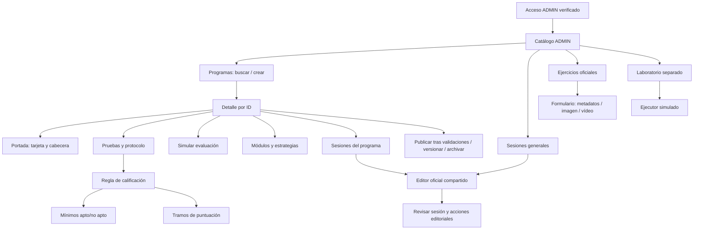
```mermaid
flowchart TD
  LOGIN[Acceso ADMIN verificado] --> HUB[Catálogo ADMIN]
  HUB --> PROGS[Programas: buscar / crear]
  PROGS --> DET[Detalle por ID]
  DET --> COVER[Portada: tarjeta y cabecera]
  DET --> PR[Pruebas y protocolo]
  PR --> REGLA[Regla de calificación]
  REGLA --> MIN[Mínimos apto/no apto]
  REGLA --> PUNT[Tramos de puntuación]
  DET --> SIM[Simular evaluación]
  DET --> MOD[Módulos y estrategias]
  DET --> SP[Sesiones del programa]
  HUB --> SG[Sesiones generales]
  SG --> ED[Editor oficial compartido]
  SP --> ED
  ED --> PREV[Revisar sesión y acciones editoriales]
  HUB --> EX[Ejercicios oficiales]
  EX --> FORM[Formulario: metadatos / imagen / vídeo]
  HUB --> LAB[Laboratorio separado]
  LAB --> EXEC[Ejecutor simulado]
  DET --> PUB[Publicar tras validaciones / versionar / archivar]
```

Admin gestiona contenido oficial, reglas de evaluación y configuración; no se
confunde con Perfil, entrenador o derechos comerciales. Versiones publicadas
limitan edición; publicar baremos incompletos no es un simple cambio de estado.
Las rutas comprueban acceso, recurso y correspondencia prueba/programa.

El detalle reúne portada, pruebas, reglas, módulos, estrategias, sesiones,
simulación y publicación. **Propuesta:** agrupar estas capacidades y conservar
estado/validaciones, sin quitar controles técnicos por economizar recursos.

## Superficies secundarias y estados

| Área | Superficies implementadas que revisar junto con la pantalla |
|---|---|
| Navegación | Salida con cambios, continuar editando, descartar/borrador según tarea; salir de sesión retomable separado de abandonarla. |
| Inicio | Selección/orden de favoritos; primer acceso, siguiente paso, sesión en curso y completada. |
| Preparaciones | Selección de programa, fecha, salir de preparación, alcance; referencias por variante/protocolo; confirmar pausa/reinicio/cambio. |
| Mi programa | Configuración, propuesta bloqueada/revisada, activo/pausado, reanudación, datos pendientes, fases y calibración. |
| Sesiones | Fuerza/carrera, ejercicio/material, formatos, copiar series/tramos, recuperar borrador, menús personales y acciones editoriales. |
| Agenda | Elegir sesión, mover fecha/retirar con confirmación; fechas/estados; semanas futuras sin volver al cuestionario. |
| Ejecución | Avisos/relojes, guiado omisible, esfuerzo declarado, abandono/motivo, cierre/notas; objetivo no acredita esfuerzo real. |
| Resultados | Detalle/desplegables; petición de corrección con contexto y registro, conservando la pauta histórica. |
| Evaluación | Edad/categoría/fecha, unidades/pruebas, mínimos/puntos, guardar/error/reintento y protección de salida. |
| Editorial admin | Crear programa, prueba/protocolo, regla, mínimo, tramo de puntos, estrategia, portada, publicar/archivar; restricciones por estado/versión. |
| Carga/permisos | Vacío/carga/error/reintento; sesión, recurso inexistente y falta de acceso en admin. Estado de fixture no demuestra fallo en producción. |

Los siete diálogos editoriales/de reinicio con clase privada se incluyen con
imagen propia. Los diálogos genéricos, hojas, selectores y menús se documentan
como estados de sus páginas. No todos los estados combinatorios están capturados.
Archivo/cámara nativos y correo de confirmación quedan fuera del render de
widgets y requieren una prueba autenticada en su plataforma.

## Qué mover, cambiar o completar

| Orden | Estado | Trabajo | Criterio de resultado |
|---|---|---|---|
| 1 | Pendiente acordado UI-008 | Guardado retenido restante y refresco entre secciones | Error conserva valores; éxito confirma; retorno actualiza sin perder filtros/posición. |
| 2 | Pendiente acordado UI-008 | Mi plan orientado al programa activo/semana | Entrenar sin elegir entre menús equivalentes; pausa y continuidad visibles. |
| 3 | Pendiente acordado UI-008 | Evolución/Marcas con destino específico | Resultados comparables por preparación e historial sin rodeo por configuración. |
| 4 | Pendiente acordado UI-008 | Biblioteca operativa | Ficha/vídeo y gestión personal; crear, consultar y reutilizar con entradas claras. |
| 5 | Pendiente acordado UI-008 | Confirmación/recuperación de cuenta | Mensajes persistentes y siguiente acción inequívoca. |
| 6 | Pendiente acordado UI-008 | Terminología, contraste y jerarquía del admin | Separar contenido, evaluación, planificación y laboratorio sin perder capacidades. |
| Deportivo | Pendiente STR-029/032 | Controles de protocolo y prioridades por déficit | Datos comparables, motivo, sustitución de carga, recuperación y efecto posterior; después ampliar cuerda/reactividad. |
| Antes de publicar | Límite de verificación | Recorrido autenticado Android/web, después iOS en su entorno | Alta, cambio de cuenta, activar/pausar/retomar, entrenar/cerrar, refrescar/reanudar con datos reales. |

Recomendación inmediata: **cerrar guardado y refresco antes de reorganizar Mi plan
y Evolución**, como establece el roadmap. El inventario no autoriza todos los
rediseños ni cierra el bloque deportivo. Suscripciones/pagos, relación
entrenador-cliente, eliminación de cuenta y recuperación explícita de borradores
v1 no tienen un recorrido completo en estas pantallas; son alcances separados,
no razones para sustituir el código local por decisiones de chats antiguos.

## Reproducción

`tools/capture_visual_atlas.py` prepara copias ignoradas de fixtures en
`build/visual-atlas-20261007/tests`; `visual_atlas_capture.dart` obtiene
píxeles/metadatos; `visual_atlas_supplement.dart` cubre las seis vistas restantes;
`build_visual_atlas.py` selecciona evidencia y genera manifiesto, inventario y
atlas desde catálogo/plantilla. Requiere Flutter, Python/Pillow y fuentes Windows;
no añade dependencias a las apps. Los widgets y tests originales quedan intactos.

Con Python ejecutar `tools/capture_visual_atlas.py app` y `… admin`. Desde cada
raíz ejecutar Flutter test sobre el directorio generado con
`--dart-define=ATLAS_COMMIT=cf7025f`, y además `CAPTURE_PERFORMANCE_REVIEW=true` en
app o `CAPTURE_COVERS=true` en admin. Desde raíz ejecutar también
`tools/visual_atlas_supplement.dart`. Por último ejecutar
`tools/build_visual_atlas.py <directorio-absoluto-de-visualizaciones>`.
El commit pasado identifica esta instantánea: para otra fecha hay que actualizar
commit/catálogo/salida, no etiquetar como actual evidencia de otra versión.

Las copias adaptan tema, fuentes y dos localizadores afectados por el tema.
Las pruebas originales se ejecutan aparte: capturar no sustituye validar.
La evidencia se comprime PNG→WebP sin añadir/quitar elementos. El atlas limita
estados por tamaño; el manifiesto y los enlaces conservan la selección completa.

<!-- INVENTARIO GENERADO: tools/build_visual_atlas.py -->

## Inventario de pantallas y diálogos

Cada imagen procede del widget real. Las vistas adicionales se conservan como enlaces; el atlas permite seleccionar estados sin desplegar este documento entero.

### Aplicación del deportista

#### Acceso

**Implementada** · Cuenta · `LoginPage`

Entrada: `/`.

**Actual:** Entrar con correo y contraseña; mostrar contraseña; validar campos; ir al registro.

**Pendiente / propuesta:** Pendiente acordado: recuperación de contraseña y mensajes de confirmación más persistentes.

Código: [lib/features/auth/presentation/pages/login_page.dart](../lib/features/auth/presentation/pages/login_page.dart).

Fixture: el acceso móvil usa el wordmark y valida antes de enviar; vista 2; 390 × 844.

#### Crear cuenta

**Implementada** · Cuenta · `SignUpPage`

Entrada: `/sign-up`.

**Actual:** Nombre, correo, contraseña y repetición; validación y envío de registro.

**Pendiente / propuesta:** Pendiente acordado: hacer más claro el paso de confirmar el correo y volver al acceso.

Código: [lib/features/auth/presentation/pages/sign_up_page.dart](../lib/features/auth/presentation/pages/sign_up_page.dart).

Fixture: el registro comparte la identidad en escritorio; vista 2; 1200 × 820.

#### Inicio

**Implementada** · Inicio · `HomePage`

Entrada: `/home`.

**Actual:** Calendario, siguiente acción, sesión en curso/completada, preparaciones, favoritos y herramientas.

**Pendiente / propuesta:** Pendiente acordado: refresco coherente entre secciones. Propuesta: priorizar una única siguiente acción.

Código: [lib/features/auth/presentation/pages/home_page.dart](../lib/features/auth/presentation/pages/home_page.dart).

Fixture: retoma y consulta resultados existentes; vista 2; 360 × 900.

- [Estado: primer acceso conserva calendario y siguiente paso a 320.0 px · vista 1](visual-audit/2026-10-07/images/HomePage-2.webp)
- [Estado: al seleccionar otro día no inventa un descanso · vista 4](visual-audit/2026-10-07/images/HomePage-3.webp)

#### Mi plan

**Implementada** · Plan · `TrainingHubPage`

Entrada: `/plan`.

**Actual:** Entradas a semana, biblioteca, sesiones propias, preparaciones y contexto.

**Pendiente / propuesta:** Pendiente acordado: organizar por preparación activa; las entradas actuales a sesiones y biblioteca se solapan.

Código: [lib/features/training_plan/presentation/pages/training_hub_page.dart](../lib/features/training_plan/presentation/pages/training_hub_page.dart).

Fixture: Mi plan conserva jerarquía y no desborda a 360 px; vista 2; 360 × 900.

#### Mis preparaciones

**Implementada** · Plan · `PreparationGoalPage`

Entrada: `/plan/goal`.

**Actual:** Consultar, crear y gestionar preparaciones independientes asociadas a programas.

**Pendiente / propuesta:** Propuesta: distinguir mejor programa publicado, preparación personal y entrenamiento.

Código: [lib/features/preparation_goal/presentation/pages/preparation_goal_page.dart](../lib/features/preparation_goal/presentation/pages/preparation_goal_page.dart).

Fixture: muestra el catálogo y permite añadir otra preparación; vista 2; 390 × 844.

- [Estado: abrir un programa no convierte una fecha de agenda en una orden de cálculo · vista 2](visual-audit/2026-10-07/images/PreparationGoalPage-2.webp)
- [Estado: muestra el catálogo y permite añadir otra preparación · vista 5](visual-audit/2026-10-07/images/PreparationGoalPage-3.webp)

#### Detalle de preparación

**Implementada** · Plan · `PreparationDetailPage`

Entrada: `/plan/goal/:goalId`.

**Actual:** Portada, fecha objetivo, programa, contexto, evaluaciones y acciones de entrenamiento según tipo de programa.

**Pendiente / propuesta:** Propuesta: jerarquizar pasos pendientes, siguiente sesión y marcas; no todas las acciones existen para todos los programas.

Código: [lib/features/preparation_goal/presentation/pages/preparation_detail_page.dart](../lib/features/preparation_goal/presentation/pages/preparation_detail_page.dart).

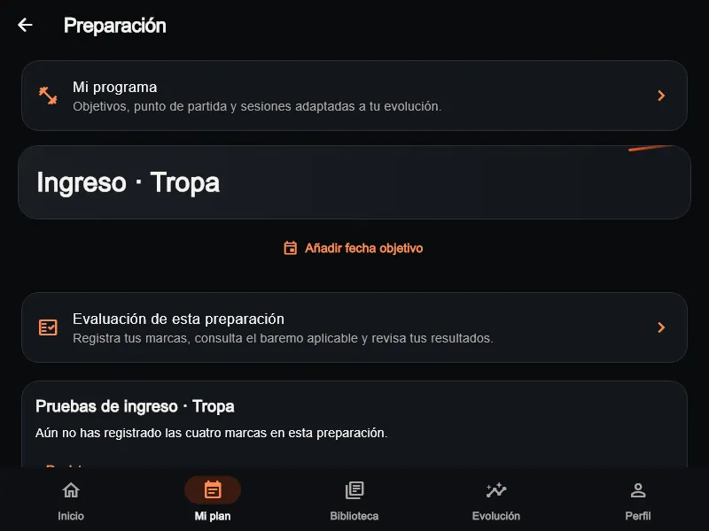

Fixture: cambiar Tropa por FAS renueva los datos en ; vista 2; 800 × 600.

- [Estado: Tropa muestra una marca solo si pertenece a la preparación · vista 2](visual-audit/2026-10-07/images/PreparationDetailPage-2.webp)
- [Estado: Tropa muestra solo su marca propia y la agenda · vista 2](visual-audit/2026-10-07/images/PreparationDetailPage-3.webp)

#### Mi programa: configurar y entrenar

**Implementada** · Plan · `PreparationTrainingPage`

Entrada: `/plan/goal/:goalId/training`.

**Actual:** Preparación completa/solo carrera/solo rendimiento; fecha y metas, contexto común, referencias, propuesta y activación. Programa activo: Esta semana, Mis fases, calibración, pausa/reanudación y continuidad automática desde resultados. Solo un programa genera sesiones por usuario.

**Pendiente / propuesta:** Pendiente deportivo: controles específicos de protocolo y prioridades por déficit; ampliar cuerda/reactividad después. La coordinación y la continuidad ya están implementadas en desarrollo, sin activar todo el banco de estrategias.

Código: [lib/features/preparation_goal/presentation/pages/preparation_training_page.dart](../lib/features/preparation_goal/presentation/pages/preparation_training_page.dart).

Fixture: un programa activo no devuelve al cuestionario ni al calculador; vista 2; 390 × 844.

- [Estado: carrera es un bloque del programa y la propuesta requiere revisión · vista 2](visual-audit/2026-10-07/images/PreparationTrainingPage-2.webp)
- [Estado: reiniciar ensayos exige confirmación y conserva los datos para una propuesta nueva · vista 2](visual-audit/2026-10-07/images/PreparationTrainingPage-3.webp)

#### Contexto personal

**Implementada** · Plan · `TrainingContextPage`

Entrada: `/profile/preferences`.

**Actual:** Disponibilidad, experiencia, material y limitaciones; guardar contexto reutilizable.

**Pendiente / propuesta:** Pendiente acordado: refrescar sus consumidores conservando el estado. Propuesta: explicar qué datos son comunes y cuáles son de cada preparación.

Código: [lib/features/training_plan/presentation/pages/training_context_page.dart](../lib/features/training_plan/presentation/pages/training_context_page.dart).

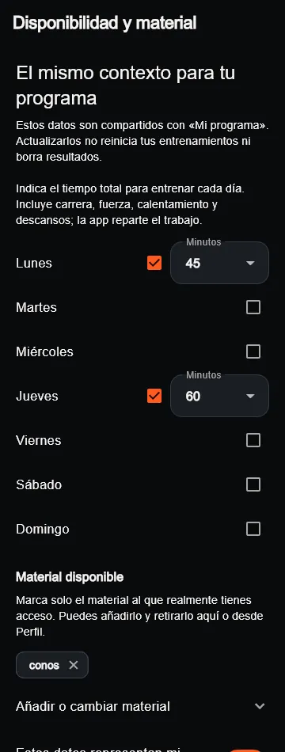

Fixture: disponibilidad y material se pueden editar a 360.0 px; vista 2; 360 × 950.

#### Contexto de carrera

**Implementada** · Carrera · `RunningContextFormPage`

Entrada: `/plan/goal/:goalId/running-context`.

**Actual:** Experiencia y carga reciente, disponibilidad y contexto de carrera; reutilización de datos comunes.

**Pendiente / propuesta:** Propuesta: reducir duplicación con el recorrido integrado y aclarar por qué se pide cada referencia.

Código: [lib/features/preparation_goal/presentation/pages/running_context_form_page.dart](../lib/features/preparation_goal/presentation/pages/running_context_form_page.dart).

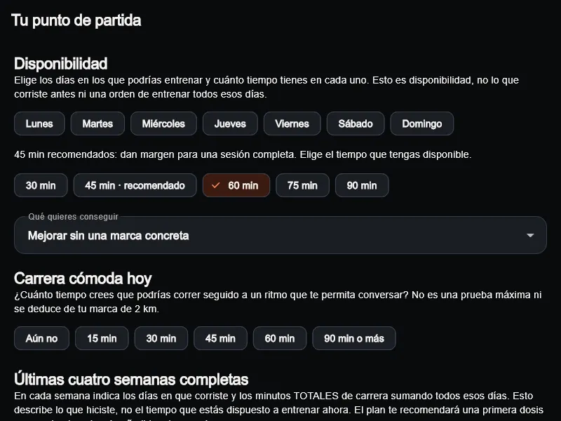

Fixture: reutiliza la duración del perfil sin inventar los días; vista 2; 800 × 600.

- [Estado: cambiar Tropa por FAS renueva los datos en /running-context?program=true · vista 2](visual-audit/2026-10-07/images/RunningContextFormPage-2.webp)
- [Estado: guarda cero carrera sin confundirlo con semanas sin responder · vista 3](visual-audit/2026-10-07/images/RunningContextFormPage-3.webp)

#### Preparar carrera

**Implementada** · Carrera · `RunningIntakePage`

Entrada: `/plan/goal/:goalId/running-intake`.

**Actual:** Preguntas de carrera, referencia inicial, contexto, propuesta y reinicio confirmado; también se integra como paso de Mi programa. La planificación vigente usa carrera v5 en servidor y agenda/ejecutor comunes.

**Pendiente / propuesta:** Pendiente deportivo: controles comparables y protocolos específicos; la existencia del motor técnico no acredita eficacia deportiva humana ni cobertura de todo el banco.

Código: [lib/features/preparation_goal/presentation/pages/running_intake_page.dart](../lib/features/preparation_goal/presentation/pages/running_intake_page.dart).

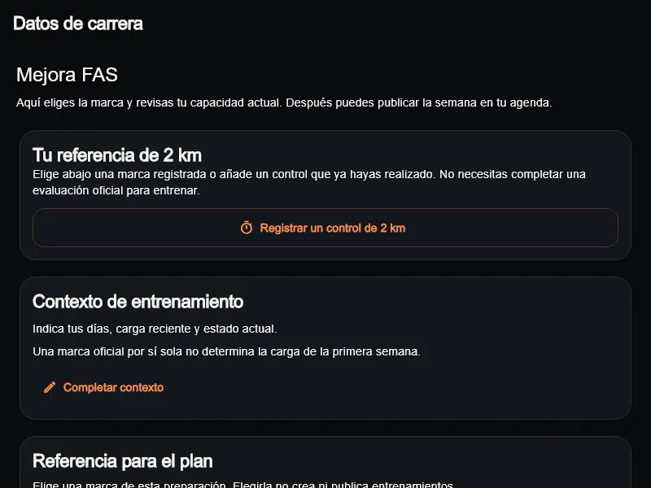

Fixture: FAS muestra su marca y contexto; solo datos: true; vista 2; 800 × 600.

- [Estado: cambiar Tropa por FAS renueva los datos en /running-intake?dataOnly=true · vista 2](visual-audit/2026-10-07/images/RunningIntakePage-2.webp)
- [Estado: reinicia solo tras dos confirmaciones y actualiza el plan · vista 2](visual-audit/2026-10-07/images/RunningIntakePage-3.webp)

#### Simular una semana

**Implementada** · Carrera · `RunningWeekSimulatorPage`

Entrada: `/plan/goal/:goalId/week-simulator`.

**Actual:** Explorar una propuesta semanal con contexto y referencia; explica la simulación.

**Pendiente / propuesta:** Simulador: separar claramente ensayo de semana asignada y de sesiones realmente realizadas.

Código: [lib/features/preparation_goal/presentation/pages/running_week_simulator_page.dart](../lib/features/preparation_goal/presentation/pages/running_week_simulator_page.dart).

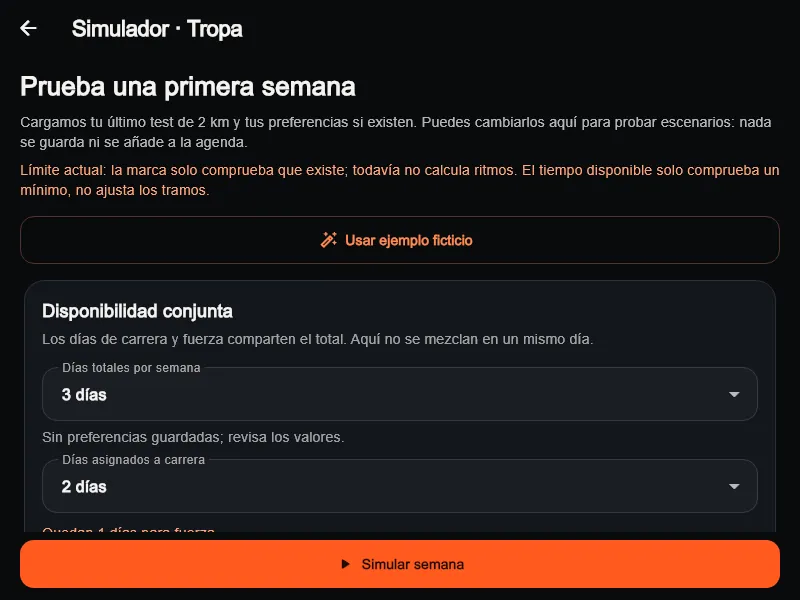

Fixture: el ejemplo ficticio produce carrera y reserva fuerza; vista 2; 800 × 600.

- [Estado: precarga test y preferencias con procedencia visible · vista 3](visual-audit/2026-10-07/images/RunningWeekSimulatorPage-2.webp)
- [Estado: el ejemplo ficticio produce carrera y reserva fuerza · vista 3](visual-audit/2026-10-07/images/RunningWeekSimulatorPage-3.webp)

#### Controles de 2 km

**Implementada** · Carrera · `RunningTestPage`

Entrada: `/plan/goal/:goalId/running-test`.

**Actual:** Explicar control, registrar una marca y consultar su historial dentro de la preparación.

**Pendiente / propuesta:** Pendiente deportivo explícito en pantalla: protocolo definitivo de realización del control.

Código: [lib/features/preparation_goal/presentation/pages/running_test_page.dart](../lib/features/preparation_goal/presentation/pages/running_test_page.dart).

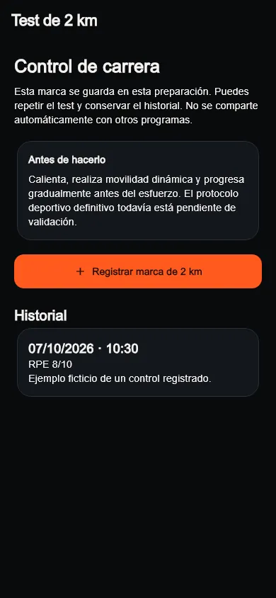

Fixture: Historial real de controles de carrera con fixture; vista 2; 390 × 844.

#### Registrar control de 2 km

**Implementada** · Carrera · `RunningTestFormPage`

Entrada: `/plan/goal/:goalId/running-test/new`.

**Actual:** Tiempo, fecha, RPE, frecuencias cardiacas opcionales, parciales y notas; guardado con protección de salida.

**Pendiente / propuesta:** Propuesta: separar datos mínimos de opcionales; no mezclar control de entrenamiento y examen oficial.

Código: [lib/features/preparation_goal/presentation/pages/running_test_page.dart](../lib/features/preparation_goal/presentation/pages/running_test_page.dart).

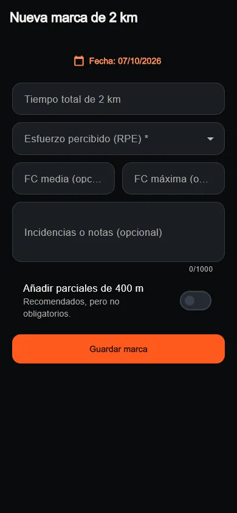

Fixture: Formulario real de control de 2 km; vista 2; 390 × 844.

#### Evaluación Tropa

**Implementada** · Marcas · `InitialAssessmentPage`

Entrada: `/plan/goal/:goalId/troop-assessment`.

**Actual:** Introducir marcas, evaluar mínimos y guardar resultado ligado a preparación.

**Pendiente / propuesta:** Propuesta: un acceso claro a sus resultados y explicar las unidades antes de introducirlas.

Código: [lib/features/physical_assessment/presentation/pages/initial_assessment_page.dart](../lib/features/physical_assessment/presentation/pages/initial_assessment_page.dart).

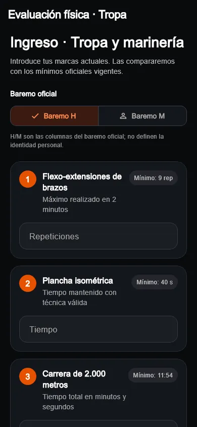

Fixture: Formulario de evaluación Tropa y resultado; vista 2; 390 × 844.

- [Estado: Formulario de evaluación Tropa y resultado · vista 3](visual-audit/2026-10-07/images/InitialAssessmentPage-2.webp)
- [Estado: Formulario de evaluación Tropa y resultado · vista 1](visual-audit/2026-10-07/images/InitialAssessmentPage-3.webp)

#### Evaluación de programa

**Implementada** · Marcas · `ProgramAssessmentPage`

Entrada: `/plan/goal/:goalId/program-assessment`.

**Actual:** Pruebas y reglas del programa configurado, marcas, evaluación y guardado; protección de cambios sin guardar.

**Pendiente / propuesta:** Propuesta: distinguir resultado oficial evaluado de referencia deportiva para planificar.

Código: [lib/features/program_assessment/presentation/program_assessment_page.dart](../lib/features/program_assessment/presentation/program_assessment_page.dart).

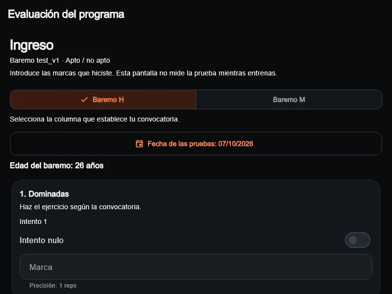

Fixture: registra nulo y segundo intento cuando la prueba lo permite; vista 2; 800 × 600.

- [Estado: solo muestra la prueba aplicable y guarda la marca en la preparación · vista 5](visual-audit/2026-10-07/images/ProgramAssessmentPage-2.webp)
- [Estado: rechaza una preparación que no está activa · vista 2](visual-audit/2026-10-07/images/ProgramAssessmentPage-3.webp)

#### Registrar evaluación FAS

**Implementada** · Marcas · `FasPeriodicAssessmentPage`

Entrada: `/plan/goal/:goalId/periodic-assessment`.

**Actual:** Categoría, edad, marcas pertinentes, puntos y mínimos; guarda intento vinculado a preparación y versión de baremo.

**Pendiente / propuesta:** Propuesta: mantener visible versión/vigencia y simplificar el recorrido de consulta posterior.

Código: [lib/features/physical_assessment/presentation/pages/fas_periodic_assessment_page.dart](../lib/features/physical_assessment/presentation/pages/fas_periodic_assessment_page.dart).

Fixture: un test del perfil FAS solo se vincula tras elegirlo; vista 2; 800 × 1500.

- [Estado: la agilidad desaparece desde los 45 años sin derivar a Tropa · vista 3](visual-audit/2026-10-07/images/FasPeriodicAssessmentPage-2.webp)
- [Estado: un test del perfil FAS solo se vincula tras elegirlo · vista 3](visual-audit/2026-10-07/images/FasPeriodicAssessmentPage-3.webp)

#### Calculadora FAS

**Implementada** · Herramientas · `FasPeriodicCalculatorPage`

Entrada: `/assessment/fas-calculator`.

**Actual:** Simular puntos y mínimos por categoría y edad, sin guardar un intento real.

**Pendiente / propuesta:** Propuesta: distinguir visualmente calcular de registrar para evitar creer que una simulación crea historial.

Código: [lib/features/physical_assessment/presentation/pages/fas_periodic_calculator_page.dart](../lib/features/physical_assessment/presentation/pages/fas_periodic_calculator_page.dart).

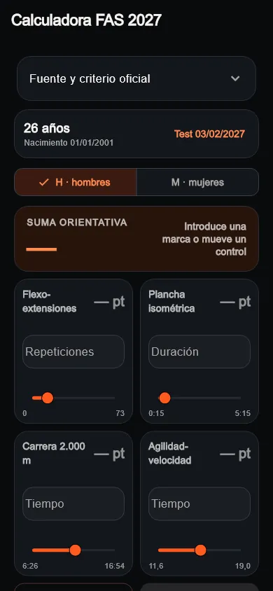

Fixture: agrupa el resumen y las cuatro pruebas en dos columnas; vista 2; 390 × 844.

#### Herramientas

**Implementada** · Herramientas · `HomeToolsPage`

Entrada: `/tools`.

**Actual:** Entradas a calculadora FAS y calculadora de ritmos; también accesibles desde Inicio/Perfil.

**Pendiente / propuesta:** Propuesta: una agrupación coherente con menos accesos repetidos.

Código: [lib/features/dashboard/presentation/widgets/home_tools_section.dart](../lib/features/dashboard/presentation/widgets/home_tools_section.dart).

Fixture: Herramientas disponibles; vista 2; 390 × 844.

#### Calculadora de ritmo

**Implementada** · Herramientas · `RunningPaceCalculatorPage`

Entrada: `/tools/running-pace-calculator`.

**Actual:** Convertir distancia, tiempo y ritmo para consultar equivalencias.

**Pendiente / propuesta:** Propuesta: conservar el carácter de herramienta; un ritmo calculado no es una prescripción adaptativa.

Código: [lib/features/running_tools/presentation/pages/running_pace_calculator_page.dart](../lib/features/running_tools/presentation/pages/running_pace_calculator_page.dart).

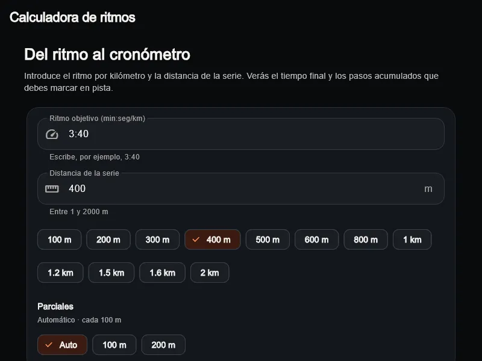

Fixture: mantiene los dos puntos al introducir el ritmo abreviado; vista 1; 800 × 600.

#### Mi semana

**Implementada** · Sesiones · `WorkoutSchedulePage`

Entrada: `/plan/week`.

**Actual:** Fechas, sesiones programadas, estados y apertura de sesión; consulta de semanas.

**Pendiente / propuesta:** Propuesta: mostrar con claridad origen de sesión y preparación, y distinguir propuesta/sesión asignada/completada.

Código: [lib/features/workout_schedule/presentation/pages/workout_schedule_page.dart](../lib/features/workout_schedule/presentation/pages/workout_schedule_page.dart).

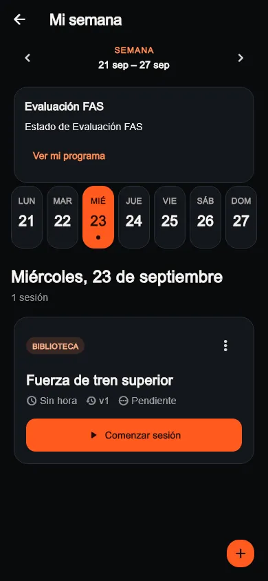

Fixture: Mi semana muestra solo el programa en curso y sigue el cambio al retomar; vista 2; 390 × 844.

- [Estado: una sesión completada abre su resultado en una pantalla estrecha · vista 2](visual-audit/2026-10-07/images/WorkoutSchedulePage-2.webp)
- [Estado: agenda futura muestra continuidad, recupera estado y no ofrece fabricar semanas · vista 2](visual-audit/2026-10-07/images/WorkoutSchedulePage-3.webp)

#### Biblioteca

**Implementada** · Biblioteca · `LibraryHubPage`

Entrada: `/library`.

**Actual:** Acceder al catálogo de sesiones y ejercicios, con distinción entre contenido oficial y personal.

**Pendiente / propuesta:** Pendiente acordado: navegación más clara respecto a Mi plan y a Mis sesiones.

Código: [lib/features/library/presentation/library_hub_page.dart](../lib/features/library/presentation/library_hub_page.dart).

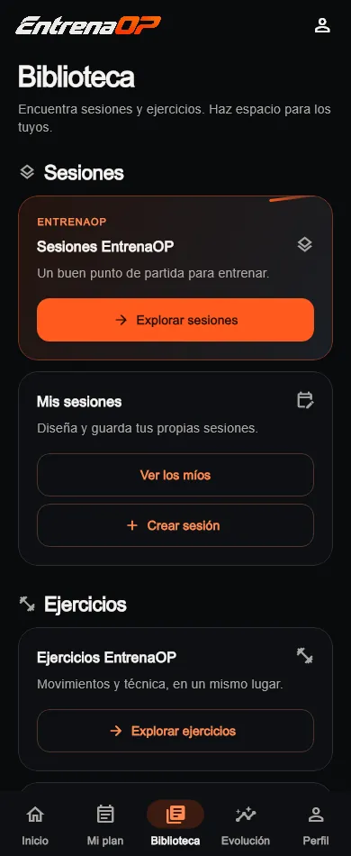

Fixture: el creador real de ejercicios vuelve a la colección y la recarga; vista 2; 390 × 950.

#### Catálogo de sesiones

**Implementada** · Biblioteca · `WorkoutLibraryPage`

Entrada: `/plan/library?tab=personal`.

**Actual:** Sesiones oficiales y personales; búsqueda/filtros; crear, abrir y gestionar sesiones propias.

**Pendiente / propuesta:** Propuesta: evitar que su ruta y ubicación visual hagan parecer que es otro apartado diferente de Biblioteca.

Código: [lib/features/workouts/presentation/pages/workout_library_page.dart](../lib/features/workouts/presentation/pages/workout_library_page.dart).

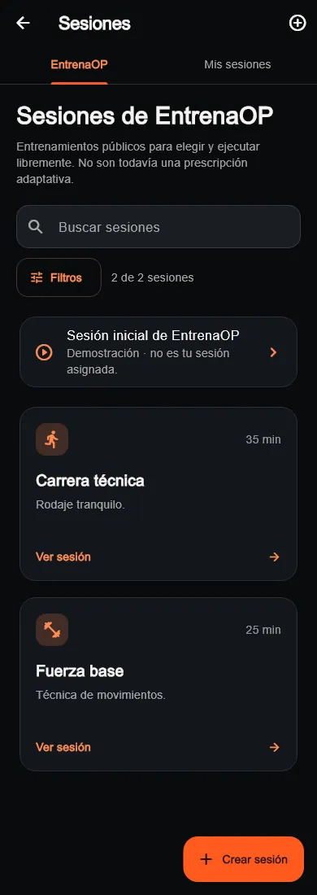

Fixture: busca sin tildes y combina tipo y duración, conservando cada pestaña; vista 2; 390 × 1100.

- [Estado: la biblioteca pública cabe en una pantalla móvil · vista 2](visual-audit/2026-10-07/images/WorkoutLibraryPage-2.webp)
- [Estado: una sesión personal sin descripción no aparece como pública · vista 2](visual-audit/2026-10-07/images/WorkoutLibraryPage-3.webp)

#### Catálogo de ejercicios

**Implementada** · Biblioteca · `ExerciseLibraryPage`

Entrada: `/library/exercises`.

**Actual:** Búsqueda y filtros por músculo, material y tipo; catálogo oficial/personal y alta de ejercicio propio.

**Pendiente / propuesta:** Pendiente acordado: consulta de vídeo/ficha y gestión de ejercicios personales.

Código: [lib/features/exercises/presentation/pages/exercise_library_page.dart](../lib/features/exercises/presentation/pages/exercise_library_page.dart).

Fixture: busca por músculo sin tildes y combina opciones reales del catálogo; vista 2; 390 × 1150.

- [Estado: los cuatro filtros se adaptan a 320 px con texto ampliado · vista 2](visual-audit/2026-10-07/images/ExerciseLibraryPage-2.webp)
- [Estado: busca por músculo sin tildes y combina opciones reales del catálogo · vista 3](visual-audit/2026-10-07/images/ExerciseLibraryPage-3.webp)

#### Crear ejercicio propio

**Implementada** · Biblioteca · `PersonalExerciseCreatorPage`

Entrada: `/library/exercises/new; alias /exercises/new`.

**Actual:** Formulario de ejercicio propio con metadatos, imagen y vídeo; vuelve y recarga la colección.

**Pendiente / propuesta:** Pendiente acordado: completar la gestión posterior del ejercicio personal, además del alta.

Código: [lib/features/exercises/presentation/pages/personal_exercise_creator_page.dart](../lib/features/exercises/presentation/pages/personal_exercise_creator_page.dart).

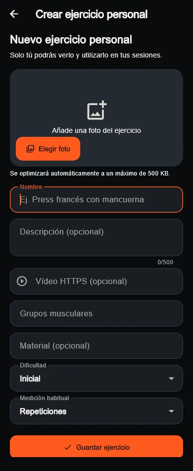

Fixture: el creador real de ejercicios vuelve a la colección y la recarga; vista 4; 390 × 950.

#### Editar sesión de fuerza

**Implementada** · Sesiones · `WorkoutEditorPage`

Entrada: `/plan/library/new; /plan/library/:templateId/edit`.

**Actual:** Bloques, ejercicios, formatos y dosis; selección/alta de ejercicio, borrador por cuenta y protección de salida.

**Pendiente / propuesta:** Propuesta: jerarquizar campos técnicos y revisar densidad en móvil; conservar capacidades actuales.

Código: [lib/features/workouts/presentation/pages/workout_editor_page.dart](../lib/features/workouts/presentation/pages/workout_editor_page.dart).

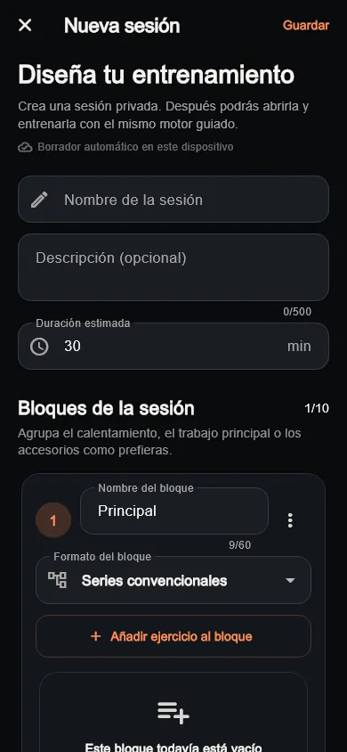

Fixture: EntrenaOP busca y añade variantes de la biblioteca de 63 ejercicios; vista 2; 390 × 844.

- [Estado: recupera y vuelve a guardar automáticamente un borrador · vista 3](visual-audit/2026-10-07/images/WorkoutEditorPage-2.webp)
- [Estado: busca y crea un ejercicio propio desde el editor · vista 3](visual-audit/2026-10-07/images/WorkoutEditorPage-3.webp)

#### Editar sesión de carrera

**Implementada** · Sesiones · `RunningWorkoutEditorPage`

Entrada: `/plan/library/new-running; /plan/library/:templateId/edit-running`.

**Actual:** Construir trabajo continuo/series de carrera y estimar duración según ritmos.

**Pendiente / propuesta:** Propuesta: explicar mejor distancia, tiempo y recuperación; comprobar recorrido de retorno tras guardar.

Código: [lib/features/workouts/presentation/pages/running_workout_editor_page.dart](../lib/features/workouts/presentation/pages/running_workout_editor_page.dart).

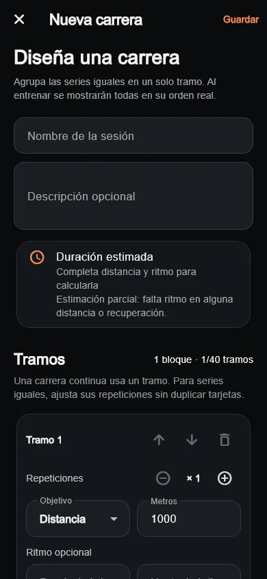

Fixture: agrupa series de carrera y estima su duración por ritmo; vista 2; 390 × 844.

- [Estado: agrupa series de carrera y estima su duración por ritmo · vista 1](visual-audit/2026-10-07/images/RunningWorkoutEditorPage-2.webp)
- [Estado: agrupa series de carrera y estima su duración por ritmo · vista 6](visual-audit/2026-10-07/images/RunningWorkoutEditorPage-3.webp)

#### Vista previa de sesión

**Implementada** · Sesiones · `WorkoutPreviewPage`

Entrada: `/plan/library/:templateId; /plan/starter-session`.

**Actual:** Consultar bloques y dosis antes de iniciar; editar cuando procede; abrir ejecución.

**Pendiente / propuesta:** Propuesta: hacer visible si es sesión propia, oficial, de inicio o procedente de un plan.

Código: [lib/features/workouts/presentation/pages/workout_preview_page.dart](../lib/features/workouts/presentation/pages/workout_preview_page.dart).

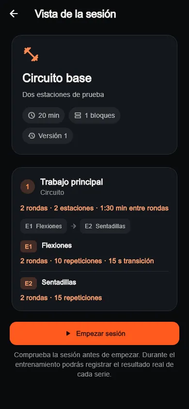

Fixture: la vista previa explica un circuito antes de iniciarlo; vista 2; 390 × 844.

- [Estado: la vista previa conserva objetivos diferentes por serie · vista 2](visual-audit/2026-10-07/images/WorkoutPreviewPage-2.webp)
- [Estado: la vista previa explica ritmo y recuperación de carrera · vista 2](visual-audit/2026-10-07/images/WorkoutPreviewPage-3.webp)

#### Realizar sesión

**Implementada** · Sesiones · `ActiveWorkoutPage`

Entrada: `…/active/:executionId`.

**Actual:** Trabajo/descanso, series, formatos, calentamiento cuando procede, resultados y esfuerzo; notas y cierre; guarda ejecución y vuelve al origen/resultado.

**Pendiente / propuesta:** Propuesta: revisar con usuario real pausa, abandono, conexión inestable y reanudación; las capturas no acreditan estos escenarios en dispositivo.

Código: [lib/features/workouts/presentation/pages/active_workout_page.dart](../lib/features/workouts/presentation/pages/active_workout_page.dart).

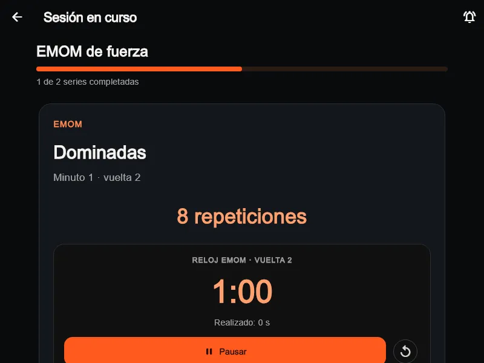

Fixture: salir y retomar conserva series y no abandona la sesión; vista 1; 800 × 600.

- [Estado: omitir calentamiento pasa al trabajo sin resultados inventados · vista 2](visual-audit/2026-10-07/images/ActiveWorkoutPage-2.webp)
- [Estado: RIR cero declarado llega al repositorio y no se sustituye por el objetivo · vista 2](visual-audit/2026-10-07/images/ActiveWorkoutPage-3.webp)

#### Evolución

**Implementada** · Historial · `WorkoutHistoryPage`

Entrada: `/assessment/history`.

**Actual:** Consultar sesiones realizadas y accesos a marcas/evaluaciones por preparación.

**Pendiente / propuesta:** Pendiente acordado: Marcas abre ahora detalle de preparación; necesita un recorrido específico de resultados.

Código: [lib/features/workouts/presentation/pages/workout_history_page.dart](../lib/features/workouts/presentation/pages/workout_history_page.dart).

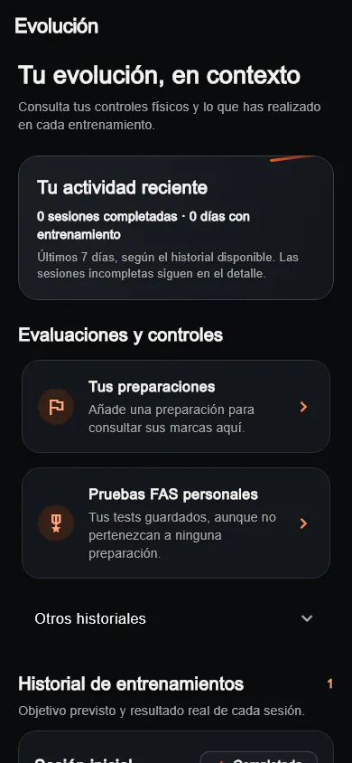

Fixture: el historial de sesiones cabe en una pantalla móvil; vista 2; 390 × 844.

- [Estado: la actividad cuenta fechas de cierre y no sesiones abandonadas · vista 2](visual-audit/2026-10-07/images/WorkoutHistoryPage-2.webp)
- [Estado: el historial de sesiones cabe en una pantalla móvil · vista 1](visual-audit/2026-10-07/images/WorkoutHistoryPage-3.webp)

#### Resultado de sesión

**Implementada** · Historial · `WorkoutHistoryDetailPage`

Entrada: `/assessment/history/workouts/:executionId`.

**Actual:** Consultar lo realizado, dosis/resultados, esfuerzo y notas; solicitar correcciones con su registro y contexto.

**Pendiente / propuesta:** Propuesta: conectar mejor resultado y siguiente sesión, sin cambiar retrospectivamente la prescripción histórica.

Código: [lib/features/workouts/presentation/pages/workout_history_detail_page.dart](../lib/features/workouts/presentation/pages/workout_history_detail_page.dart).

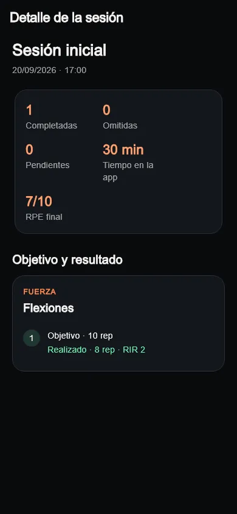

Fixture: el detalle distingue objetivo y resultado real; vista 2; 390 × 844.

- [Estado: el detalle muestra el resultado agregado de un AMRAP · vista 2](visual-audit/2026-10-07/images/WorkoutHistoryDetailPage-2.webp)
- [Estado: el detalle distingue objetivo y resultado real · vista 1](visual-audit/2026-10-07/images/WorkoutHistoryDetailPage-3.webp)

#### Historial físico Tropa

**Implementada** · Historial · `PhysicalAssessmentHistoryPage`

Entrada: `/assessment/history/physical`.

**Actual:** Listar evaluaciones físicas guardadas y sus marcas/resultados.

**Pendiente / propuesta:** Propuesta: evitar fragmentación entre historial físico, FAS y controles de carrera.

Código: [lib/features/physical_assessment/presentation/pages/physical_assessment_history_page.dart](../lib/features/physical_assessment/presentation/pages/physical_assessment_history_page.dart).

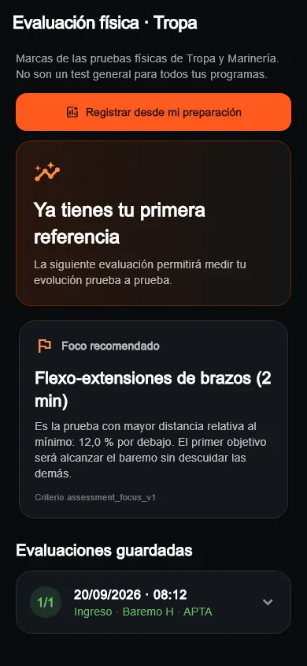

Fixture: el historial cabe en una pantalla móvil; vista 2; 390 × 844.

#### Historial periódico FAS

**Implementada** · Historial · `FasPeriodicHistoryPage`

Entrada: `/assessment/fas-history`.

**Actual:** Consultar evaluaciones guardadas, desplegar marcas/puntos y controlar versión del baremo; las simulaciones no aparecen.

**Pendiente / propuesta:** Propuesta: acceso directo coherente desde la preparación y Evolución.

Código: [lib/features/physical_assessment/presentation/pages/fas_periodic_history_page.dart](../lib/features/physical_assessment/presentation/pages/fas_periodic_history_page.dart).

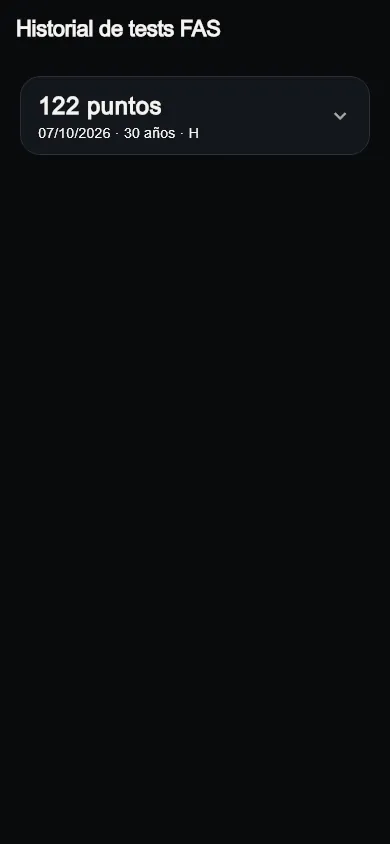

Fixture: Historial periódico con resultado ficticio; vista 2; 390 × 844.

- [Estado: Historial periódico con resultado ficticio · vista 3](visual-audit/2026-10-07/images/FasPeriodicHistoryPage-2.webp)

#### Perfil

**Implementada** · Cuenta · `ProfilePage`

Entrada: `/profile`.

**Actual:** Cuenta, fecha de nacimiento, preparaciones, contexto, herramientas y cierre de sesión.

**Pendiente / propuesta:** Pendiente acordado: aclarar contexto, correo/confirmación y terminología. No hay en esta pantalla un recorrido completo de suscripción/borrado de cuenta.

Código: [lib/features/profile/presentation/pages/profile_page.dart](../lib/features/profile/presentation/pages/profile_page.dart).

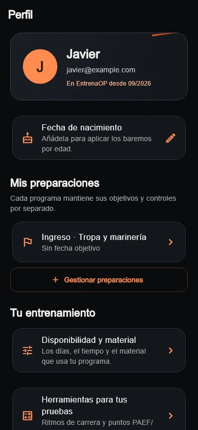

Fixture: muestra identidad y preparaciones reales sin plan comercial ficticio; vista 2; 390 × 844.

- [Estado: guardar la fecha actualiza el perfil sin mostrar un falso error · vista 3](visual-audit/2026-10-07/images/ProfilePage-2.webp)

#### Preferencias antiguas

**Sin entrada actual** · Código sin entrada · `TrainingPlanPage`

Entrada: `Sin ruta actual`.

**Actual:** Formulario anterior de preferencias, todavía presente en el código.

**Pendiente / propuesta:** No presentarlo como pantalla accesible: /plan/preferences lleva al contexto vigente. Propuesta: decidir su retirada en una tarea específica, sin borrarlo en esta auditoría.

Código: [lib/features/training_plan/presentation/pages/training_plan_page.dart](../lib/features/training_plan/presentation/pages/training_plan_page.dart).

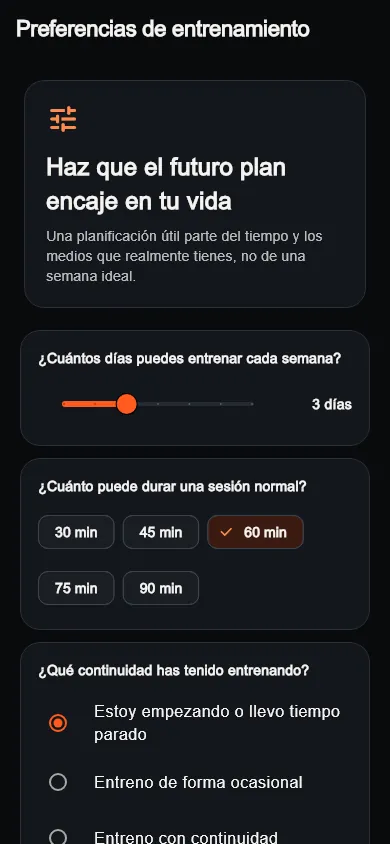

Fixture: Pantalla antigua de preferencias, sin ruta actual; vista 2; 390 × 844.

#### Referencia de capacidad

**Implementada** · Diálogos · `PerformanceReferenceDialog`

Entrada: `Modal dentro de entrenamiento`.

**Actual:** Registrar referencia por variante/protocolo y sus unidades/detalles pertinentes; guardado conserva el diálogo para revisar.

**Pendiente / propuesta:** Propuesta: mantener lenguaje comprensible y explicar qué referencia necesita cada objetivo.

Código: [lib/features/preparation_goal/presentation/widgets/performance_reference_dialog.dart](../lib/features/preparation_goal/presentation/widgets/performance_reference_dialog.dart).

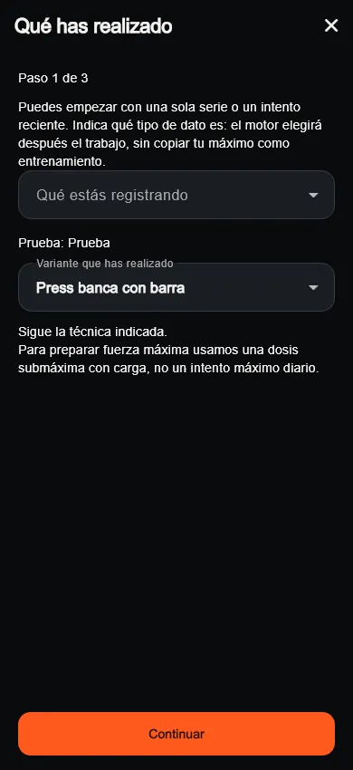

Fixture: bench_press_barbell: guarda un intento sin descanso ni detalles inventados; vista 1; 390 × 850.

- [Estado: slalom_ball_course_16m: guarda un intento sin descanso ni detalles inventados · vista 2](visual-audit/2026-10-07/images/PerformanceReferenceDialog-2.webp)
- [Estado: plancha no pide RIR ni rellena una capacidad ficticia · vista 2](visual-audit/2026-10-07/images/PerformanceReferenceDialog-3.webp)

#### Esta semana y Mis fases

**Componente de Mi programa** · Plan · `ProgramPhaseSection`

Entrada: `Sección dentro de /plan/goal/:goalId/training`.

**Actual:** Propósito y fase actual por objetivo, previsión orientativa, principal/apoyo, estado y referencias de calibración. Pestañas Esta semana/Mis fases.

**Pendiente / propuesta:** Propuesta: hacer visible el propósito sin convertir la previsión en plazo garantizado. Es un componente del programa activo, no otra pantalla con ruta propia.

Código: [lib/features/preparation_goal/presentation/widgets/program_phase_section.dart](../lib/features/preparation_goal/presentation/widgets/program_phase_section.dart).

Fixture: fase real y fechas previstas se distinguen en móvil; vista 2; 360 × 900.

- [Estado: fase real y fechas previstas se distinguen en móvil · vista 3](visual-audit/2026-10-07/images/ProgramPhaseSection-2.webp)
- [Estado: fase real y fechas previstas se distinguen en móvil · vista 1](visual-audit/2026-10-07/images/ProgramPhaseSection-3.webp)

#### Desglose de la semana de carrera

**Componente del recorrido de carrera** · Carrera · `RunningWeekPreviewSection`

Entrada: `Sección de RunningIntakePage cuando no está en modo dataOnly`.

**Actual:** Consultar/calcular propuesta, detalle de sesiones/duración/bloques, publicar o simular según estado. Se conserva en el acceso separado de carrera; el cuestionario integrado dataOnly la oculta.

**Pendiente / propuesta:** Propuesta: aclarar esta entrada secundaria frente a la continuidad automática de Mi programa; no interpretar propuesta/simulación como ejecución registrada.

Código: [lib/features/preparation_goal/presentation/widgets/running_week_preview_section.dart](../lib/features/preparation_goal/presentation/widgets/running_week_preview_section.dart).

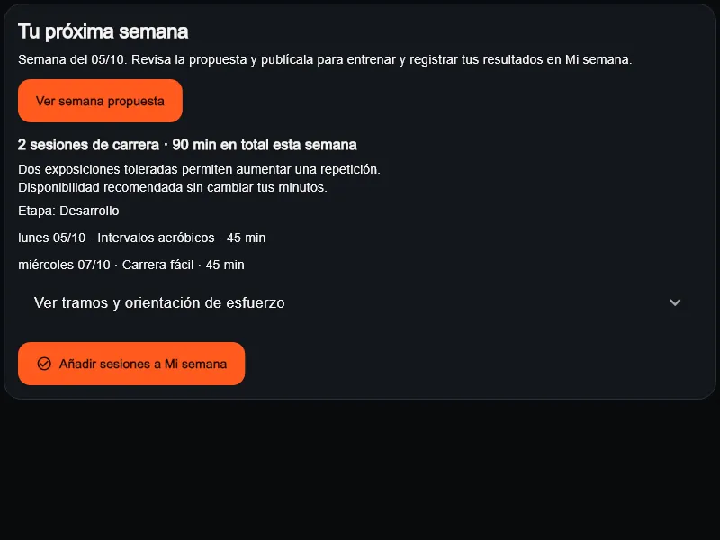

Fixture: publica custom_2k_program en la agenda existente; vista 2; 800 × 600.

- [Estado: muestra la siguiente semana calculada con ejecuciones sin publicarla · vista 2](visual-audit/2026-10-07/images/RunningWeekPreviewSection-2.webp)
- [Estado: simula la regla actual sin modificar la semana publicada · vista 2](visual-audit/2026-10-07/images/RunningWeekPreviewSection-3.webp)

#### Confirmar reinicio de ensayos

**Implementada** · Diálogos · `_TrialResetDialog`

Entrada: `Modal desde Mi programa`.

**Actual:** Explica qué semanas/resultados de ensayos se borran y qué contexto/metas/referencias se conserva; exige confirmación explícita.

**Pendiente / propuesta:** Propuesta: mantener esta acción secundaria, diferenciada de actualizar datos o pausar; es una operación distinta de la auditoría visual.

Código: [lib/features/preparation_goal/presentation/pages/preparation_training_page.dart](../lib/features/preparation_goal/presentation/pages/preparation_training_page.dart).

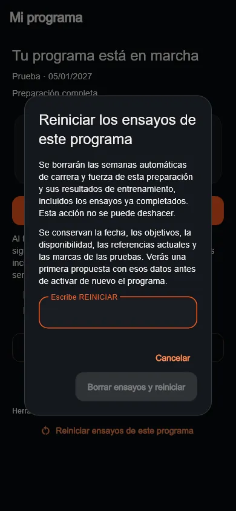

Fixture: reiniciar ensayos exige confirmación y conserva los datos para una propuesta nueva; vista 4; 390 × 844.

### Administración

#### Acceso ADMIN

**Implementada** · Acceso · `AdminLoginPage`

Entrada: `/login`.

**Actual:** Correo/contraseña y acceso administrativo verificado; error de acceso y cierre de sesión.

**Pendiente / propuesta:** Propuesta: explicar sesión caducada y falta de permiso sin perder orientación.

Código: [admin_app/lib/features/auth/presentation/admin_login_page.dart](../admin_app/lib/features/auth/presentation/admin_login_page.dart).

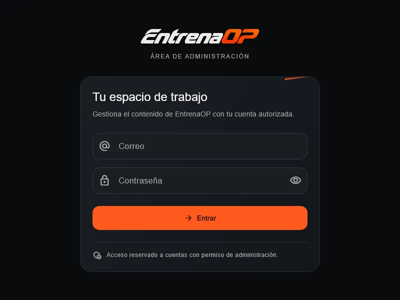

Fixture: acceso admin con marca, validación y visibilidad de contraseña; vista 2; 800 × 600.

#### Catálogo ADMIN

**Implementada** · Catálogos · `AdminProgramsPage`

Entrada: `/programs`.

**Actual:** Buscar programas por nombre/tipo/estado, crear programa, abrir detalle y acceder a sesiones, ejercicios y laboratorio separado.

**Pendiente / propuesta:** Pendiente acordado: extender guardado retenido a formularios editoriales que aún lo necesitan.

Código: [admin_app/lib/features/programs/presentation/admin_programs_page.dart](../admin_app/lib/features/programs/presentation/admin_programs_page.dart).

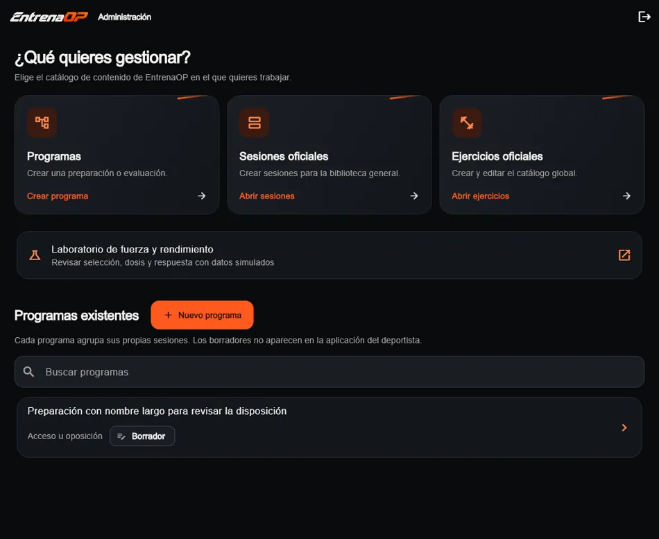

Fixture: panel de administración adaptable a 1100 px; vista 2; 1100 × 900.

- [Estado: un detalle se reconstruye por URL y un identificador inexistente ofrece salida · vista 2](visual-audit/2026-10-07/images/AdminProgramsPage-2.webp)
- [Estado: la búsqueda de programas combina términos e ignora tildes · vista 3](visual-audit/2026-10-07/images/AdminProgramsPage-3.webp)

#### Editar programa

**Implementada** · Programas · `AdminProgramDetailPage`

Entrada: `/programs/:programId`.

**Actualización acotada UI-014, 08/10/2026:** Índice fijo de Contenido (portada/publicación), Evaluación (calificación/pruebas/baremos) y Entrenamiento (sesiones/módulos/estrategias). Conserva estado y formularios; publicado ofrece «Ver baremo». Consultas de entrenamiento con reintento. [Alcance, esquema y capturas actuales](REFRESH_ADMIN_2026_10_08.md).

**Pendiente / propuesta:** Resto del pulido transversal y revisión autenticada real. La asignación de un módulo no acredita planificación automática completa.

Código: [admin_app/lib/features/programs/presentation/admin_program_detail_page.dart](../admin_app/lib/features/programs/presentation/admin_program_detail_page.dart).

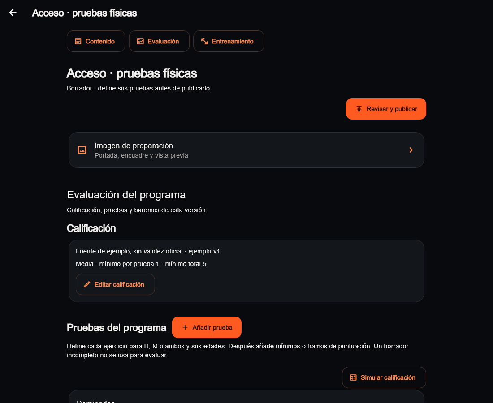

Fixture actualizado: widgets reales, tema compartido y datos ficticios; borrador en escritorio, 1100 × 900. Las dos vistas siguientes pertenecen al inventario inicial del 07/10.

- [Estado: ADMIN vincula solo la prueba de 2 km compatible · vista 2](visual-audit/2026-10-07/images/AdminProgramDetailPage-2.webp)
- [Estado: ADMIN vincula solo la prueba de 2 km compatible · vista 3](visual-audit/2026-10-07/images/AdminProgramDetailPage-3.webp)

#### Editar portada

**Implementada** · Programas · `ProgramCoverEditor`

Entrada: `Modal desde detalle de programa`.

**Actual:** Subir/quitar imagen y ajustar encuadres independientes de tarjeta/cabecera; previsualización móvil/escritorio.

**Pendiente / propuesta:** Propuesta: verificar fotos reales y pantallas estrechas; las imágenes de la auditoría usan archivos de fixture.

Código: [admin_app/lib/features/programs/presentation/program_cover_editor.dart](../admin_app/lib/features/programs/presentation/program_cover_editor.dart).

Fixture: captura optativa del editor web con una fotografía real; vista 6; 1440 × 1080.

- [Estado: cerrar solicita descarte y no persiste una imagen retirada · vista 3](visual-audit/2026-10-07/images/ProgramCoverEditor-2.webp)

#### Mínimos apto/no apto

**Implementada** · Programas · `AdminTestPassStandardsPage`

Entrada: `/programs/:programId/tests/:testId/scale (pass/fail)`.

**Actual:** Definir mínimos por categoría/edad según regla; edición sujeta al estado editorial del programa.

**Pendiente / propuesta:** Propuesta: jerarquizar unidad, dirección de mejor marca y rangos para evitar errores al introducir baremos.

Código: [admin_app/lib/features/programs/presentation/admin_test_pass_standards_page.dart](../admin_app/lib/features/programs/presentation/admin_test_pass_standards_page.dart).

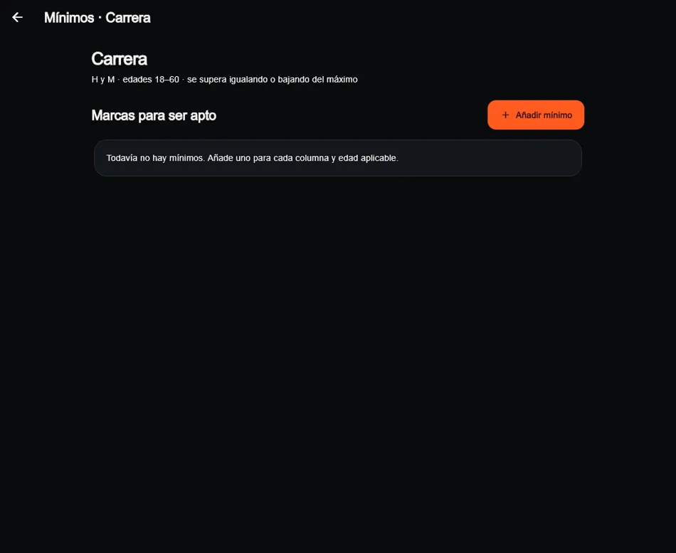

Fixture: ADMIN crea, edita y borra mínimos por sexo y edad; vista 2; 1100 × 900.

- [Estado: ADMIN crea, edita y borra mínimos por sexo y edad · vista 4](visual-audit/2026-10-07/images/AdminTestPassStandardsPage-2.webp)
- [Estado: ADMIN crea, edita y borra mínimos por sexo y edad · vista 8](visual-audit/2026-10-07/images/AdminTestPassStandardsPage-3.webp)

#### Tramos de puntuación

**Implementada** · Programas · `AdminTestScoreBandsPage`

Entrada: `/programs/:programId/tests/:testId/scale (graded)`.

**Actual:** Gestionar tramos/puntos de la prueba y reglas de evaluación; versiones publicadas protegidas.

**Pendiente / propuesta:** Propuesta: facilitar revisión de huecos/solapamientos y coherencia con la simulación.

Código: [admin_app/lib/features/programs/presentation/admin_program_scoring_editor.dart](../admin_app/lib/features/programs/presentation/admin_program_scoring_editor.dart).

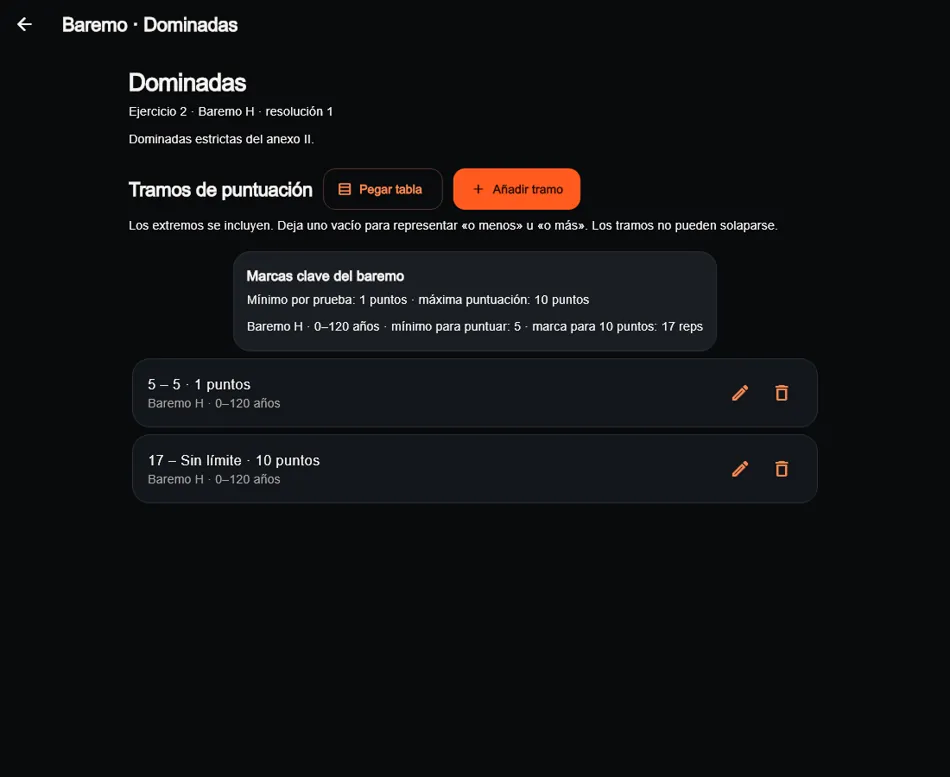

Fixture: baremo H/M y simulación muestran el ejercicio correspondiente; vista 7; 1100 × 900.

- [Estado: baremo H/M y simulación muestran el ejercicio correspondiente · vista 8](visual-audit/2026-10-07/images/AdminTestScoreBandsPage-2.webp)

#### Simular evaluación

**Implementada** · Programas · `AdminProgramAttemptPreviewPage`

Entrada: `/programs/:programId/simulation`.

**Actual:** Introducir marcas ficticias y comprobar resultado del programa y sus baremos.

**Pendiente / propuesta:** Simulación editorial: no crea una evaluación del deportista ni acredita eficacia del algoritmo deportivo.

Código: [admin_app/lib/features/programs/presentation/admin_program_attempt_preview_page.dart](../admin_app/lib/features/programs/presentation/admin_program_attempt_preview_page.dart).

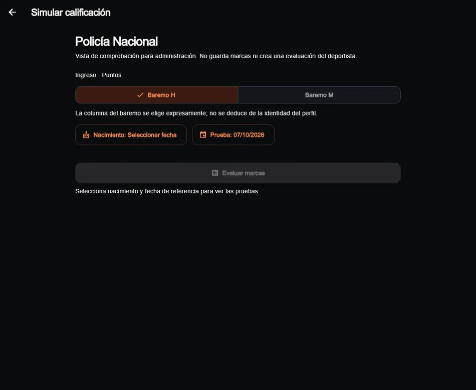

Fixture: baremo H/M y simulación muestran el ejercicio correspondiente; vista 11; 1100 × 900.

- [Estado: baremo H/M y simulación muestran el ejercicio correspondiente · vista 13](visual-audit/2026-10-07/images/AdminProgramAttemptPreviewPage-2.webp)
- [Estado: baremo H/M y simulación muestran el ejercicio correspondiente · vista 15](visual-audit/2026-10-07/images/AdminProgramAttemptPreviewPage-3.webp)

#### Sesiones oficiales

**Implementada** · Catálogos · `AdminProgramWorkoutsPage`

Entrada: `/sessions; /programs/:programId/sessions`.

**Actual:** Listar/buscar sesiones generales o de programa, crear y abrir sesiones oficiales.

**Pendiente / propuesta:** Propuesta: hacer visible qué cambia entre catálogo general y sesiones vinculadas a un programa.

Código: [admin_app/lib/features/workouts/presentation/admin_program_workouts_page.dart](../admin_app/lib/features/workouts/presentation/admin_program_workouts_page.dart).

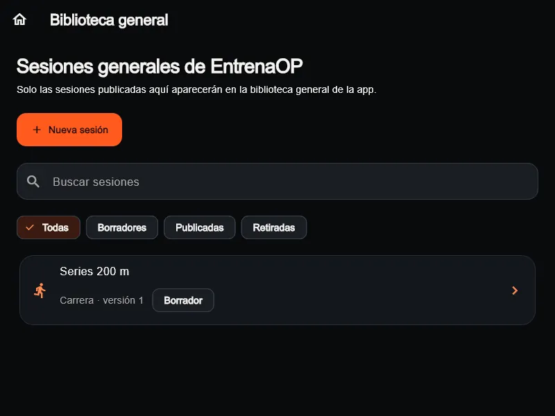

Fixture: la biblioteca general confirma publicación y borra borrador; vista 1; 800 × 600.

- [Estado: publicar exige confirmación y vuelve a cargar el estado · vista 1](visual-audit/2026-10-07/images/AdminProgramWorkoutsPage-2.webp)
- [Estado: la biblioteca general confirma publicación y borra borrador · vista 4](visual-audit/2026-10-07/images/AdminProgramWorkoutsPage-3.webp)

#### Editor oficial de sesión

**Implementada** · Sesiones · `AdminWorkoutEditorPage`

Entrada: `…/sessions/new; …/sessions/:templateId/edit`.

**Actual:** Editor compartido de bloques, ejercicios, dosis y formatos; guardado y protección de salida; conserva historial/versiones.

**Pendiente / propuesta:** Propuesta: separar edición del contenido y estado editorial; comprobar legibilidad de formularios largos.

Código: [admin_app/lib/features/workouts/presentation/admin_workout_editor_page.dart](../admin_app/lib/features/workouts/presentation/admin_workout_editor_page.dart).

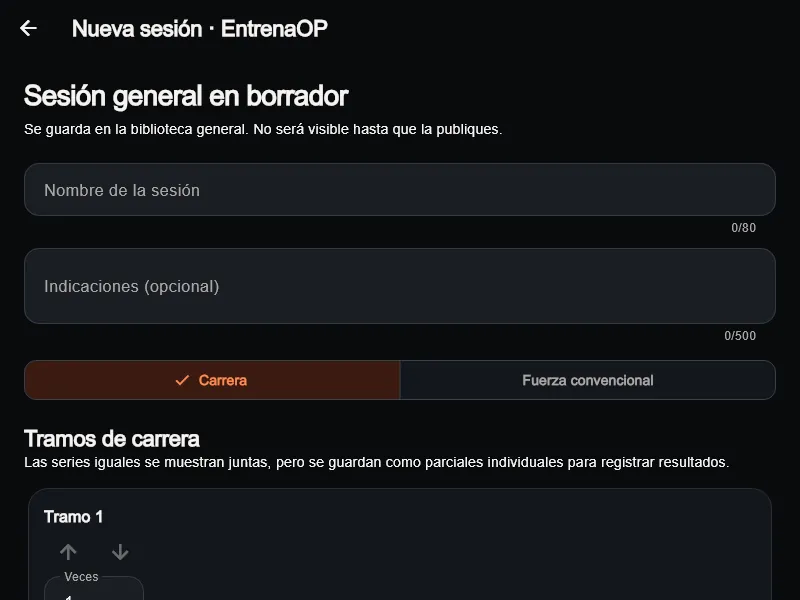

Fixture: perder la sesión retira un editor incluso con cambios pendientes; vista 1; 800 × 600.

- [Estado: fuerza edita segundos sin reloj y conserva una sesión anterior · vista 2](visual-audit/2026-10-07/images/AdminWorkoutEditorPage-2.webp)
- [Estado: editar una carrera conserva series agrupadas y revisa la plantilla · vista 2](visual-audit/2026-10-07/images/AdminWorkoutEditorPage-3.webp)

#### Vista previa oficial

**Implementada** · Sesiones · `AdminWorkoutPreviewPage`

Entrada: `/sessions/:templateId; /programs/:programId/sessions/:templateId`.

**Actual:** Inspeccionar sesión y acceder a edición/acciones editoriales permitidas.

**Pendiente / propuesta:** Propuesta: resaltar versión, estado y vínculo al programa antes de publicar.

Código: [admin_app/lib/features/workouts/presentation/admin_workout_preview_page.dart](../admin_app/lib/features/workouts/presentation/admin_workout_preview_page.dart).

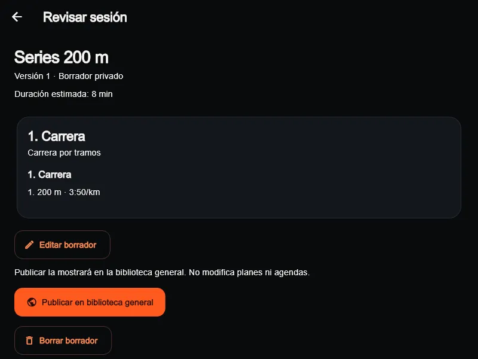

Fixture: la biblioteca general confirma publicación y borra borrador; vista 2; 800 × 600.

- [Estado: publicar exige confirmación y vuelve a cargar el estado · vista 3](visual-audit/2026-10-07/images/AdminWorkoutPreviewPage-2.webp)

#### Ejercicios oficiales

**Implementada** · Catálogos · `AdminExercisesPage`

Entrada: `/exercises`.

**Actual:** Buscar y editar catálogo oficial con formulario compartido, metadatos, imagen y vídeo; guardado permite revisión.

**Pendiente / propuesta:** Propuesta: priorizar datos visibles para deportista y relaciones de entrenamiento, conservando validaciones de servidor.

Código: [admin_app/lib/features/exercises/presentation/admin_exercises_page.dart](../admin_app/lib/features/exercises/presentation/admin_exercises_page.dart).

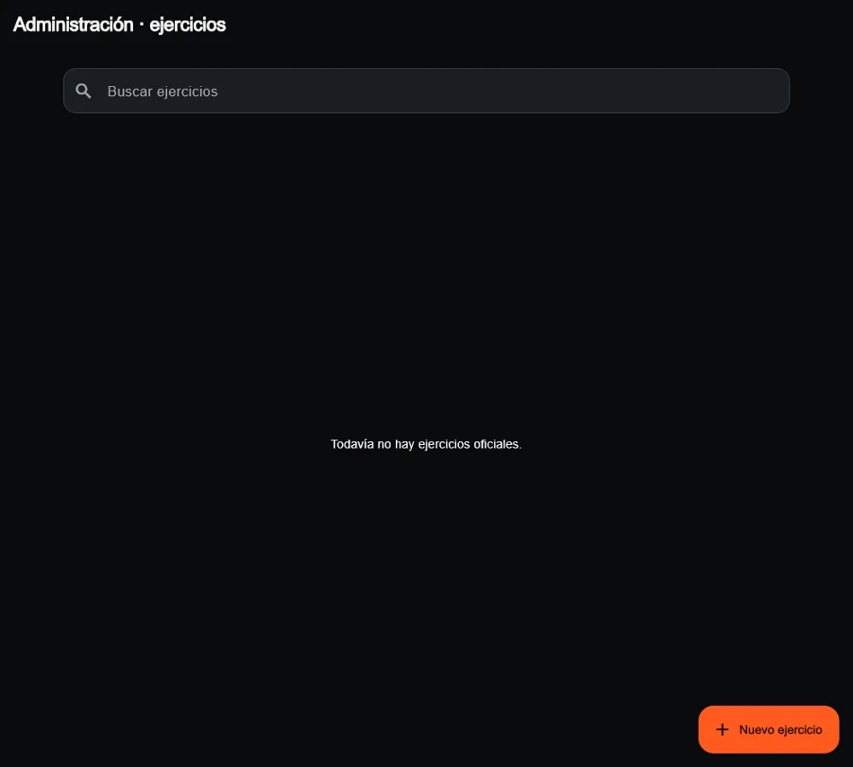

Fixture: el panel crea un ejercicio con el formulario compartido; vista 2; 1000 × 900.

- [Estado: el panel crea un ejercicio con el formulario compartido · vista 6](visual-audit/2026-10-07/images/AdminExercisesPage-2.webp)
- [Estado: el panel crea un ejercicio con el formulario compartido · vista 3](visual-audit/2026-10-07/images/AdminExercisesPage-3.webp)

#### Laboratorio de progresión

**Experimental** · Laboratorio · `AdminPerformanceProgressionLab`

Entrada: `/laboratory`.

**Actual:** Ensayar capacidad, dosis calibradas, series, esfuerzo y progresión por bloques; ejemplos, decisiones explicadas y ejecutor simulado.

**Pendiente / propuesta:** Laboratorio: no publica sus ensayos como sesiones del deportista. El recorrido real del deportista ya tiene coordinación/continuidad propias; no confundirlos ni presentar parámetros experimentales como eficacia validada.

Código: [admin_app/lib/features/programs/presentation/admin_performance_progression_lab.dart](../admin_app/lib/features/programs/presentation/admin_performance_progression_lab.dart).

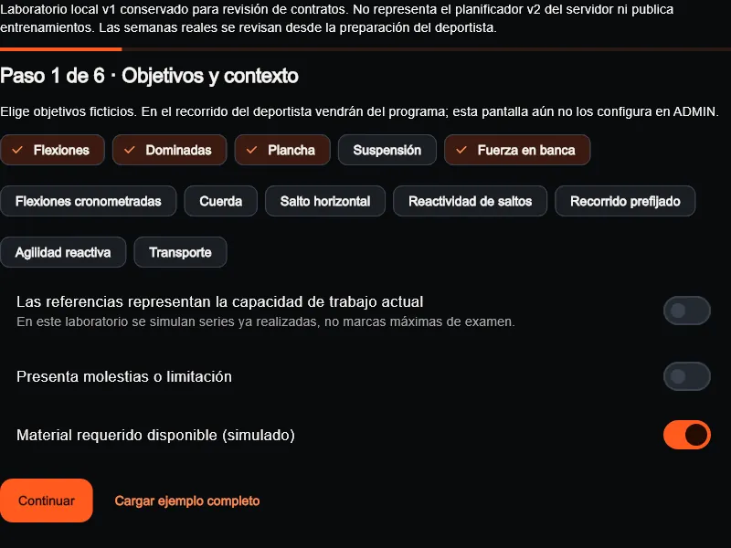

Fixture: entrada inválida se queda en el bloque y no avanza silenciosamente; vista 2; 800 × 600.

- [Estado: contexto y perfiles ausentes no producen una dosis · vista 5](visual-audit/2026-10-07/images/AdminPerformanceProgressionLab-2.webp)
- [Estado: entrada inválida se queda en el bloque y no avanza silenciosamente · vista 6](visual-audit/2026-10-07/images/AdminPerformanceProgressionLab-3.webp)

#### Ejecutor simulado ADMIN

**Experimental** · Laboratorio · `AdminPerformanceExecutionDialog`

Entrada: `Modal del laboratorio`.

**Actual:** Simular respuestas y resultados por serie para revisar la decisión de progresión.

**Pendiente / propuesta:** Datos simulados: no es el ejecutor que usa el deportista ni un registro real.

Código: [admin_app/lib/features/programs/presentation/admin_performance_execution_dialog.dart](../admin_app/lib/features/programs/presentation/admin_performance_execution_dialog.dart).

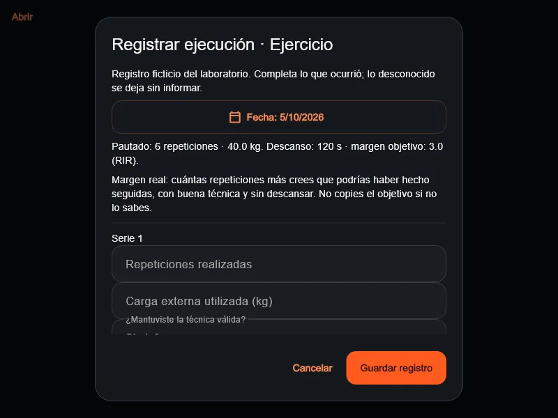

Fixture: un registro vacío conserva ausencias y no copia objetivos; vista 1; 800 × 600.

- [Estado: isometría registra duración sin RIR en pantalla estrecha · vista 1](visual-audit/2026-10-07/images/AdminPerformanceExecutionDialog-2.webp)
- [Estado: un registro vacío conserva ausencias y no copia objetivos · vista 2](visual-audit/2026-10-07/images/AdminPerformanceExecutionDialog-3.webp)

#### Ensayo anterior de flexiones

**Sin entrada actual** · Código sin entrada · `AdminPushUpPolicyLab`

Entrada: `Sin ruta actual`.

**Actual:** Laboratorio previo de política de flexiones, conservado en código y pruebas.

**Pendiente / propuesta:** No tiene entrada en el router vigente; el laboratorio actual es el de progresión por bloques. No sustituir el actual por este código.

Código: [admin_app/lib/features/programs/presentation/admin_push_up_policy_lab.dart](../admin_app/lib/features/programs/presentation/admin_push_up_policy_lab.dart).

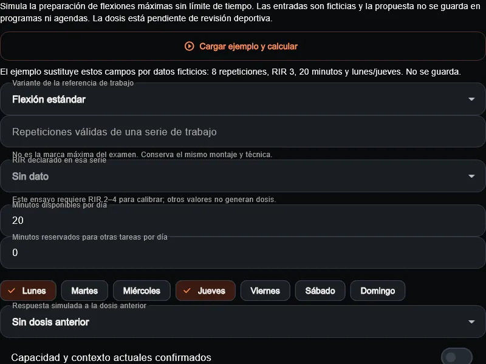

Fixture: calcular con campos inválidos da un aviso visible; vista 2; 800 × 600.

- [Estado: ADMIN revisa una propuesta individual con ejercicios reales del catálogo · vista 11](visual-audit/2026-10-07/images/AdminPushUpPolicyLab-2.webp)
- [Estado: no presenta cobertura para un protocolo cronometrado · vista 9](visual-audit/2026-10-07/images/AdminPushUpPolicyLab-3.webp)

#### Crear programa ADMIN

**Implementada** · Formularios · `_NewProgramDialog`

Entrada: `Modal desde catálogo`.

**Actual:** Nombre y tipo del nuevo programa; guardado retenido y error sin perder campos.

**Pendiente / propuesta:** UI-008 ya incorpora guardado retenido aquí; extender el patrón a los restantes formularios.

Código: [admin_app/lib/features/programs/presentation/admin_programs_page.dart](../admin_app/lib/features/programs/presentation/admin_programs_page.dart).

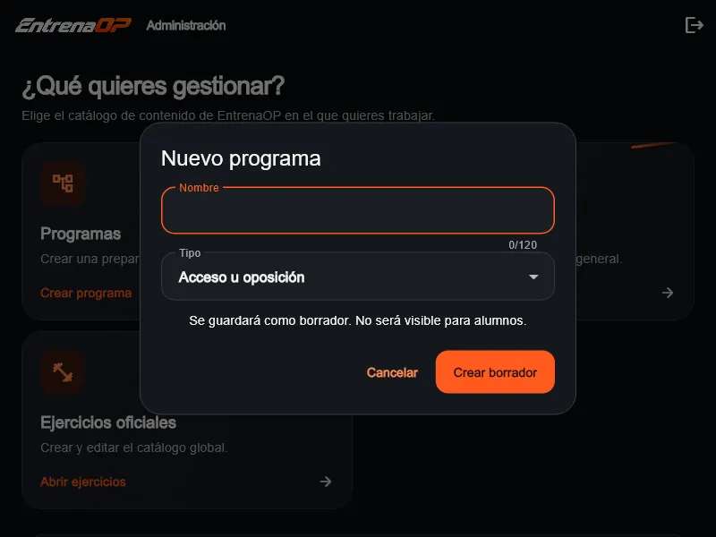

Fixture: administración crea un borrador y vuelve a listarlo; vista 3; 800 × 600.

#### Añadir/editar prueba ADMIN

**Implementada** · Formularios · `_NewProgramTestDialog`

Entrada: `Modal desde detalle de programa`.

**Actual:** Nombre, unidad, protocolo/tipo de tarea y dirección de mejor marca; se incorpora al programa borrador.

**Pendiente / propuesta:** Pendiente acordado: revisar guardado retenido y jerarquía de formularios editoriales restantes.

Código: [admin_app/lib/features/programs/presentation/admin_program_detail_page.dart](../admin_app/lib/features/programs/presentation/admin_program_detail_page.dart).

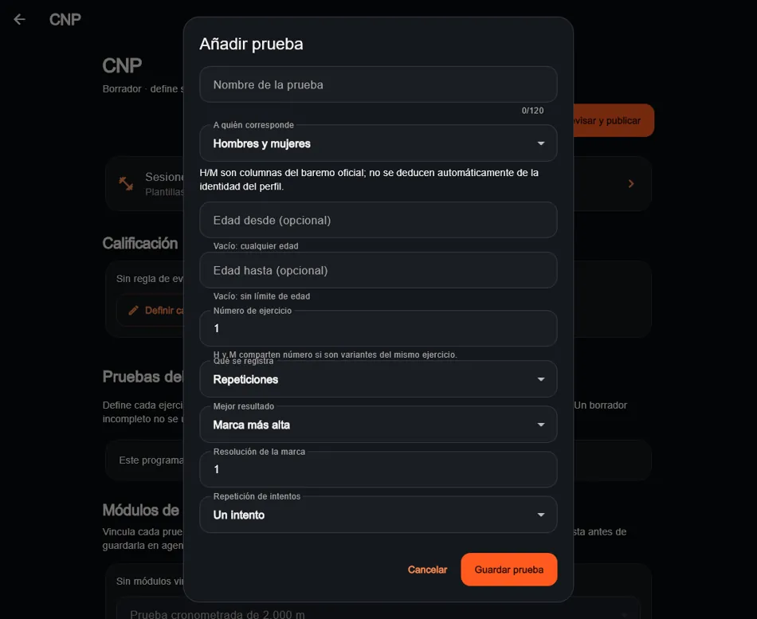

Fixture: un programa borrador incorpora su prueba con protocolo; vista 4; 1100 × 900.

- [Estado: un programa borrador incorpora su prueba con protocolo · vista 12](visual-audit/2026-10-07/images/_NewProgramTestDialog-2.webp)

#### Regla de evaluación ADMIN

**Implementada** · Formularios · `_ScoringRuleDialog`

Entrada: `Modal desde detalle de programa`.

**Actual:** Configurar modo de calificación y condiciones del resultado del programa.

**Pendiente / propuesta:** Pendiente acordado: revisar guardado retenido y claridad de edición de reglas.

Código: [admin_app/lib/features/programs/presentation/admin_program_scoring_editor.dart](../admin_app/lib/features/programs/presentation/admin_program_scoring_editor.dart).

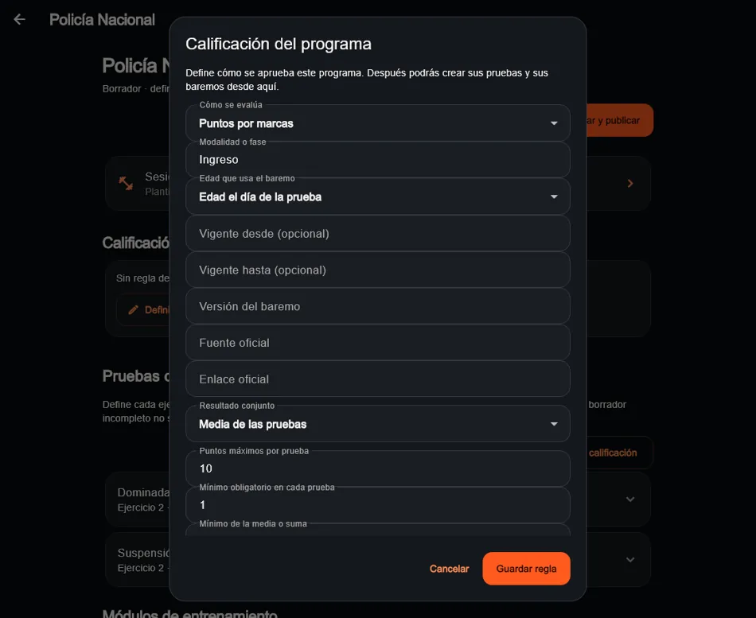

Fixture: baremo H/M y simulación muestran el ejercicio correspondiente; vista 4; 1100 × 900.

#### Editar un mínimo ADMIN

**Implementada** · Formularios · `_StandardDialog`

Entrada: `Modal desde mínimos`.

**Actual:** Categoría, edad y umbral de aptitud de una prueba.

**Pendiente / propuesta:** Propuesta: mantener visibles unidad y dirección de mejor marca, revisar validación y guardado retenido.

Código: [admin_app/lib/features/programs/presentation/admin_test_pass_standards_page.dart](../admin_app/lib/features/programs/presentation/admin_test_pass_standards_page.dart).

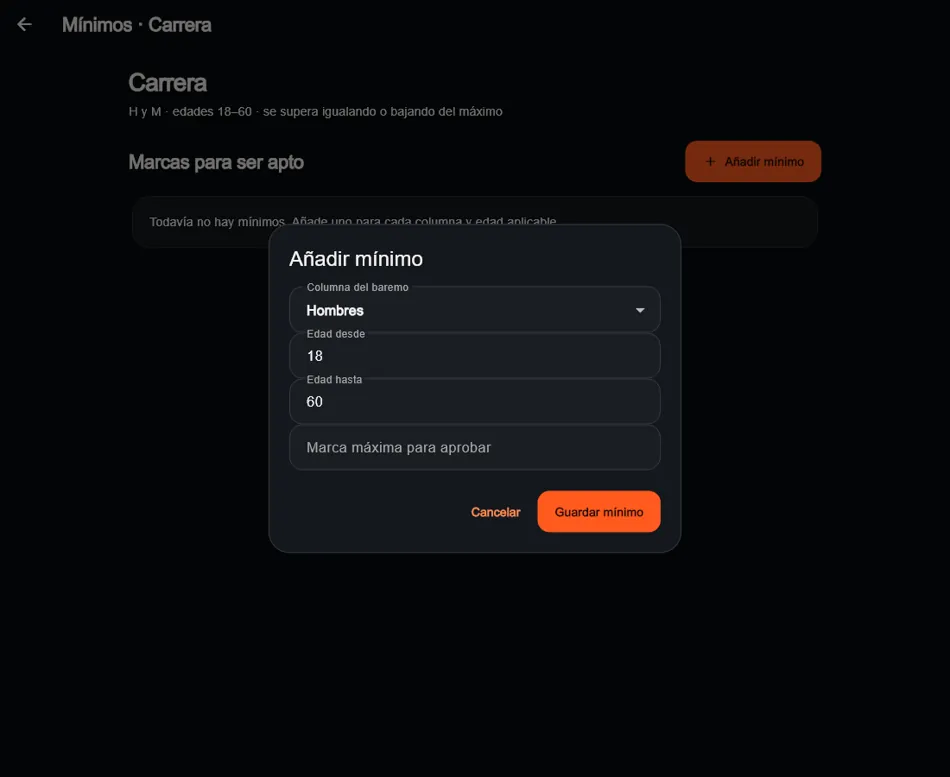

Fixture: ADMIN crea, edita y borra mínimos por sexo y edad; vista 3; 1100 × 900.

#### Editar tramo de puntos ADMIN

**Implementada** · Formularios · `_ScoreBandDialog`

Entrada: `Modal desde puntuaciones`.

**Actual:** Rangos de marca y puntos de un tramo de baremo.

**Pendiente / propuesta:** Propuesta: revisar límites/coherencia del baremo y guardado retenido sin reducir restricciones.

Código: [admin_app/lib/features/programs/presentation/admin_program_scoring_editor.dart](../admin_app/lib/features/programs/presentation/admin_program_scoring_editor.dart).

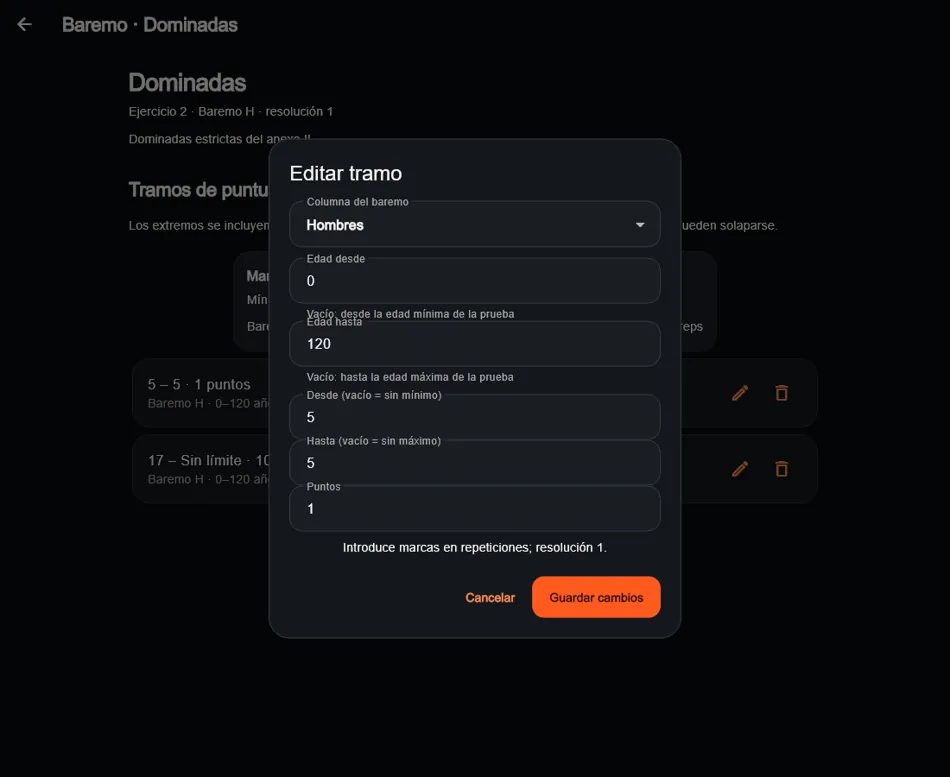

Fixture: baremo H/M y simulación muestran el ejercicio correspondiente; vista 8; 1100 × 900.

#### Configurar estrategia ADMIN

**Implementada** · Formularios · `_StrategyDialog`

Entrada: `Modal desde estrategias de prueba`.

**Actual:** Asociar/configurar estrategia deportiva de la prueba y sus datos versionados.

**Pendiente / propuesta:** Propuesta: distinguir configuración editorial de activación efectiva del objetivo; no habilitar todo el banco por elegir una etiqueta.

Código: [admin_app/lib/features/programs/presentation/admin_performance_strategy_section.dart](../admin_app/lib/features/programs/presentation/admin_performance_strategy_section.dart).

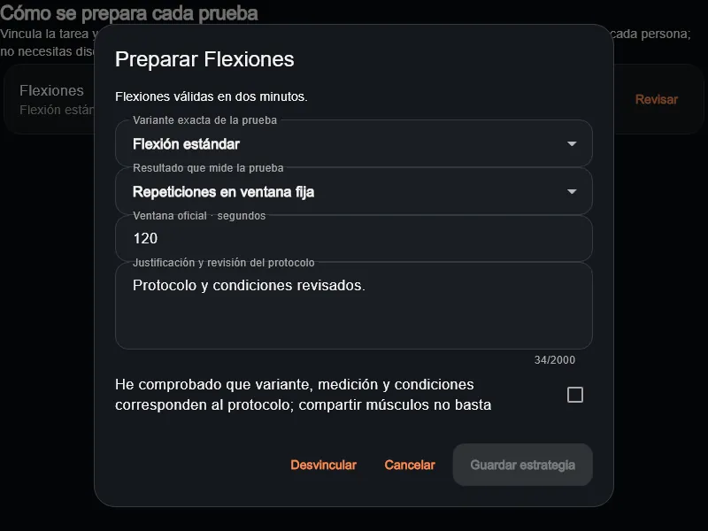

Fixture: estrategia exige revisión y conserva ventana; vista 1; 800 × 600.
