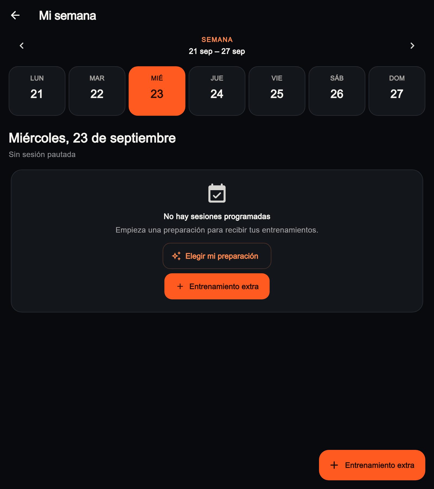
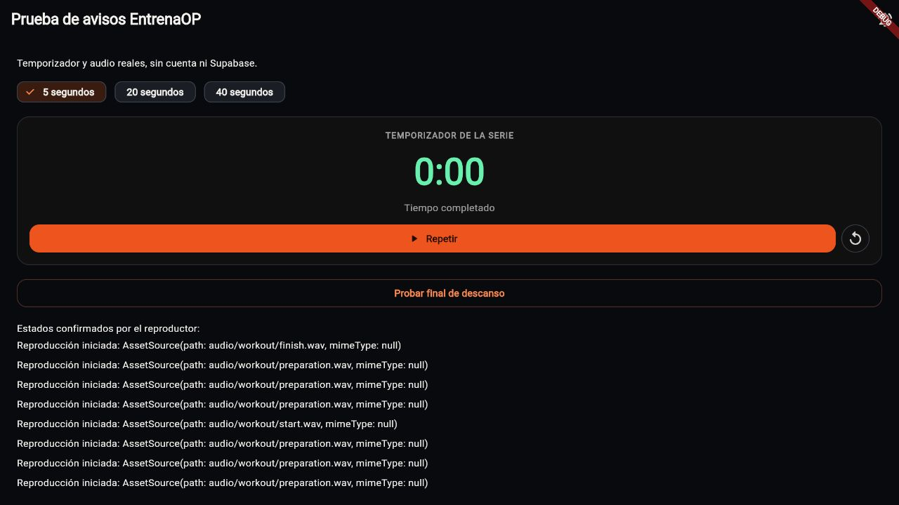

# Sesión y ancho de Mi semana · UI-019 · 08/10/2026

## Abandono: fallo reproducido y corrección

El vídeo de Javier muestra una ejecución abierta con todas las series resueltas,
esperando RPE y confirmación final. El botón de abandono se ocultaba porque su
visibilidad dependía de tener una serie pendiente o estar descansando. La
regresión nueva falla antes de corregirlo: no encuentra el botón de abandono.

El criterio ahora es el estado `inProgress` de la ejecución. Se puede abandonar
antes de registrar trabajo, a mitad, durante el descanso y esperando el cierre
final. Se reutiliza el diálogo existente con motivo obligatorio. Resolver las
series no equivale a cerrar la sesión; abandonar no exige declarar RPE.

La operación existente conserva las series confirmadas, sus resultados y las
omisiones; tampoco convierte las pendientes en resultados inventados. Un error
mantiene abierta la sesión y conserva el borrador de la pantalla para reintentar.
El cierre encolado muestra su sincronización pendiente. El retorno sigue usando
`go_router` y una sesión terminal no pregunta de nuevo si se quiere retomar.

## Qué significa cada salida hoy

| Acción | Estado y datos |
| --- | --- |
| Seguir entrenando / Seguir aquí | Cancela el diálogo y permanece en la pantalla. |
| Salir y retomar después | Mantiene la ejecución en curso y las series confirmadas. Los campos no confirmados en pantalla no se registran. |
| Abandonar la sesión definitivamente | Cierra esa ejecución con motivo y conserva lo confirmado para consultar el historial. |
| Finalizar sesión | Confirma el cierre normal con el RPE obligatorio y las notas introducidas. |

En Mi semana, una ejecución abandonada conserva su referencia y abre
**Ver resultado**, mientras que una ejecución en curso ofrece **Continuar
sesión**. La migración `20260921004000_weekly_workout_schedule.sql` sincroniza
el estado de la cita con el de la ejecución. Abandonar una sesión no pausa ni
abandona toda la preparación. Los motores mantienen su interpretación existente
del estado y del motivo; no se cambian sus políticas en esta tarea.

Javier propone valorar una salida más clara con opciones de retomar, abandonar
conservando resultados y salir sin guardar. **Pendiente de diseño:** unificar
esas opciones en un único diálogo. «Sin guardar» necesita distinguir descartar
campos no confirmados de eliminar series ya guardadas. La segunda operación
afectaría historial y entradas de los planes y requiere su propio contrato; no
se trata como un abandono ordinario. Esta propuesta no está implementada ni
se registra como una autorización para borrar datos.

## Mi semana: ancho disponible

El segundo vídeo muestra la franja de días ocupando solo parte del contenido.
El ancho de cada día estaba limitado a 74 px. La regresión a 800 px reproduce
554 px ocupados frente a los 768 px disponibles.

Se elimina ese máximo y se reparte el ancho entre los siete días, dentro del
contenido existente de hasta 920 px. El mínimo respeta el tamaño del texto:
en ventanas estrechas o con texto ampliado se mantiene el desplazamiento
horizontal para que los días sigan legibles y seleccionables. Se conservan
colores, tarjetas, alturas, separaciones y selección.

Captura del widget actual a 800 px, con datos de prueba y sin cuenta:

También se conservan capturas de 390 y 1200 px. No proceden de un rediseño ni
de imágenes generadas. Los vídeos personales permanecen fuera de Git.

## Cuenta final de trabajo: 3, 2, 1

Javier confirma empezar el aviso cuando quedan **tres segundos**. Las cuentas
con duración objetivo emiten un pitido breve en 3, 2 y 1, seguido del sonido
de final existente. Se aplica a series por tiempo, ventanas de rendimiento,
EMOM y el reloj global AMRAP. Reutiliza el WAV breve de preparación y el mismo
reproductor, preferencias y manejo de fallos; no añade paquetes ni descargas.

Pausar/reanudar no repite el segundo anterior; repetir permite una cuenta nueva.
Restaurar no reproduce pitidos pasados. Una actualización tardía emite solo el
segundo actual o el final, sin una ráfaga de avisos atrasados. En intervalos de
uno a tres segundos el inicio tiene prioridad y solo avisan los segundos
restantes posteriores; nunca se solapan inicio y cuenta final.

El descanso conserva mitad, diez segundos y final. Los cronómetros sin duración
objetivo no inventan un final. Los pitidos siguen sin confirmar resultados por
el usuario ni garantizar reproducción con la aplicación suspendida.

## Verificación y límites

- Análisis de la app limpio. Batería completa: **621 pruebas correctas**, una
  exclusiva de web omitida en VM, como antes.
- **49 pruebas específicas** de ejecución, semana, cuenta atrás y adaptador de
  audio correctas; otras **15 comprobaciones** de semana/diálogo correctas tras
  actualizar el texto de avisos y generar las capturas.
- Abandono antes de confirmar, parcial, todas completadas y todas omitidas;
  cancelación sin enviar, motivo, fallo/reintento, cierre encolado y retorno.
- Ancho 390/800/1200 px y selección de domingo; 320 px con texto doble y
  desplazamiento horizontal sin errores.
- Pitidos finales, pausa/reanudación/repetición, restauración, tiempos cortos y
  salto al final. Banco manual actualizado y compilado en web. Intervalo real
  de cinco segundos en Chromium: ocho reproducciones aceptadas (preparación
  3/2/1, inicio, cuenta final 3/2/1 y final), sin errores ni avisos en consola.
  Acredita aceptación del reproductor, no una valoración humana del sonido.
- Los recorridos de abandono usan un repositorio de prueba. El contrato SQL
  existente se ha leído, sin modificar ni ejecutar migraciones ni acreditar
  otra prueba autenticada de servidor.
- Alcance localizado de la app. No hay cambios de dependencias, admin, paquetes
  compartidos, motores, datos, permisos ni producción. Se conservan los límites
  nativos de UI-018: una compilación web no acredita iOS/Android físico.

El siguiente recorrido recomendado sigue siendo comprobar el audio actualizado
en el Mac/simulador y registrar la escucha nativa; el diálogo de salidas queda
como propuesta para acordar después, sin mezclarlo con borrado de historial.
