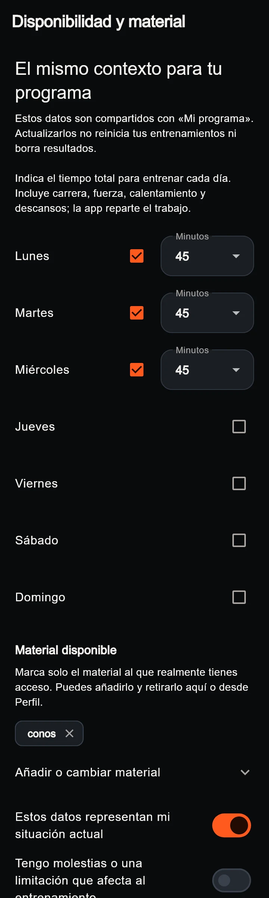

# Ajustes del uso cotidiano · UI-022 · 09/10/2026

Javier pide cinco correcciones concretas: descartar una sesión abierta por error,
retirar el acceso duplicado a Perfil, aclarar Añadir entrenamiento, separar los
campos de Disponibilidad e investigar el bloqueo al abrir Calculadora FAS.
Confirma expresamente que el descarte debe incluir las series ya registradas.
El diseño fotográfico, los motores y el negocio Free/Pro se conservan.

## Tres salidas distintas de la sesión

| Acción | Series confirmadas | Sesión | Cita en agenda |
| --- | --- | --- | --- |
| Salir y retomar después | Se conservan | En curso | En curso |
| Abandonar y conservar lo realizado | Se conservan, con motivo de abandono | Cerrada | Abandonada |
| Salir sin guardar → Descartar y salir | Se eliminan las de esta sesión | Eliminada | Pendiente para empezar de nuevo |

La flecha y el botón inferior ofrecen el descarte antes de registrar, con trabajo
parcial y tras resolver todas las series, mientras la ejecución siga en curso.
El diálogo explica la eliminación, la necesidad de conexión y el efecto sobre
la agenda. Cancelar o fallar mantiene la pantalla, las series y el borrador.
Finalizar y abandonar siguen conservando resultados y sus contratos anteriores.

`discard_workout_execution(uuid,text)` comprueba identidad, propiedad,
confirmación `DESCARTAR` y estado `in_progress` dentro de una transacción.
Bloquea cuenta, cita, ejecución y series antes de cambiar la cita a `planned`
sin `execution_id`. Conserva plantilla, preparación, fecha y pauta. Elimina
recibos de mutación, ejecución, series, correcciones y resultados AMRAP
dependientes. Rechaza sesiones completadas/abandonadas y cuentas ajenas.
Flutter no recibe permiso directo de borrado.

La tabla privada `discarded_workout_executions` retiene únicamente IDs de
ejecución/series, propietario y fecha del descarte. No conserva resultados
deportivos. Permite repetir una petición cuya respuesta se perdió y reconocer
colas antiguas de otro dispositivo; se elimina junto con la cuenta.
`get_discarded_workout_resource_ids` devuelve solo los IDs consultados que
pertenecen a la cuenta autenticada, sin dar acceso directo a esa tabla.

El repositorio no sincroniza primero las series que se quieren descartar.
Solo retira las mutaciones locales de esa cuenta y esos recursos tras recibir
confirmación del servidor. Si otro dispositivo reintenta un resultado eliminado,
la cola lo retira únicamente cuando el servidor acredita el descarte; otros
errores mantienen los datos. Cambiar de cuenta impide limpiar la cola anterior.
La petición tiene un límite de 20 segundos; perder su respuesta permite repetir
sin duplicar efectos. Descartar no se encola para ejecutarse silenciosamente
más tarde. Un fallo conserva los temporizadores; un éxito limpia sus instantáneas.

Migración `20261009000000_discard_in_progress_workout.sql`, solo desarrollo.
No se borran sesiones reales durante la verificación: las pruebas SQL crean
cuentas ficticias y terminan con `ROLLBACK`.

## Accesos y Disponibilidad

Inicio mantiene la pestaña Perfil y retira su icono duplicado de la cabecera.
Mi semana usa Añadir entrenamiento y Añadir entrenamiento al día, aplicables
con o sin programa. Elegir una preparación y Ver preparaciones conservan
sus destinos anteriores. Los entrenamientos añadidos siguen utilizando la
agenda y la fecha seleccionada existentes.

Cada día de Disponibilidad tiene separación vertical. Los minutos pasan debajo
del día cuando el espacio o el texto ampliado lo requieren; el selector ocupa
su ancho y conserva valor/opciones. No se crea otro contexto: siguen siendo
los mismos datos compartidos por cuenta, Perfil y asistente de preparación.

## FAS al abrir

Hecho comprobado: la lectura del perfil no tenía límite de espera y se iniciaba
antes de montar su `FutureBuilder`. La regresión reproduce tanto una petición
sin respuesta como un error inmediato que escapaba mientras cargaba el baremo.
No hay trazas del incidente de Javier que permitan atribuirle una causa única.

La lectura del baremo y del perfil se limita a 15 segundos y ofrece reintento.
El perfil comienza cuando su interfaz de carga ya se va a montar. Las respuestas
antiguas no sustituyen el reintento y los controladores conservan lo escrito.
No cambia el cálculo, el catálogo oficial ni el guardado del test; los límites
de lectura no se aplican a escrituras para evitar repetir un guardado ambiguo.

## Evidencia y límites

Recorte de una captura del widget actual, con tres días consecutivos de prueba:

El manifiesto de la misma carpeta registra dimensiones, método y hash.

- Regresiones del ejecutor: vacío/parcial/completo, cancelación, fallo/reintento,
  borrador conservado, estado ocupado y descanso, historial cerrado protegido.
  Las mutaciones se bloquean también en el cubit mientras hay una operación,
  evitando que una segunda pulsación se cruce con el descarte pendiente.
- Repositorio: limpieza por recurso/propietario, fallo sin conexión, cola tardía
  confirmada, errores ajenos y cambio de cuenta durante la petición.
- Disponibilidad: tres días consecutivos, separación geométrica y cambio de
  minutos guardado con texto normal/doble, además de recorridos de material.
- FAS: espera agotada, error inmediato, reintento y respuesta antigua ignorada.
- `flutter analyze --no-pub`: limpio. Batería completa de raíz: 685 pruebas
  correctas y una prueba exclusiva web omitida como antes.
- SQL de descarte, tipos históricos e integración de la semana: correctas,
  transacciones con `ROLLBACK` sin datos permanentes. Preflight del nuevo contrato
  también con `ROLLBACK`; 134 migraciones coincidentes después de aplicarlo.

El siguiente paso es la revisión pausada de Javier del recorrido de preparación,
Mi plan y Hoy, sobre los estados reales. Este bloque no acredita uso en gimnasio,
iPhone físico, segundo plano ni una nueva prueba autenticada de Flutter.
Esas comprobaciones siguen registradas como pendientes, junto con los límites
anteriores del audio. Admin y paquetes compartidos no cambian.
