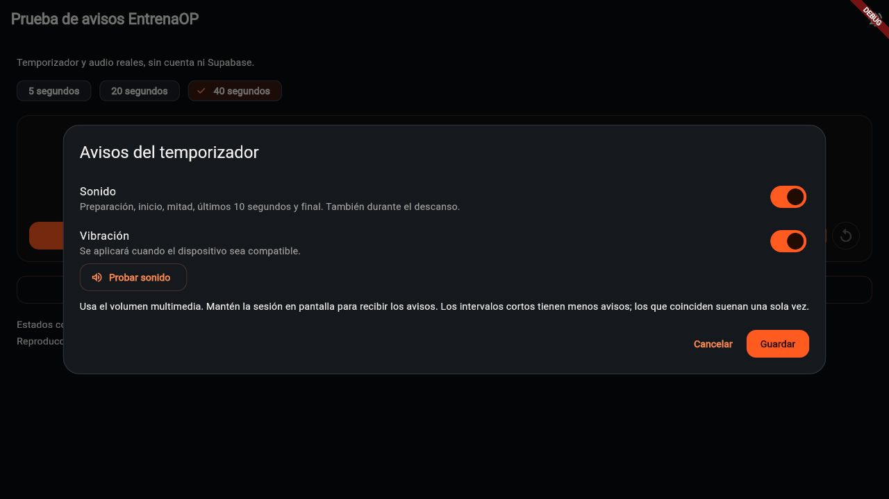
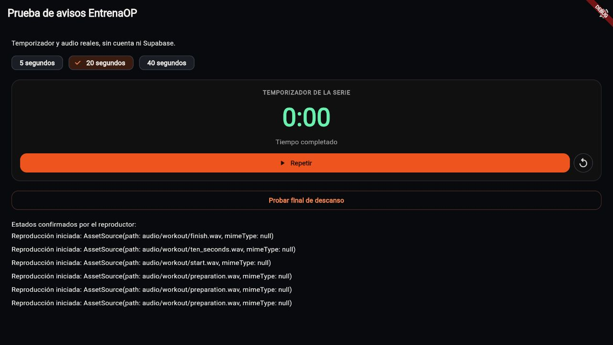

# Avisos del ejecutor · UI-018 · 08/10/2026

## Problema comprobado y criterio

Javier comunica ausencia de sonido en localhost, Android físico y el simulador
iOS. El código sí emitía eventos, pero su adaptador usaba
`SystemSound.play(SystemSoundType.alert)`: Flutter documenta que este aviso se
ignora en Android, iOS y web. No había archivos de audio incluidos.
[Contrato de Flutter](https://api.flutter.dev/flutter/services/SystemSoundType.html).

Javier confirma avisos a mitad y cuando quedan diez segundos, además de
preparación, inicio y final. Se conserva el diseño del ejecutor y las preferencias
independientes de sonido y vibración. Son avisos del reloj, sin cambiar
prescripciones, motores ni la confirmación manual de resultados.

## Implementación

- Cinco WAV originales, mono PCM de 16 bits/44,1 kHz, generados por
  `tools/generate_workout_cues.py`: preparación, inicio, mitad, diez segundos
  y final. El final del descanso usa el sonido de inicio del siguiente trabajo.
  Duraciones de 0,10 a 0,43 segundos, con fundidos y amplitud moderada.
  Están incluidos en la app; no se descargan de un servidor ni requieren red.
- `audioplayers` 6.8.1 fijado, con siete paquetes nuevos incluidos sus
  implementaciones de plataforma; no se actualizan dependencias anteriores.
  El paquete Darwin resuelto (6.5.0) incluye Swift Package Manager y mínimo
  iOS 13, compatible por configuración con el mínimo iOS 15 de IOS-001.
  Esto no sustituye una compilación y escucha nativas en el Mac.
- Adaptador de audio separado de preferencias y eventos, con un reproductor
  reutilizable y precarga. Android usa volumen multimedia sin reclamar foco
  exclusivo; iOS configura playback con mixWithOthers. No se solicitan permisos
  adicionales ni se cambia el audio global del SDK de forma indiscriminada.
  La sesión de audio de iOS es compartida por el sistema y su convivencia con
  música/vídeo debe comprobarse en dispositivo real.
- El diálogo existente añade **Probar sonido**: prueba explícita que no guarda
  ni cambia los interruptores; errores visibles con reintento. El borrador se
  aplica solo al guardar y cancelar conserva las preferencias anteriores.
- Fallos de audio o vibración no interrumpen el otro canal, el reloj ni guardados.
  Solicitudes de audio se serializan; un aviso sustituido o retrasado más de un
  segundo se descarta para evitar reproducir una fase antigua. La prueba manual
  puede esperar la carga, porque no representa un hito temporal.

La reproducción usa la interacción normal del usuario. No se desactivan las
restricciones de autoplay del navegador. En Safari/iOS web queda pendiente la
prueba específica de sus restricciones.

## Hitos y restauración

**Ampliación UI-019, 08/10/2026:** Javier confirma también pitidos breves cuando
quedan tres, dos y un segundo de trabajo. Reutilizan el WAV de preparación y
el sonido final existente. No se añaden al descanso ni a cronómetros sin duración
objetivo. Pausar y restaurar no repite segundos; un salto emite únicamente el
segundo actual o el final, sin recuperar una ráfaga atrasada. En tiempos de uno
a tres segundos el inicio prima sobre un pitido simultáneo y solo avisan los
segundos posteriores. Banco web actualizado y compilado; intervalo real de cinco
segundos aceptado en Chromium (tres preparaciones, inicio, tres pitidos finales
y final), sin errores. Análisis limpio y
621 pruebas completas correctas, con la omisión web existente. Evidencia de
regresiones y límites en [SESSION_CONTROLS_2026_10_08.md](SESSION_CONTROLS_2026_10_08.md).
La tabla siguiente conserva el criterio de mitad/diez segundos; en trabajo se
suma esa cuenta final cuando haya tiempo para ella.

| Tiempo del intervalo | Avisos durante la cuenta |
| --- | --- |
| Hasta 10 segundos | Inicio y final, además de preparación cuando corresponda |
| De 11 a 19 segundos | Últimos 10 segundos, sin mitad |
| Desde 20 segundos | Mitad y últimos 10 segundos |

La mitad se redondea al segundo siguiente en tiempos impares. Si ambos hitos
coinciden (20 o 21 segundos), prima diez segundos. Si una actualización cruza
ambos, se emite el último; si llega directamente al final, se emite solo final.
Pausar/reanudar no repite hitos; repetir reinicia su recorrido. Restaurar no
reproduce hitos pasados. El descanso conserva duración original y tiempo
transcurrido al restaurarse, para no calcular una mitad nueva sobre el resto.

Conexiones comprobadas: reloj AMRAP, series por tiempo, ventanas de rendimiento,
EMOM y temporizador de descanso. Los cronómetros sin duración objetivo no
inventan una mitad ni un final. El ejecutor sigue requiriendo confirmar resultados.

## Validación y límites

- Análisis limpio en raíz y admin. Baterías completas: **606 pruebas correctas**
  en raíz y **91** en admin, con la omisión web y la captura optativa existentes.
- **27 pruebas específicas** correctas: WAV empaquetados con señal PCM,
  preferencias independientes/persistentes, prueba/cancelación/guardado,
  errores, reutilización del plugin, sustitución y carga lenta,
  pausa/reanudación/repetición, restauración y descansos.
- Compilación Android debug correcta, usando desarrollo. No acredita escucha
  en Android físico ni convivencia con música/auriculares.
- Banco manual `tools/workout_cue_probe.dart` compilado en web. Recorrido real
  de 40 segundos en Chromium: tres preparaciones, inicio, mitad, diez segundos
  y final con estados playing confirmados por el reproductor; final de descanso
  también reproducido. Sin errores de audio en consola. No se simula el plugin
  ni se altera autoplay en esta comprobación. Los estados acreditan aceptación
  de reproducción, no una valoración humana del volumen o de los tonos.
  Prueba explícita y recorrido final de 20 segundos también correctos: preparación,
  inicio, un solo aviso intermedio de diez segundos y final, sin errores de consola.
- iOS en UI-018: compatibilidad de SPM revisada en el paquete resuelto; esa
  comprobación desde Windows no acreditaba compilación o escucha nativas.
  IOS-002 añade después compilación/reproducción en simulador y escucha de
  Javier, como se detalla más abajo. Dispositivo físico sigue pendiente.
- No se implementan avisos garantizados con pantalla bloqueada o aplicación
  suspendida. El diálogo indica mantener la sesión en pantalla. El trabajo en
  segundo plano necesitaría su propio diseño y verificación.
- Sin cambios SQL, RLS, derechos Free/Pro, fotos, navegación de pantallas,
  contenido admin ni producción. El Mac IOS-001 se incorpora por avance directo
  tras revisar su diff, conservando su configuración e historial.

Javier comunica una revisión superficial en el simulador de guardado, Evolución
y fotografías con resultado correcto. Es una observación del usuario, no una
auditoría completa. La recuperación por correo en el simulador no se fuerza:
la recepción/recuperación web ya está confirmada en MAIL-001.

Capturas del banco compilado con el tema y los controles actuales, sin cuenta
ni datos personales; no representan un rediseño de la sesión:

## Siguiente recorrido único

**IOS-002, 08/10/2026:** Javier confirma sonido en navegador Android y comunica
silencio en simulador iOS. Autoriza coordinar «Prepara EntrenaOP para iOS» del
proyecto EntrenaOP MacOS. La copia y la app instalada seguían en `98e037e`, antes
del plugin y los WAV. Tras revisar el diff, actualizar la copia limpia a
`774361b`, preparar el lockfile y reconstruir, el banco sin cuenta compila y
arranca en iPhone 17 Pro/iOS 26.3.1. Los cinco WAV están empaquetados e idénticos
a los del repositorio; SPM registra audioplayers_darwin 6.5.0.

El banco confirma estados playing de preparación, inicio, mitad, diez segundos,
3/2/1, final y descanso. Javier confirma en ese chat **«Sí, ahora suena»**. Análisis
limpio y 621 pruebas correctas con la omisión web existente; app principal
relanzada con Supabase de desarrollo. Sin cambios de código, dependencias,
configuración iOS ni sesión playback/mixWithOthers. La vibración estaba activada
y sus llamadas no dieron errores, pero el simulador no acredita sensación física.
[Herramientas y comprobación nativa](IOS_DEVELOPMENT.md).

Para preparar una copia actualizada del Mac, usar las dependencias con
`flutter pub get --enforce-lockfile`, detener y volver a lanzar la app en iOS
de desarrollo (el plugin nuevo requiere reinicio completo). En una sesión:
**Avisos del temporizador → Probar sonido**, seguido de un intervalo de 40
segundos, pausa/reanudación y descanso. Comprobar volumen, silencio, música y
auriculares cuando haya dispositivo físico disponible. El banco sin cuenta
puede ejecutarse también con `flutter run -d <simulador> -t
tools/workout_cue_probe.dart`.

El siguiente recorrido recomendado es comprobar sonido y vibración en iPhone/
Android físicos cuando estén disponibles, incluyendo volumen/silencio, música,
auriculares y una sesión real. Segundo plano no se da por implementado.
Comparativas configurables, publicación segura, vídeos, negocio y motores
conservan sus pendientes propios.

## HAPT-001 · vibración en Android nativo

Javier aclara que prueba la app nativa en un Samsung mediante F5 de VS Code,
no el navegador: oye los pitidos, pero no percibe la vibración. El adaptador
anterior usaba `HapticFeedback.selectionClick`, `lightImpact` y `mediumImpact`.
En Android Flutter los traduce a efectos de reloj, tecla virtual y teclado,
respectivamente. Respetan la configuración de respuesta táctil del sistema;
que la llamada termine sin error no acredita vibración perceptible. Las
duraciones de 10–20 ms corresponden al adaptador web de Flutter, no a esta prueba
nativa. [Contrato de Android](https://developer.android.com/develop/ui/views/haptics/haptics-apis).

Se añade un adaptador Android pequeño, sin dependencias nuevas, conectado por
`es.entrenaop/workout_vibration`. Usa el motor del dispositivo con patrones
finitos, sin repetición ni cola de avisos:

| Aviso | Patrón solicitado en Android |
| --- | --- |
| Preparación y últimos 3/2/1 de trabajo | Un pulso de 60 ms |
| Mitad y últimos diez segundos | Un pulso de 120 ms |
| Inicio del trabajo | Un pulso de 200 ms |
| Final del trabajo o descanso | Dos pulsos de 160 ms separados por 100 ms |

El permiso normal `VIBRATE` se declara en el manifiesto, sin diálogo de
autorización. API 31+ usa `VibratorManager`; API 26+ usa `VibrationEffect`, con
el mecanismo anterior para las versiones admitidas más antiguas. Los avisos
se clasifican como notificaciones, sujetos a sus ajustes y No molestar,
sin forzar amplitud ni tratar el entrenamiento como una alarma. Solo se
solicitan mientras la actividad esté visible y se cancelan al salir de primer
plano. No se añade soporte de pantalla bloqueada o ejecución en segundo plano.
iOS y web conservan los efectos de Flutter existentes.

El diálogo añade **Probar vibración**, que solicita el aviso de final sin sonido
ni guardar preferencias. Los botones de prueba dependen de sus interruptores
del borrador; cancelar conserva los valores guardados. Se indica error si el
motor no existe o falla la solicitud nativa. Una solicitud aceptada no permite
detectar si Android la silencia por sus ajustes ni si el usuario la percibe.

Para comprobarlo en el Samsung, actualizar la copia de desarrollo, detener la
ejecución de VS Code y volver a lanzar con F5: el código nativo y el manifiesto
requieren recompilación completa, no hot reload. En una sesión abrir
**Avisos del temporizador → Probar vibración**, sosteniendo el móvil, y después
probar preparación, intervalo de 40 segundos y final de descanso.

Validación de la corrección: análisis limpio y 637 pruebas correctas, con la
omisión web existente. APK Android debug de desarrollo y compilación iOS para
simulador correctos. El APK contiene el permiso VIBRATE y el adaptador nativo.
El diálogo y la prueba independiente se comprueban en el banco del simulador,
sin error ni reproducción de audio; se restaura la app principal con Supabase
de desarrollo. Para la primera compilación Android del Mac se instalan NDK
28.2.13676358, plataforma/build-tools 36 y CMake 3.22.1, sin cambiar lockfiles.
Esto no acredita todavía la sensación física en el Samsung ni en iPhone.

**Prueba posterior de Javier, 08/10/2026:** trabaja desde Windows y lanza el
Samsung por F5 en esa copia. Al principio no aparecía Probar vibración: la copia
Windows seguía en `d79dde3`. Javier aporta el avance directo con
`git pull --ff-only` hasta `b38d974`; después de volver a lanzar comunica que
sigue sin vibrar. La salida aportada anteriormente contiene solo MediaPlayer,
sin diagnóstico de la vibración. La corrección compilada no se considera una
solución físicamente confirmada. Se investiga si la solicitud llega al sistema,
los ajustes de vibración/notificación, modo silencio y funcionamiento del motor;
no se cambian los patrones de nuevo ni se ignoran ajustes del usuario sin
evidencia. [Comprobaciones de Samsung](https://www.samsung.com/uk/support/mobile-devices/solutions-for-when-your-galaxy-phone-wont-vibrate-when-receiving-calls-or-notifications/).

Javier confirma después que el Samsung sí vibra en su prueba de ajustes y que
tiene la vibración activada para esta comprobación. El funcionamiento del motor
queda confirmado por el usuario; no se atribuye el fallo de EntrenaOP a los
ajustes ni se cambia la clasificación del aviso sin diagnóstico del dispositivo.

Se añade diagnóstico de desarrollo al botón existente, con el prefijo
`EntrenaOPVibration` en la consola de VS Code: inicio de prueba, plataforma/web,
modelo y SDK Android, presencia del motor y control de amplitud, permiso VIBRATE,
actividad visible, modo de sonido, filtro de interrupciones e intensidad de
notificaciones cuando sea legible. `-1` en esta última indica valor no explícito,
no intensidad cero. El canal nativo registra también el aviso y si se envía la
solicitud; no expone el método de diagnóstico en compilaciones no depurables.
No se registran datos de cuenta, sesiones, identificadores del teléfono ni
credenciales. Los patrones y ajustes se conservan; Android no devuelve por esta
API si el usuario percibe la vibración.

El diagnóstico solo se consulta en la prueba manual de desarrollo. Fallar o
tardar más de dos segundos no impide solicitar después la vibración. Para
continuar desde Windows: traer el commit, detener la app y volver a lanzar F5,
pulsar Probar vibración y aportar las líneas `EntrenaOPVibration` de la consola.
Esto permitirá distinguir la ruta de Flutter, la recepción nativa y las
condiciones declaradas por Android; la causa del fallo físico sigue pendiente.
Análisis limpio, 638 pruebas correctas con la omisión web existente y
compilaciones Android debug/iOS simulador correctas. Una regresión acredita que
el fallo de diagnóstico no impide solicitar el aviso. El Samsung no está
conectado al Mac de este chat; se requiere la traza de su ejecución en Windows
para contrastar estas condiciones en el dispositivo real.

Javier aporta después la traza de dos pruebas manuales en Samsung SM-A326B,
Android SDK 33: motor presente, permiso VIBRATE concedido, actividad visible,
modo de sonido normal (`ringerMode=2`) y todas las interrupciones permitidas
(`interruptionFilter=1`). Ambas llegan al adaptador nativo y envían
`workFinished` sin excepción. `hasAmplitudeControl=false` no impide los patrones
básicos de encendido/apagado usados aquí; `notificationIntensity=-1` sigue sin
acreditar intensidad cero. La percepción física continúa fallando según Javier.

La ruta Flutter/nativa queda contrastada en el teléfono. El siguiente paso es
leer desde ADB en Windows el historial de `dumpsys vibrator_manager` filtrado
por el paquete y el estado de AppOps VIBRATE, inmediatamente después de la
prueba, para distinguir solicitudes ignoradas, canceladas o finalizadas por
Android. No se cambia la amplitud, el patrón ni la clasificación sin esa
evidencia. El historial puede aportar el estado del sistema, pero tampoco
acredita por sí solo sensación física.
[Patrones básicos de Android](https://developer.android.com/develop/ui/views/haptics/haptics-apis)
y [estados del historial de vibración](https://android.googlesource.com/platform/frameworks/base/+/81f52b053da6/services/core/java/com/android/server/vibrator/Vibration.java).
