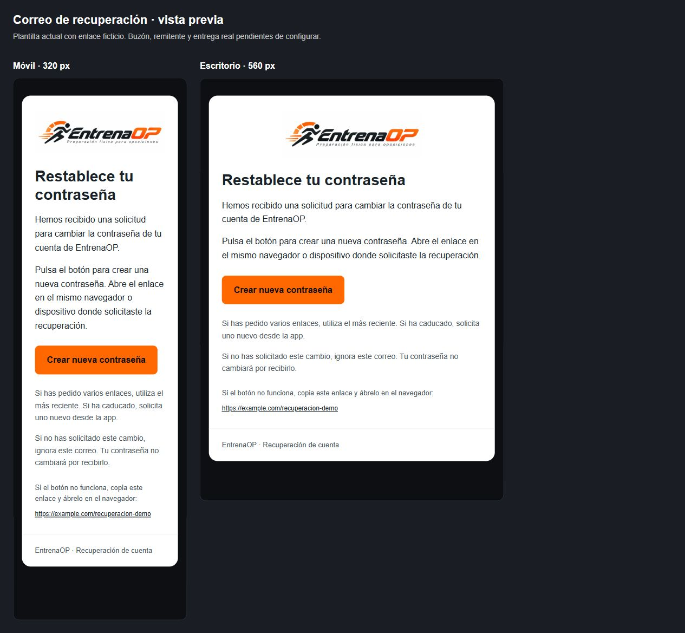

# Cuenta · configuración de desarrollo

Proyecto permitido: **entrenaop-dev**, `sxbxfjqgoddzhtcyhalw`. No usar estos
comandos contra producción ni aplicar el `supabase/config.toml` general generado
por `supabase init`, que contiene valores distintos a los del proyecto remoto.

## Retornos

La configuración parcial declara retornos de localhost/127.0.0.1 y el callback
móvil. Antes de aplicar, inspeccionar el diff:

```powershell
supabase config diff --workdir tools/account_access_dev --project-ref sxbxfjqgoddzhtcyhalw --output-format json
```

## Correo de recuperación

Javier acuerda utilizar **EntrenaOP <acceso@entrenaop.es>**, una dirección propia
para el acceso, separada de su correo personal de empresa. El asunto y HTML de
recuperación están en `supabase/config.toml` y `supabase/templates/recovery.html`.
El HTML conserva `{{ .ConfirmationURL }}` para botón y enlace alternativo; no
recibe ni solicita contraseñas, no añade seguimiento ni fija la duración del
enlace. Utiliza el logotipo público actual de la web, con texto alternativo.

**Estado al 08/10/2026:** buzón activo, **SMTP conectado y asunto/HTML españoles
aplicados y comprobados en desarrollo**. Javier ha completado la contraseña en
Hostinger y la configuración SMTP en Supabase. La consulta remota acredita host,
puerto, usuario, remitente y nombre acordados; también coincide exactamente la
plantilla versionada. El bloqueo HTTP 400 inicial del proveedor predeterminado
queda resuelto al conectar SMTP propio. No se ha comprado ningún plan ni se han
modificado DNS o producción. Javier aporta después un correo real recibido en
Gmail: asunto español, remitente acordado y logotipo visibles. La recepción y
esa representación quedan comprobadas. Tras repetir la prueba desde el mismo
perfil, Javier confirma «funciona perfectamente»: la recuperación web queda
confirmada por él. La comprobación nativa y de producción sigue abierta.
Confirmación de alta y otras plantillas no se modifican en este tramo.

Javier confirma el 08/10/2026 que ha cambiado la contraseña del buzón y guardado
los cambios; la credencial vigente es distinta de la que apareció en la captura.
La rotación deja de ser una tarea pendiente. Esta confirmación no acredita por
sí sola el transporte SMTP; el correo real recibido posteriormente sí acredita
la entrega de esa solicitud. Javier confirma posteriormente que la recuperación
funciona al completar el enlace en el mismo perfil de navegador y origen.

El CLI instalado 2.117.0 compara el `subject` de esta plantilla, pero no carga
su `content_path` en ese recorrido remoto. No basta un diff limpio del CLI para
afirmar que el HTML está aplicado. `apply_recovery_template.py` utiliza la
Management API oficial, dirige la operación únicamente al proyecto de
desarrollo y permite comprobar ambas propiedades antes/después:

Requiere Python 3.11 o posterior; utiliza únicamente la biblioteca estándar.

```powershell
# SUPABASE_ACCESS_TOKEN debe estar disponible mediante configuración segura,
# nunca escrito en el código, el historial del terminal o un archivo versionado.
python tools/account_access_dev/apply_recovery_template.py
python tools/account_access_dev/apply_recovery_template.py --apply
```

Sin `--apply` solo consulta. Al aplicar envía únicamente
`mailer_subjects_recovery` y `mailer_templates_recovery_content`. Comprueba el
contenido exacto y que las demás propiedades no cambien. No imprime la
configuración completa, credenciales ni tokens. No guarda claves en Flutter.

La API actualiza automáticamente sus dos mapas de indicadores de personalización.
La comprobación admite únicamente el indicador de recuperación dentro de cada
mapa; cualquier cambio en los indicadores de otros correos, permisos, cuotas o
configuración SMTP sigue provocando fallo. Hay cinco regresiones locales:

```powershell
python -B -m unittest discover -s tools/account_access_dev -p test_recovery_template.py
```

## Prueba real y perfiles de navegador

Javier confirma que solicitó la recuperación desde Chrome lanzado con F5 en
VS Code y abrió el correo en su navegador habitual. La inspección del equipo
comprueba dos procesos principales: Chrome habitual y Chrome con perfil temporal
de Flutter en `localhost:55554`. La configuración de VS Code fija ese puerto y
no fuerza otro destino de Auth. Son almacenes distintos aunque ambos navegadores
estén en el mismo PC; esto explica el rechazo esperado del canje PKCE al pasar
del perfil de Flutter al habitual. El mensaje de la app agrupa varias causas y
no acredita por sí solo caducidad o reutilización del enlace.

Para repetir la prueba, mantener F5 ejecutándose y abrir
`http://localhost:55554/#/forgot-password` en Chrome habitual. Solicitar allí un
correo nuevo y abrir el botón en ese mismo perfil, sin cambiar de puerto ni de
`localhost` a `127.0.0.1`. No reutilizar el intento anterior. El verificador PKCE
se conserva en el perfil y origen de la solicitud; no se cambia el flujo de
seguridad ni se comparte almacenamiento entre perfiles para facilitar la prueba.

La captura del correo recibido acredita bandeja de entrada, remitente y
presentación en Gmail. La confirmación posterior de Javier acredita su prueba
funcional de recuperación web; no es una auditoría del servicio ni una prueba
de caducidad o reutilización contra Auth real. Quedan por comprobar la
firma/alineación del mensaje y el recorrido en dispositivos nativos. El agente
no ha enviado correos ni cambiado la contraseña de Javier. El remitente SMTP de
Supabase es común a los correos de Auth, aunque aquí solo se ha traducido
recuperación. Las credenciales permanecen en servidor y no se versionan.

Comprobaciones del 08/10/2026:

- Dominio `entrenaop.es`, plan activo **Free Business Email**, caducidad mostrada
  `2028-11-05`, **99 de 100 plazas libres**. El formulario ofrece crear el buzón
  sin compra ni cambio de plan.
- Límites mostrados: 1 GB por buzón y 100 envíos cada 24 horas. Esta capacidad
  se utiliza para desarrollo y pruebas; no acredita dimensionamiento comercial.
- Tras la intervención de Javier, el panel muestra «Buzón creado correctamente»
  y `acceso@entrenaop.es` activo, con 98 plazas libres. No se ha cambiado la
  contraseña de ningún buzón previo.
- SMTP documentado por el proveedor: `smtp.hostinger.com`, puerto 465 con TLS
  implícito; alternativa 587 con STARTTLS. Usuario: dirección completa del
  buzón. La contraseña se introduce en los servicios y se conserva fuera del
  repositorio y del chat.
  El panel «Conecta apps y dispositivos» del buzón nuevo confirma host y puerto.
- Consulta DNS pública: MX `mx1.hostinger.com`/`mx2.hostinger.com`, SPF con
  `_spf.mail.hostinger.com`, tres CNAME `hostingermail-{a,b,c}._domainkey` hacia
  sus destinos DKIM de Hostinger, y DMARC `v=DMARC1; p=none`. No se han modificado
  estos registros. La presencia de registros no acredita todavía la firma y
  alineación de un mensaje entregado.
- Tras guardar SMTP y aplicar la plantilla, la consulta de desarrollo confirma
  `smtp.hostinger.com:465`, usuario/remitente `acceso@entrenaop.es`, nombre
  `EntrenaOP`, límite inicial de **30 envíos por hora** e intervalo por usuario
  de **60 segundos**. Este límite de Supabase se combina con los 100 envíos
  diarios de Hostinger; aumentar uno no elimina el otro. No se han ampliado
  cuotas ni reducido controles contra abuso manualmente.
- Asunto y HTML remotos coinciden con los archivos versionados; SHA-256 del HTML
  `10c4d2b975800a3e43cd30e1c86ed1b9b601e043da0c2f35bc8667d04f6bf121`.
  Solo recuperación aparece marcada como personalizada. Segunda aplicación
  idempotente: ninguna escritura y ninguna propiedad inesperada.

La revisión de HTML en navegador con un enlace ficticio no acredita la entrega,
la representación en todos los clientes de correo ni un recorrido autenticado.
El panel de Supabase muestra asunto y cuerpo españoles; en su previsualización
no carga el logotipo externo, aunque la URL es la misma que carga la vista local.
La captura real aportada posteriormente por Javier muestra el logotipo y la
presentación correctamente en Gmail; no acredita otros clientes. El texto
alternativo identifica EntrenaOP cuando la imagen no se muestra.
Las cuotas de Supabase y Hostinger son independientes; subir la cuota del
proyecto o contratar Supabase Pro no amplía el plan de correo de Hostinger.

Validación local del 08/10/2026: HTML/TOML y sintaxis comprobados; simulación de
consulta sin escritura, actualización limitada a las dos propiedades,
idempotencia y detección de cambios ajenos. Las salidas no incluyen el token ni
la contraseña SMTP de las simulaciones. Las consultas de API acreditan la
configuración remota; las simulaciones y regresiones acreditan el verificador
local. La entrega real se acredita por separado mediante el correo recibido por
Javier, no mediante estas comprobaciones locales.

Vista revisada en navegador a 320 y 560 píxeles, con enlace ficticio:



Fuentes: [plantillas de Supabase](https://supabase.com/docs/guides/auth/auth-email-templates),
[flujo PKCE](https://supabase.com/docs/guides/auth/sessions/pkce-flow),
[SMTP de Supabase](https://supabase.com/docs/guides/auth/auth-smtp),
[configuración SMTP de Hostinger](https://www.hostinger.com/support/1575756-how-to-get-email-account-configuration-details-for-hostinger-email/),
[buzones de Hostinger](https://www.hostinger.com/support/1583217-how-to-create-and-manage-mailboxes-for-hostinger-email/).
